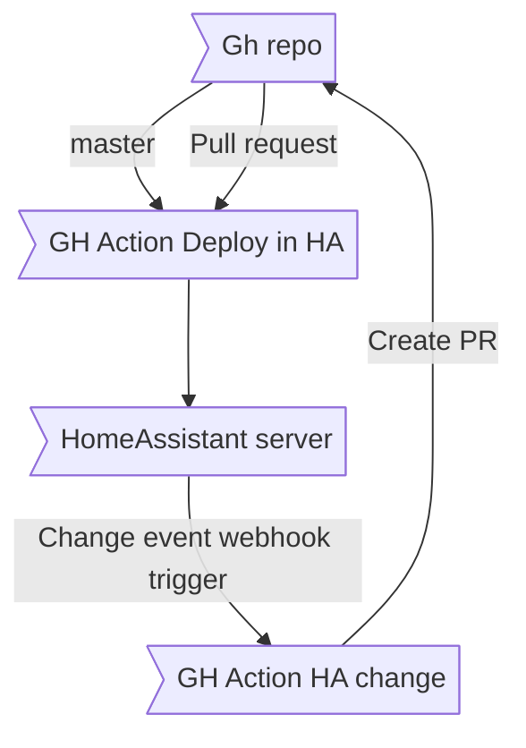

TODO just do template query? https://community.home-assistant.io/t/get-api-areas-rest-endpoint/271440/12?u=perok
jsonnetfmt input.json > output.libsonnet
static stuff => json output saved as libssonnet
jsonnet to filter and use that to generate defintions
defintions use some kind of templating language

how to create reusable config UIs
https://clan.lol/blog/json-schema-converter/
https://rjsf-team.github.io/react-jsonschema-form/

so dumn https://github.com/home-assistant/core/pull/37376

## Inspiration

https://github.com/AppDaemon/appdaemon
https://github.com/hassio-addons/addon-appdaemon/blob/edc32b49dba7e0757e95916ea672543b821d147b/appdaemon/config.yaml#L20-L25

https://netdaemon.xyz/ using websockets

on the rest API! https://github.com/home-assistant/core/issues/96273#issuecomment-1650479691

# other

TODO logging? https://github.com/LEGO/woof

Device: Something physical
Entities: things on devices, sensors, automations, etc

## Automation

1. Triggers
 -> From devices. Specific api's
 -> Other things
2. Conditions
3. Action
  -> For devices
  -> For standardized things? Lights, etc, must use services to understand params?

## Updates

Triggers from these events to webhooks to github to rebuild
device_registry_updated (5 listeners)
entity_registry_updated (10 listeners)

## Entity handling

https://developers.home-assistant.io/docs/core/entity/light/
1. api generates defintioins
2. Pga. for.eks at en entity har effect som er hva som er nå og effekt_list som er hva som er støtta så blir det
   veldig vanskelig å lage ett godt api generisk. Derfor burde det være at noen entitettyper har overstyrende
   custom greier som bedre støtter dette (effect: "effekt1" | "effekt2")

## Codegen

https://stackoverflow.com/questions/11509843/sbt-generate-code-using-project-defined-generator
https://www.scala-sbt.org/1.x/docs/Howto-Generating-Files.html

currently sbt-assembly
tree shake before sending to the pie https://github.com/sbt/sbt-proguard
or https://github.com/scalameta/sbt-native-image

## Uploading/developing

### pushing changes
netdaemon is folder based https://netdaemon.xyz/docs/user/started/installation/
https://github.com/net-daemon/homeassistant-addon/blob/master/netdaemon_5/config.json

SSH? to folder https://community.home-assistant.io/t/how-to-copy-files-to-home-homeassistant-directory/60939/7

can we do a container that detects new jars in a folder and restarts based on it?

in entrypoint.sh
https://stackoverflow.com/a/66319316 notify-tools trigger xml api https://stackoverflow.com/a/20298885
run supervisord
  runs a shell script that runs `java -jar ${find latest jar file}`
