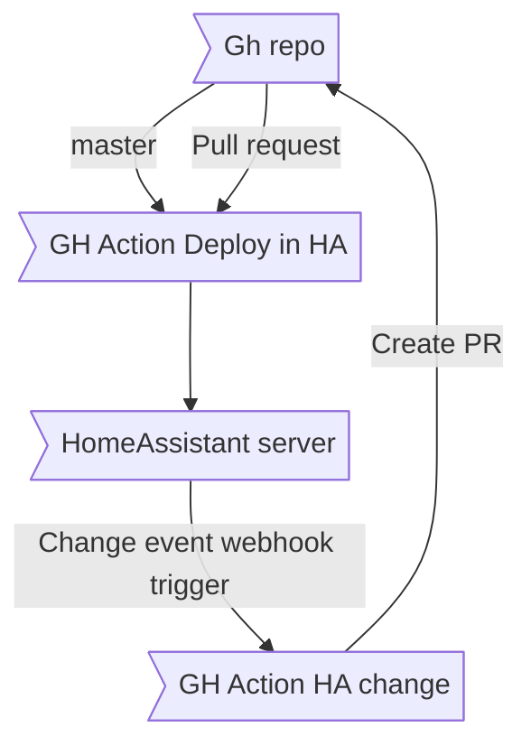

## Status: pre-v1 alpha

> [!CAUTION]
> This project is **pre-v1 alpha**. Nothing here is stable: APIs, the dashboard
card model, the jsonnet authoring surface, generated code, and on-disk formats
can all change without notice. **Breaking changes are expected and allowed** —
favour the cleanest design over backward compatibility until v1.


# Functional Home Assistant - Your home on functions

A dashboard builder built for composition, simplicity, performance, and shareability.

```pkl
TODO small example
```

- Build your dashboard with reusable functions. No more YAML ctrl c ctrl v.
- Share your dashboard functions or new components by just putting it on Github. Ready for consumption by others immediately.
- Speed and efficiency ready for all old devices that can run html with some javascript
  - Everything is serverside rendered. Changes are morped from an SSE session as values or as new html blocks
  - Even for dynamic blocks
- Catch errors in your dashboard immediately; fully typed overview of all your entities, devices, and users
- Secure by design; Can only do actions on entities that are in dashboards you can view

## Traces, metrics and logs from a local run

The dashboard emits OpenTelemetry when — and only when — an OTLP endpoint is set.
[`grafana/otel-lgtm`](https://github.com/grafana/docker-otel-lgtm) is one container
and no configuration, and gives you all three signals in one Grafana:

```bash
docker run -d --name lgtm \
  -p 3000:3000 -p 4317:4317 -p 4318:4318 \
  -p 3200:3200 -p 9090:9090 -p 3100:3100 \
  grafana/otel-lgtm:latest

OTEL_EXPORTER_OTLP_ENDPOINT=http://localhost:4318 \
OTEL_EXPORTER_OTLP_PROTOCOL=http/protobuf \
OTEL_SERVICE_NAME=fh-dashboard \
  sbt dashboardServe
```

Grafana is on 3000 with no login. The other three ports are Tempo, Prometheus and
Loki themselves — publish them if you want to query the APIs instead of clicking.

**`OTEL_EXPORTER_OTLP_PROTOCOL` is not optional.** The OpenTelemetry Java SDK
defaults to gRPC, `:4318` is OTLP/HTTP, and the mismatch fails as
`FRAME_SIZE_ERROR` from okhttp's http2 layer rather than as anything that names
the cause. (The add-on's `run.sh` sets it for you; `dashboardServe` does not.)

Open a dashboard, then read that one page open three ways: the request span with
its `dashboard.page.walk` child, the log lines from it found by its trace id, and
`fh.page.nodes` agreeing with the `fh.nodes` attribute on the span. Unset the
endpoint and the SDK is never constructed at all.

What is emitted, what it costs, and the `OTEL_*` knobs: [`home-addon/DOCS.md`](home-addon/DOCS.md#telemetry-optional).

---

TODO just do template query? https://community.home-assistant.io/t/get-api-areas-rest-endpoint/271440/12?u=perok
jsonnetfmt input.json > output.libsonnet
static stuff => json output saved as libssonnet
jsonnet to filter and use that to generate defintions
defintions use some kind of templating language


how to create reusable config UIs
https://clan.lol/blog/json-schema-converter/
https://rjsf-team.github.io/react-jsonschema-form/


so dumn https://github.com/home-assistant/core/pull/37376


## Inspiration

https://github.com/AppDaemon/appdaemon
https://github.com/hassio-addons/addon-appdaemon/blob/edc32b49dba7e0757e95916ea672543b821d147b/appdaemon/config.yaml#L20-L25

https://netdaemon.xyz/ using websockets

on the rest API! https://github.com/home-assistant/core/issues/96273#issuecomment-1650479691

# other

TODO logging? https://github.com/LEGO/woof

Device: Something physical
Entities: things on devices, sensors, automations, etc

## Automation

1. Triggers
 -> From devices. Specific api's
 -> Other things
2. Conditions
3. Action
  -> For devices
  -> For standardized things? Lights, etc, must use services to understand params?

## Updates


```mermaid

flowchart TD
    ghrepo>Gh repo]
    ghactiondeploy>GH Action Deploy in HA]
    ghactionchange>GH Action HA change]
    ha>HomeAssistant server]
    ghrepo -- master --> ghactiondeploy
    ghrepo -- Pull request --> ghactiondeploy
    ghactiondeploy --> ha
    ha -- Change event webhook trigger --> ghactionchange
    ghactionchange -- Create PR --> ghrepo

```
Triggers from these events to webhooks to github to rebuild
device_registry_updated (5 listeners)
entity_registry_updated (10 listeners)

## Entity handling

https://developers.home-assistant.io/docs/core/entity/light/
1. api generates defintioins
2. Pga. for.eks at en entity har effect som er hva som er nå og effekt_list som er hva som er støtta så blir det
   veldig vanskelig å lage ett godt api generisk. Derfor burde det være at noen entitettyper har overstyrende
   custom greier som bedre støtter dette (effect: "effekt1" | "effekt2")

## Codegen

https://stackoverflow.com/questions/11509843/sbt-generate-code-using-project-defined-generator
https://www.scala-sbt.org/1.x/docs/Howto-Generating-Files.html

currently sbt-assembly
tree shake before sending to the pie https://github.com/sbt/sbt-proguard
or https://github.com/scalameta/sbt-native-image


## Uploading/developing

### pushing changes
netdaemon is folder based https://netdaemon.xyz/docs/user/started/installation/
https://github.com/net-daemon/homeassistant-addon/blob/master/netdaemon_5/config.json

SSH? to folder https://community.home-assistant.io/t/how-to-copy-files-to-home-homeassistant-directory/60939/7

can we do a container that detects new jars in a folder and restarts based on it?

in entrypoint.sh
https://stackoverflow.com/a/66319316 notify-tools trigger xml api https://stackoverflow.com/a/20298885
run supervisord
  runs a shell script that runs `java -jar ${find latest jar file}`
