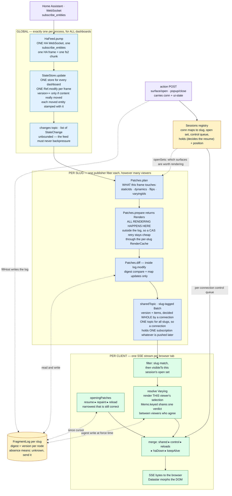
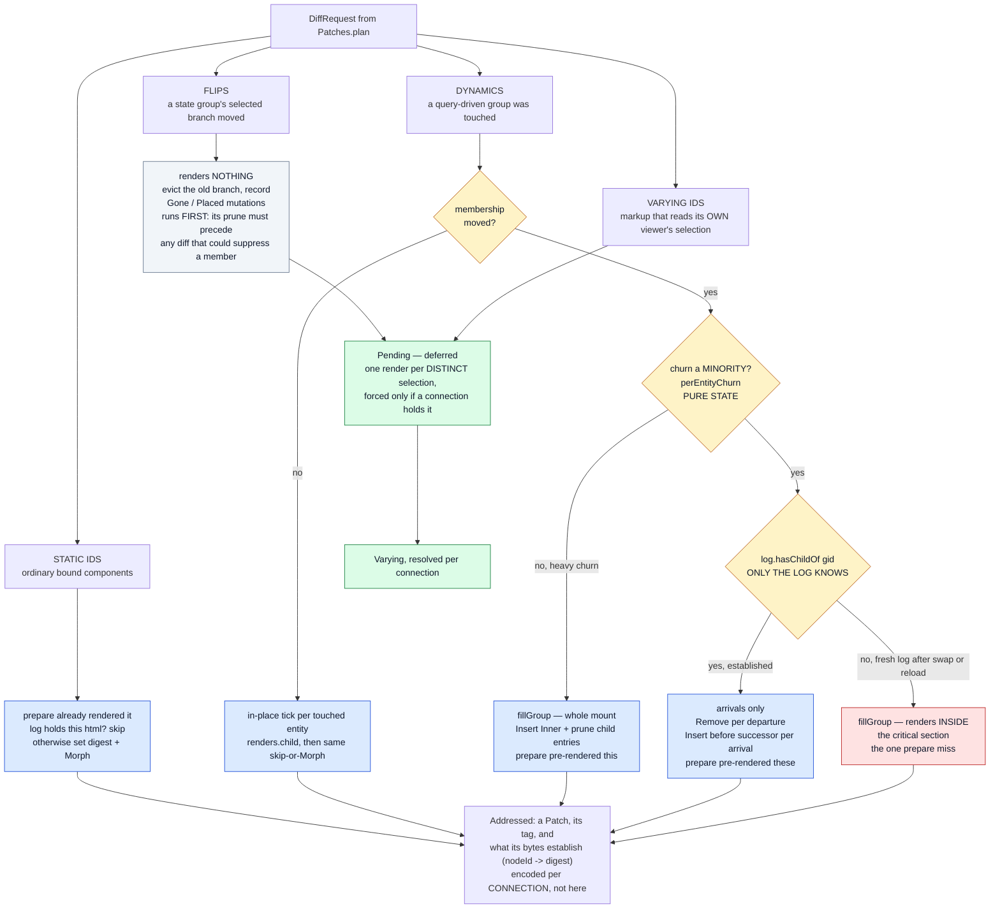
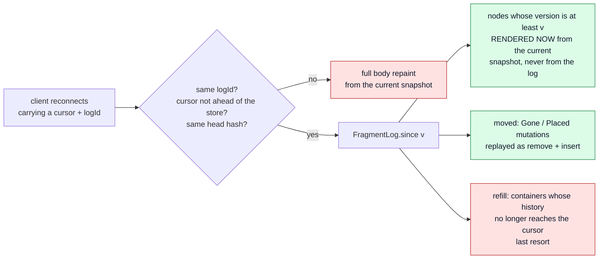

# fh-datastar-view — the rendering pipeline

How a Home Assistant state change becomes bytes in a browser: what runs **once per slug** (shared,
whatever the viewer count) and what runs **once per connection** (because only that connection knows
what its viewer has selected).

> **This is a current-state document, and it is the map we plan changes against.**
>
> It describes the pipeline as the code is today — not a proposal, not a history. Keep it true:
>
> - Change the pipeline, change this file **in the same commit**. A diagram that lags the code is
>   worse than no diagram, because it is trusted.
> - An **ADR that alters this pipeline must update this file too** — the ADR owns the *decision and
>   its rationale*, this file owns *the shape of the thing*. They are not alternatives to each other.
>   ADRs [0011](adr/0011-the-live-connection.md) and
>   [0012](adr/0012-one-pass-addressed-per-client.md) are the two that most often will;
>   [0003](adr/0003-dynamic-groups.md) (dynamic groups) and
>   [0007](adr/0007-state-activated-surfaces.md) (state-activated surfaces) own two of the four node
>   kinds below.
> - When proposing work here, say which box moves. "Render outside the critical section" is a
>   statement about §1; "prune at pull time" is a statement about §6.
> - Everything here is current state. Work in flight lives in
>   [`plan-session-pulled-changelog.md`](plan-session-pulled-changelog.md) and moves into this file
>   as it lands — §9 is a pointer, not an exception.

---

## 1. End to end



The publisher is **one fiber per slug** (`Server.publisherFor`), re-armed by `switchMap` on every
renderer swap — and a swap past the first mints a fresh log identity, so cursors issued against the
old renderer cannot be resumed.

**Three scopes, not two.** Getting these confused is the easiest mistake to make here:

| Scope | One per | What lives there |
|---|---|---|
| Global | process | the HA WebSocket, `HaFeed`, **the `StateStore`**, the `changes` topic, `sharedTopic`, the `Sessions` registry |
| Per slug | dashboard | the publisher fiber, the `Renderer` (in a `SignallingRef`, hot-swapped), the `FragmentLog` |
| Per connection | browser tab | the `Session` — created by the DOCUMENT, adopted by the stream (slug, open surfaces, control queue, plus `holds`/`position` — what THIS client's DOM has and how far it has been served), the SSE stream, that viewer's selections |

There is exactly ONE store and ONE upstream subscription for every dashboard — `HaFeed.resource`
creates the store, `Server.fromFeed` takes `feed.store`. Dashboards are views over one shared state,
never separate feeds.

---

## 2. The setup, in pseudo-code

The same thing as §1, in words, because the diagram cannot show ordering and lifetime.

### Boot — once per process

```
open ONE WebSocket to Home Assistant, subscribe_entities
  the opening frame IS the full entity set, so there is no separate seeding step
create ONE StateStore              // for every dashboard, not one each
evaluate every *.pkl entry         // slug = filename
  per slug: one Renderer in a SignallingRef   // hot-swapped on file edit
  per slug: one FragmentLog with a fresh id, in a Ref
create ONE sharedTopic  (slug-tagged)  and ONE Sessions registry
for each slug: start a publisher fiber
  // STARTS IMMEDIATELY, and runs whether or not a browser ever connects
```

### A browser opens a dashboard

```
GET /d/:slug
  render the WHOLE page from the current snapshot
  mint conn; create Session{slug, open surfaces, control queue, holds, position}
  holds = the digest of every node this render painted   // what THIS client's DOM has
  register it, and schedule a reap if no stream adopts it within AdoptionWindow
  embed in the page as Datastar signals: logId, storeVersion, headHash, styleHash
  ...and conn, on the data-init URL the page advertises

GET /sse/dashboard/:slug/patch
  adopt the session that URL's conn names (epoch++); mint one under the same id
    if it is gone — a reap, a bookmark, a restart: costs suppression, not correctness
  subscribe ONCE to sharedTopic                       // all slugs, filtered per patch
  opening patches, narrowest that is still correct:
      resume   if the cursor's logId matches and nothing structural moved
      repaint  if it does not
      reload   if the document itself is stale
  then stream: shared patches ▸ control ▸ reloads ▸ haDown ▸ keepAlive

on disconnect
  deregister IMMEDIATELY, but only if this stream still OWNS the session —
    a displaced stream must not delete the live one's session on its way out
  nothing lingers, no disconnected state
  the client keeps the cursor; the session's own `position`/`holds` go with it
```

### A state change arrives — once, globally

```
StateStore.update(frame)                    // one Ref.modify for the whole frame
  version++ ONLY if some entity's content really moved
  stamp each MOVED entity with that version  // EntityState.contentVersion;
                                             // a deduped re-seed keeps its old one
  publish List[StateChange] on `changes`

every slug's publisher wakes            // whether or not that slug has any viewer
  read snapshot+version together, wall clock, and sessions.openSets(slug)
    visible = surfaces some session can actually SEE  // widens what is considered
  plan     -> staticIds, dynamics, flips, varyingIds
  prepare  -> render everything            // OUTSIDE the log
  log.modify:
      flips first    -> evict, record Gone/Placed, defer the bytes
      static         -> digest holds? skip : set + Morph
      dynamics       -> tick per entity, or membership delta, or whole-mount fill
      varying        -> Pending, rendered later per distinct selection
  publish slug-tagged patches to sharedTopic

each connection
  drop other slugs; drop what its open set cannot see
  force any Varying against ITS OWN selections (memoised across equal selections)
  write bytes
```

### The log

```
keyed by node id: digest per variant + the version it was rendered from
  a later write overwrites — latest wins, and a version never goes backwards
mutations: Gone / Placed per node, latest wins
pruned by WALL CLOCK: mutations older than FragmentLog.Retention (1h) are evicted
  per-container `horizon` records the version at which its history became incomplete
  -> a cursor below a container's horizon gets a refill instead of a delta
absence means "unknown, send it" — so dropping an entry is ALWAYS safe
```

### Reconnect

```
client sends back its stored signals: logId, version, headHash, styleHash
  different logId, or version ahead of the store, or head moved -> full repaint
  otherwise since(version):
      nodes   whose logged version >= cursor   -> rendered NOW from the current snapshot
      moved   Gone/Placed                      -> replayed as remove + insert
      refill  containers whose history aged out -> whole mount
```

---

## 3. Inside `Patches.diff` — the four kinds, and where each is rendered



**Legend**

| Colour | Meaning |
|---|---|
| Blue | rendered by `prepare`, before the log is touched |
| Red | rendered *inside* `log.modify` — the single case `prepare` cannot predict |
| Green | deferred: rendered per distinct viewer selection, only if someone holds it |
| Grey | renders nothing at all |

---

## 4. Why the flip renders nothing

A flip is server truth — the branch every viewer must move to — but *which* branch a given viewer
has mounted, and what belongs inside it, depends on selections below it. So the shared pass does the
part that is identical for everyone (evict the departed branch, record where it went) and defers the
bytes to a `Pending`, which each connection forces for its own selection. A branch no connected
viewer reaches is never rendered at all.

That is the same mechanism as `varyingIds`, not a second path.

---

## 5. The two rendering lanes, side by side

| | Shared (per slug) | Per client (per connection) |
|---|---|---|
| Runs on | one publisher fiber per slug | that connection's own SSE fiber |
| Sees | the full entity snapshot + the union of visible surfaces | one session's open set and ui-state |
| Renders | static nodes, dynamic ticks, group fills and arrivals | `Varying` nodes, opening paint, resume |
| Writes the log | yes, in `log.modify` | yes, at force time and on surface fills |
| Cost of N viewers | ×1 | ×(distinct selections), not ×N — `Memo.keyed` |

---

## 6. Reconnect: the pull path



The log stores **digests and versions, never HTML** — a resume renders from the current snapshot,
which is by construction at least as fresh as anything the log could have held. That is why a
missing entry is always safe: it reads as "unknown, send it", costing bytes and never staleness.

The second question a resume asks — *does this client already have these bytes?* — is answered by
the **session's own `holds`**, not by the log: it is seeded by the document that created the session
and updated wherever a patch is kept. The log's digests still answer it for the LIVE pass, and that
is the remaining half of the split (`docs/plan-session-pulled-changelog.md`).

Mutations age out after `FragmentLog.Retention` = 1 hour; a container whose history has aged past a
client's cursor yields a `refill` rather than a refusal.

---

## 7. Where each box lives

Paths are under `modules/fh-datastar-view/src/main/scala/fh/view/`.

| Box | Code |
|---|---|
| feed → store | `runtime/HaFeed.scala` · `pump`, `runConnection` |
| store + changes topic | `runtime/StateStore.scala` · `update`, `changes` |
| per-slug publisher | `runtime/Server.scala` · `publisherFor`, `sharedPatchPublishers` |
| what a frame touches | `runtime/Patches.scala` · `plan` |
| all shared rendering | `runtime/Patches.scala` · `prepare`, class `Renders` |
| the render cache | `runtime/RenderCache.scala` — per slug, one generation per node, created per publisher arm |
| the critical section | `runtime/Patches.scala` · `diff` (called inside `Server.sharedPatches`) |
| flips | `runtime/Patches.scala` · `flipStateGroup` |
| dynamic groups | `runtime/Patches.scala` · `renderDynamicGroup`, `renderMembershipChange`, `fillGroup` |
| deferred per-viewer renders | `runtime/Patches.scala` · `Pending` / `Varying`; `runtime/Memo.scala` |
| the log | `runtime/FragmentLog.scala` |
| SSE stream + fan-out | `runtime/Server.scala` · `sseStream` |
| opening paint / resume | `runtime/Server.scala` · `openingPatches`; `runtime/Patches.scala` · `resume` |
| sessions + surface actions | `runtime/Sessions.scala`; `runtime/Server.scala` · `withSession`, `openSurface`, `swapHost` |
| a document establishes a session | `runtime/Server.scala` · `pageResponse`, `reapUnadopted`; `runtime/Sessions.scala` · `Session.adopt` |
| the actual rendering | `runtime/Renderer.scala` · `renderNodeById`, `renderDynamicChild`, `renderDynamicMembers` |
| what keys a render | `runtime/Renderer.scala` · `renderInputs`, `dynamicChildInputs`, `activeBakeIndex` |

## 8. Known open questions

Live list — delete an entry when it is answered, and say where the answer landed.

- **Nobody is watching.** The publisher runs from boot and `plan` does not gate main-page nodes on
  viewers, so with every browser closed each frame still renders every affected fragment into a
  topic with no subscribers. Measured at 0 CPU ticks over 90 s idle on a real instance, so this is
  architecture rather than a live cost. Gating on subscriber count needs one correctness move with
  it: mint a fresh log identity on the 0→1 transition, or a client returning with a pre-gap cursor
  resumes against a log that never recorded the gap.
- **`prepare` vs `hasChildOf`.** The single render `prepare` cannot predict (§2, the red box). The
  alternative — pre-render both sides — makes every membership change pay for the whole mount.
- **Pull instead of push.** Being designed — see [`plan-session-pulled-changelog.md`](plan-session-pulled-changelog.md).
  The two objections that used to block it (losing digest suppression, losing the shared render) are
  answered there by a per-slug render cache and a per-session digest map.
- **Carrying the converted attribute map across a tick.** See TODO2.md — `EntityState.javaAttributes`
  is rebuilt per state change even when attributes did not move.

---

## 9. In progress

The pipeline above is being reshaped: the publisher stops rendering and pushing, and each session
pulls what it is owed from a changelog, deciding for itself what is worth sending.

That work has its own document — **[`plan-session-pulled-changelog.md`](plan-session-pulled-changelog.md)**
— because it is not current state and this file is. As phases land, the shape moves into §1–§8 above
and the plan shrinks. Nothing else in this file describes code that does not exist.

**Phases 0 and 1 have landed**, and are in the sources above: `EntityState.contentVersion` (the
per-entity stamp, §2), `Renderer.renderInputs` (what keys a cached render), and `RenderCache`, which
`Patches.prepare` now renders through (§1, §7). The pipeline's SHAPE is unchanged — still one
publisher, still push, still the same bytes on the wire — so nothing else in this file moves.

Two findings worth carrying here rather than leaving in the plan:

- An `if`/`else` host's branch is a quantified predicate over the WHOLE entity map, so it is keyed
  on the RESOLVED selection rather than on what the selection reads.
- The cache holds ONE generation per node, which is what bounds it: `plan` selects the nodes whose
  entity just moved, so a `(nodeId, inputs)` key would grow forever at a near-zero hit rate.
