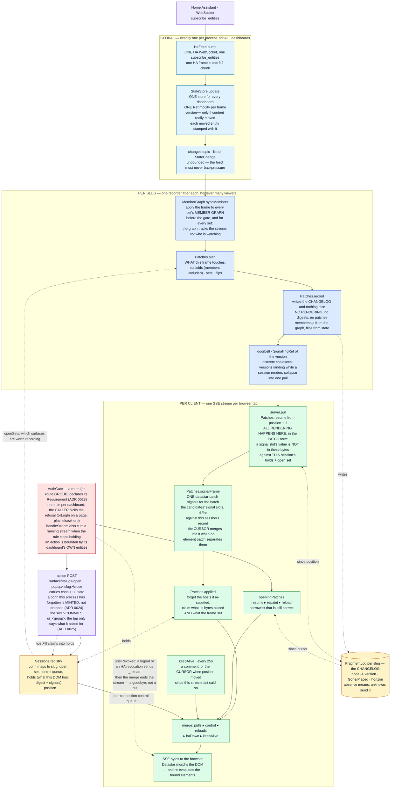
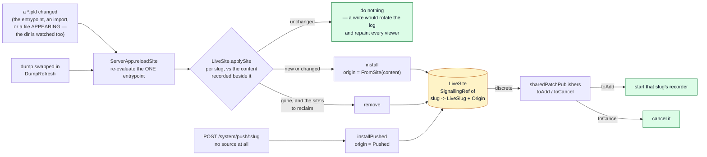
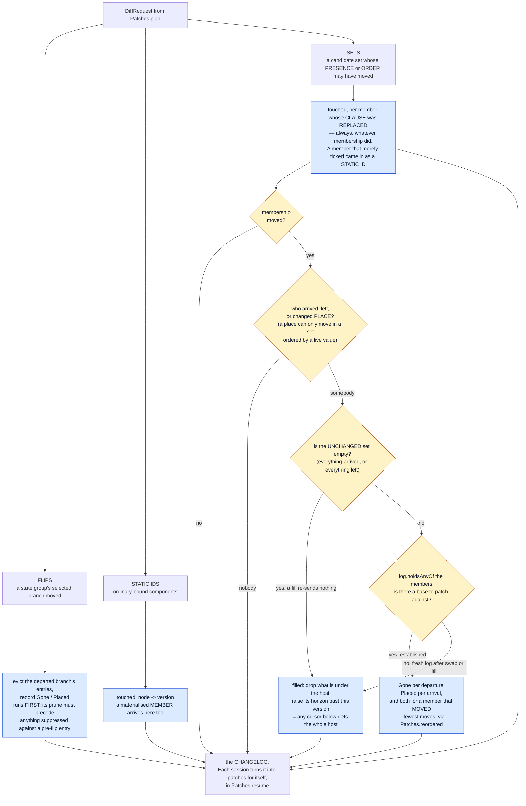
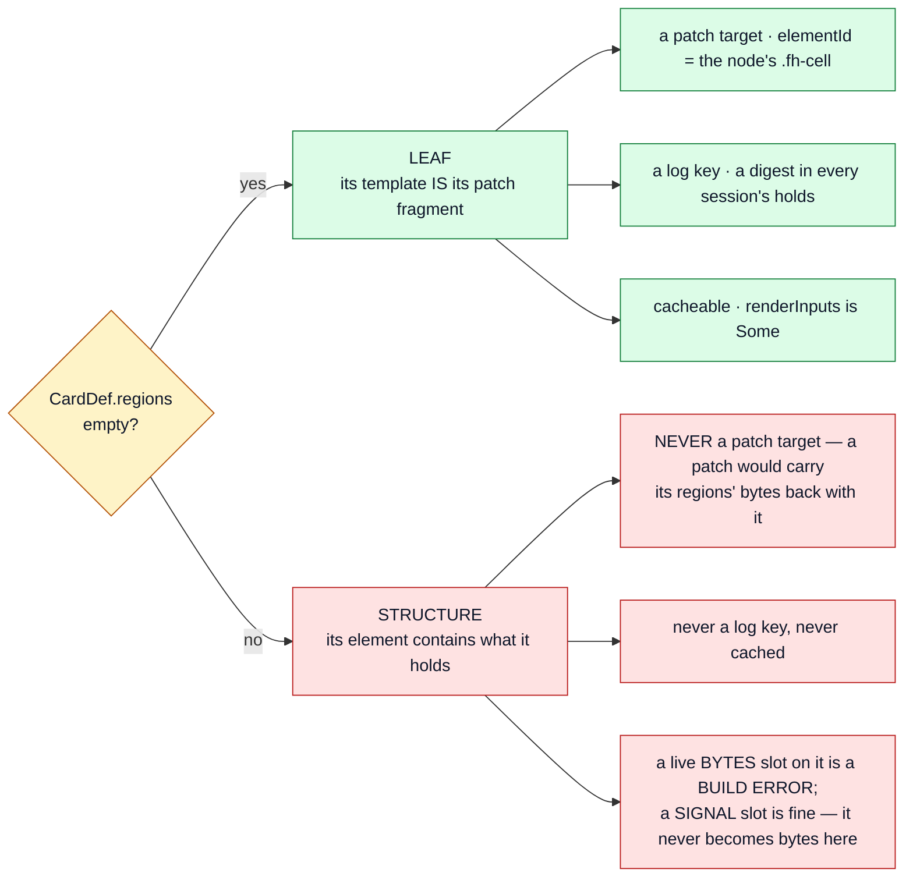
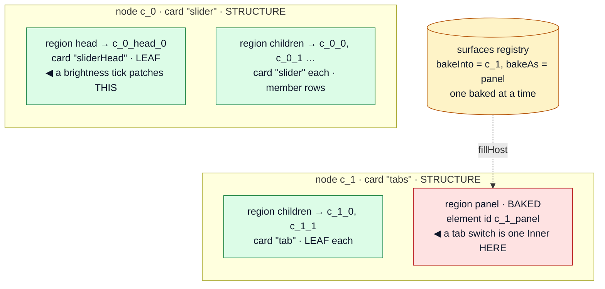
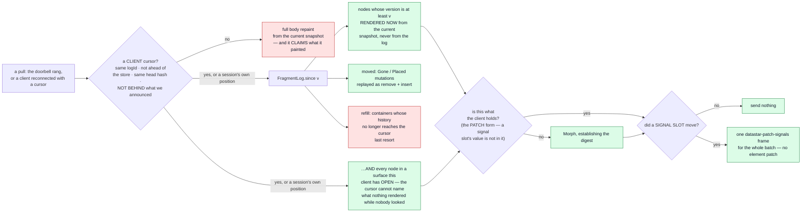

# fh-datastar-view — the rendering pipeline

How a Home Assistant state change becomes bytes in a browser: what runs **once per slug** (shared,
whatever the viewer count) and what runs **once per connection** (because only that connection knows
what its viewer has selected).

> **This is a current-state document, and it is the map we plan changes against.**
>
> It describes the pipeline as the code is today — not a proposal, not a history. Keep it true:
>
> - Change the pipeline, change this file **in the same commit**. A diagram that lags the code is
>   worse than no diagram, because it is trusted.
> - An **ADR that alters this pipeline must update this file too** — the ADR owns the *decision and
>   its rationale*, this file owns *the shape of the thing*. They are not alternatives to each other.
>   ADRs [0011](adr/0011-the-live-connection.md) and
>   [0012](adr/0012-each-session-renders-what-it-is-owed.md) are the two that most often will;
>   [0003](adr/0003-candidate-sets.md) (candidate sets) and
>   [0007](adr/0007-state-activated-surfaces.md) (state-activated surfaces) own two of the three node
>   kinds below.
> - When proposing work here, say which box moves. "Render outside the critical section" is a
>   statement about §1; "prune at pull time" is a statement about §6.
> - Everything here is current state. Work in flight lives in a `plan-*.md` and moves into this file
>   as it lands; a plan is deleted once its decisions are in the ADRs and its shape is here.

---

## 1. End to end



**A route declares its own requirement; a route group declares one for all of it.** Only a PAGE
load redirects to login — a human is waiting there — and everything that page then opens answers
401 instead, because a refusal on one of those means the session died. That is one requirement
with a caller-chosen `onInvalid`, not two. Admission is not one-time:
a page has finished long before anything could change, but an SSE stream runs for hours, so the
two SSE routes go through `handleStream`, which wraps the body in one `interruptWhen` over the
same `Access.permits` the door used. An action POST names its dashboard in the URL and may only
reach an entity that dashboard references — live membership varies, the candidate LIST does not.
See ADR 0023.

**Nothing is pushed.** A frame is recorded once per slug; every byte is produced by the session that
will receive it, from the same `Patches.resume` a reconnect runs. A live tick is a resume from
`position + 1` — one mechanism, not two — which is why there is no audience tag on a patch and no
per-client filter at the wire edge: a patch exists only because the session that will send it asked
for it, against its own open set and its own record of its own DOM.

The recorder is **one fiber per slug** (`Server.publisherFor`), re-armed by `switchMap` on every
renderer swap — and a swap past the first mints a fresh log identity, so cursors issued against the
old renderer cannot be resumed.

**Three scopes, not two.** Getting these confused is the easiest mistake to make here:

| Scope | One per | What lives there |
|---|---|---|
| Global | process | the HA WebSocket, `HaFeed`, **the `StateStore`**, the `changes` topic, the `Sessions` registry, the `AuthSessions` registry (a different fact — `Sessions` is keyed by `conn` and is a TAB, `AuthSessions` is keyed by a cookie and is a PERSON) |
| Per slug | dashboard | the recorder fiber, the `RendererState` (in a `SignallingRef`: `Ready(renderer)` or `Failed(message)`, hot-swapped on edit) **and, when ready, the renderer and the member graph inside it**, the `FragmentLog`, the doorbell, the `RenderCache` |
| Per connection | browser tab | the `Session` — normally created by the DOCUMENT and adopted by the stream, but MINTED by a stream or a surface tap that names a `conn` this process does not have, empty (slug, open surfaces, control queue, plus `holds`/`position`/`told` — what THIS client's DOM has, how far it has been served, and the newest version it was ANNOUNCED, which is the most it can echo back), the SSE stream, that viewer's selections |

There is exactly ONE store and ONE upstream subscription for every dashboard — `HaFeed.resource`
creates the store, `Server.fromFeed` takes `feed.store`. Dashboards are views over one shared state,
never separate feeds.

---

## 2. The setup, in pseudo-code

The same thing as §1, in words, because the diagram cannot show ordering and lifetime.

### Boot — once per process

```
open ONE WebSocket to Home Assistant, subscribe_entities
  the opening frame IS the subscribed set in full, so there is no separate seeding step
  UNFILTERED at boot — nothing is built yet, so nothing knows which entities matter,
  and it is this frame that fills the store the boot waits for
create ONE StateStore              // for every dashboard, not one each
evaluate the ONE entrypoint        // site.pkl -> slug -> dashboard (ADR 0021);
                                   // decoded PER SLUG, and neither a broken
                                   // dashboard nor a broken entrypoint crashes
                                   // the boot — both register
  per slug: one RendererState in a SignallingRef
      Ready(renderer) when it built, Failed(message) when it did not
      // hot-swapped on edit; a failed dashboard is watched, serves an
      // error page, and rebuilds live when the source is fixed
  per slug: one FragmentLog with a fresh id, in a Ref, and one doorbell
create ONE Sessions registry, and ONE LiveSite holding all of the above
  // plus, per slug, what it evaluated to and whether the entrypoint owns it
recorders follow the registry     // sharedPatchPublishers reconciles toAdd/
                                   // toCancel against LiveSite.changes
  // a recorder STARTS IMMEDIATELY, and runs whether or not a browser connects
```

### Membership moves while it runs

The slug set is not fixed at boot, and the registry write IS the recorder's
lifecycle — there is no second path that could disagree:



Three properties worth stating, because each is silent when broken:

- **Installing a slug IS starting its recorder**, and removing one IS stopping
  it. A removed slug cannot leave a fiber diffing every state batch forever.
- **Removal only ever reclaims a slug the ENTRYPOINT dropped**: every live slug
  records its `Origin`, so a pushed one (ADR 0010) cannot be in the removal set —
  it is not the entrypoint's to drop, and no second copy of the membership has to
  be kept in step to know that.
- **An unchanged dashboard is not re-installed.** The watcher fires on anything
  in the workspace; writing a `Ready` state anyway emits on the slug's
  `SignallingRef`, which rotates its log identity and repaints every open
  browser. The comparison is per slug, so one author's edit repaints one
  dashboard.

### A browser opens a dashboard

```
GET /d/:slug
  a Failed slug serves the error page: a self-contained HTML document (no
    renderer, no theme, no cursor) naming the slug and the build error, with an
    editor link straight to the source — the fix path. Its only script is the
    Datastar module; `data-init` opens the dedicated `sse/dashboard/<slug>/recover`
    stream, whose `_reload` signal the page's `data-effect` turns into
    `window.location.reload()`. Opening under `Failed` sends the inert
    `recover-open` comment (dropped by the browser before Datastar), not a
    reload (no reload loop); under an already-`Ready` slug it sends an
    immediate reload (the fix landed between render and connect). Recovery
    reloads exactly when the slug does — a fix, or a re-broken edit whose
    changed error message the page must show. Non-HTML consumers see
    a failed slug as absent, exactly like an unknown one
  render the WHOLE page from the current snapshot
  mint conn; create Session{slug, open surfaces, control queue, holds, position}
  holds = the digest of every node this render painted   // what THIS client's DOM has
  told  = this version — the page renders a cursor into itself, so the document
          is the first announcement, and a reconnect is measured against it
  register it, and schedule a reap if no stream adopts it within AdoptionWindow
  embed in the page as Datastar signals: the cursor under `_cursor` (logId,
    storeVersion, headHash, styleHash), conn, and haDown READ FROM `healthy` — not a hardcoded false,
    or a page loaded while HA is unreachable renders as healthy until the
    stream corrects it
  ...and conn again on the data-init URL, which is what the connect reads
  close the body with fhScroll(slug): re-apply this tab's saved scroll offset
    // LAST, so the body's full height is already laid out and the offset
    // lands before the first paint. A page holding a streaming fetch is not
    // bfcache-eligible, so crossing dashboards (a document load, ADR 0002)
    // has no browser mechanism to fall back on

GET /sse/dashboard/:slug/patch
  an UNKNOWN slug is a 404, decided on the stream's own single lookup:
    // not in the route — a route-side `renderers.get` and the stream's read
    // could disagree (a slug removed between them) and answer a 200 empty-body
    // SSE instead. Nothing is registered by the time the gate says no
    // (registration is bracketed to the stream body, which never runs).
  announce `conn` ONLY if this URL named none (a bookmarked SSE endpoint):
    the document seeds it, so echoing it back says nothing
  retire the session `?prev=` names, if any, unless a stream is HOLDING it
    // this tab's previous document, from sessionStorage. A reload mints a
    // fresh conn, so without this its predecessor sits in the registry for a
    // whole linger window holding an old position — and the floor is the
    // LOWEST position, so a few reloads keep the changelog un-prunable.
    // Retiring is all that is wanted: the old holds describes a DOM that no
    // longer exists. The not-Held guard is for a DUPLICATED tab, which
    // inherits sessionStorage and would otherwise evict a live viewer
  adopt the session that URL's conn names (epoch++); mint one under the same id
    if it is gone — a reap, a bookmark, a restart: costs suppression, not correctness
  opening patches, narrowest that is still correct:
      resume   if the cursor's logId matches, nothing structural moved, AND the
               cursor is not behind `told` — a client that never acknowledged
               what we announced has `holds` we cannot answer from
      repaint  if it does not      // claims what it painted, same as the document
      reload   if the document itself is stale
    ...then position = WHAT THIS CONNECTION CAN PROVE IT SENT: the doorbell's
      value (read BEFORE the log) for a resume, since a resume can only answer
      for versions the changelog describes; the snapshot's version for a
      repaint, which painted all of it
  then stream: pulls ▸ control ▸ reloads ▸ haDown ▸ keepAlive
    // PULLS have no window to nest around: the doorbell hands a new watcher
    // its current value, and the pull USES it, so a frame recorded before this
    // stream existed still wakes it.
    //
    // RELOADS are the branch where that does not follow. They are merged after
    // the opening block, so they subscribe once the cursor is already out, and
    // `renderer.discrete` gives a late subscriber only the CURRENT value —
    // which says nothing about whether it moved. So the comparison is seeded
    // with the renderer the HANDLER read, and the first pair asks "is what is
    // current still what I served you". Reading it off the subscription
    // instead cannot tell "unchanged" from "changed while nobody was looking",
    // and the second leaves a client on a dashboard that no longer exists.
  the whole response, AFTER untilRevoked wraps it, is interruptWhen'd on this
    stream's tenure: a later stream displaces it by taking the next epoch
    // NEVER on the stream handed to untilRevoked. fs2 interruption is scoped,
    // so interrupting a branch of that merge ends the branch without the merge
    // learning it completed, and the other branch is AuthGate's Stream.never —
    // the response body then never ends and the displaced client hangs.

on disconnect
  release the session into a LINGER (Tenure.Lingering), but only if this stream
    still OWNS it — a displaced stream must not put the live one out to pasture
  it stays registered and recorded for, so a client back inside LingerWindow
    resumes against its own holds instead of paying for a repaint
  after the window, the reaper drops it — but only from exactly the tenure it
    expected, so a reconnect that lands while the reaper sleeps simply wins
```

A session's whole life is one value (`Tenure`), walked in order:

```
Fresh ──(a stream adopts)──▸ Held(1) ──(that stream ends)──▸ Lingering(1)
  │                             ▲                                │
  │                             └────(a reconnect adopts)─────────┤
  └──(AdoptionWindow passes)──▸ Reaped ◂──(LingerWindow passes)───┘
```

Every transition names the tenure it expects to replace, which is what makes
the reaper unable to race a stream: both decide on the same ref, so the loser
sees the winner's answer rather than acting on a stale read. `Held` is also the
only state that counts as a live stream (`Sessions.liveStreams`, the readiness
seam tests wait on) — a lingering session is registered and has nobody to send
to.

### An action POST and its feedback

The CQRS split (action POST is no-content; the result arrives later over the
stream, ADR 0005) leaves a click visibly answerless, so the card layer adds
client-only feedback around the `@post` — see `docs/adr/0019-an-action-in-flight.md`:

- **Busy, per node — one splice the card places, not four.** A card declares
  `busy = true` on the tap and splices `tapMod.guardClick` into its click
  expression and `tapMod.guard` beside it. Both carry their own `{{#busy}}`
  section, so the card places them unconditionally and an unguarded tap emits
  nothing. What lands is `data-indicator="_<id>__busy"`
  (the value form — the pinned bundle splits attribute KEYS on `__`, so the
  keyed form would arm a differently-named signal), `data-fh-node`, the refusal
  handler, `data-class:fh-disabled="$<id>__busy"`, and a click wrapped in
  `$<id>__busy ? '' : …` (a second click while in flight is a no-op). The
  indicator clears in a `finally` on success AND error. The signal is
  `_`-prefixed client-only state: it never joins a request and is per-node, so
  one card spinning never disables its sibling. A node re-render (the state
  change that is the whole point of the action) replaces the element and resets
  the signal — that is the NORMAL clear. The busy LOOK is TWO timings (ADR
  0019). `fh-disabled` (dim) and `fh-loading` (`cursor:progress`) bind straight
  to the signal and are IMMEDIATE — they answer the tap. The spinner (whatever
  class the THEME named under `busySpin` — BeerCSS's `.shape.loading-indicator`,
  a self-morphing SVG mask around any `i.mdi` glyph the element carries; ADR
  0020) binds to `_<id>__busy_slow`, which a
  `data-on-signal-patch__delay.300ms` handler on the same element copies from
  the busy signal after the threshold — so a fast action never adds the class at
  all. The gate is that signal, NOT CSS: a class carries layout as well as
  paint, so `animation-delay` cannot defer it. `busyVisual = false` on a
  tap/slider drops every class binding but never the guard.
- **The slider's value commit is the second guarded element.** A slider commits
  on release (`data-on:change` → the value POST), so its range input carries the
  same pieces under its own `_<id>__busy_change` signal (never sharing the power
  button's name — the indicator counter is per-element but writes a named
  signal, so a shared name would let one element's `finished` clear the other's
  busy). While the signal is set the input is also `disabled` — safe because
  busy can only become true on release — so a drag back on is frozen at the
  browser and a programmatic `change` is swallowed by the guard. The busy class
  rides the `.slider.max` track wrapper (and the head badge, whose icon spins
  during the commit).
- **A refusal is signals on a 200, not a status** (ADR 0024). Every refused
  action — HA rejecting the call, an entity this dashboard does not name, an
  unknown surface, a `conn` on another slug — goes through `Server.actionRefused`
  and answers 200 with a `datastar-patch-signals` body: `_<node>__error` on the
  control that was pressed, `_<group>__pending` cleared, `_toast` carrying HA's
  own message. The two ids ride in the action's query string, read off
  `data-fh-node` at click time. The bundle parses a response body only on
  exactly 200 (`if (M !== 200) { … return }`), which is why a 4xx could never
  have carried any of this.
- **Nothing is coming, so no ask is outstanding — one rule, in the shell.**
  `Server.PendingSweep` clears every `*__pending` signal on a dead stream
  (`_sse > 0`) or a non-200 response, via `@setAll('', {include:/__pending$/})`.
  Both are page-wide facts, so neither knows nor needs which group asked; a
  refusal the server SENDS is different and names its own group. Busy signals
  are not swept — the bundle dispatches `finished` in a `finally` and the
  indicator clears on a counter, so a busy state cannot outlive its fetch.
- **Failure toast, in the shell.** `<body>`'s signal-patch handler calls
  `window.fhToast` when `_toast` is written, showing a themed `fh-toast`.
  `shell.ts` also keeps a `datastar-fetch:error` listener for what a signal
  patch cannot reach — a response that is not 200 at all, whose detail carries
  only `status` — filtered to elements under a `[data-on\:click]` (the
  escaped-colon selector; the persistent stream's errors arrive with `el` =
  `<body>` and are already the `_sse`/haDown banners' job).
- **Connection banner, the same split the other way.** `shell.ts` also
  re-dispatches the `datastar-fetch` events whose element IS `<body>` as
  `fh-stream`, and the banner's debounced `data-on` binds that. The filter
  cannot live in the banner's own handler: a debounce keeps only the last event
  of its window, so an action's fetch would displace the stream event it
  followed. Both directions have bitten — a rejected click raising
  "Reconnecting…" on a live connection, and a stream frame landing during a
  failing tap putting the banner away again.
- **The feedback layer never blocks the patch path.** A call that WORKS answers
  `NoContent` and the state change flows back over the persistent stream; a
  rejected one answers signals and never touches the stream.

### A state change arrives — once, globally

```
StateStore.update(frame)                    // one Ref.modify for the whole frame
  version++ ONLY if some entity's content really moved
  stamp each MOVED entity with that version  // EntityState.contentVersion;
                                             // a deduped re-seed keeps its old one
  publish List[StateChange] on `changes`

every slug's recorder wakes
  read snapshot+version together, and sessions.openSets(slug) + floor(slug)
  syncMembers -> apply the frame to EVERY set's member graph, and
      report what it did to each: the member lists before and after, plus the
      members whose CASE was replaced in place. BEFORE the gate and for
      every group, not the visible ones: the graph tracks the state stream, so
      a frame nobody records still moves members and the next page render must
      see them. Only a CHANGED entity can have crossed a query or case
      boundary, so a frame costs the number of CHANGES, not the size of the
      house — and a frame that only ticks members walks no member list at all
      (10 µs on a 2 000-entity house, flat in group size)
    NO SESSIONS -> record nothing at all, just mark the gap (log.skipped) and
      stop. A dashboard with no browser on it is the normal state of a home
      instance. Safe only because a document registers its session BEFORE
      reading the snapshot it renders from, which makes any version skipped
      one that document already contains
    visible = surfaces some session can actually SEE  // widens what is considered
  plan    -> staticIds (members included — they are in the reverse index),
             sets (which to ask about PRESENCE/ORDER), flips
  record  -> the changelog, and nothing else:
      flips first    -> evict the departed branch, record Gone/Placed
      static         -> node -> version    // members are in here: they are in
                                           // the reverse index like any node
      sets           -> the members whose CLAUSE was replaced (no entity edge can
                        name a card binding nothing live), then Gone/Placed per
                        membership move, or a filled host
                        (a fill is recorded as `filled`, which raises the
                         container's horizon — "any cursor below this gets
                         this host")
  ring the doorbell with the version          // AFTER the log is written, or a
                                              // session could set its position
                                              // past changes it never saw

each connection wakes and PULLS
  resume(log, holds, snapshot, position + 1, open, its own ui-state)
      -> render the candidates IN THE PATCH FORM; send the ones whose digest is
         not what it holds
      -> and ONE datastar-patch-signals frame for the signal slots whose value
         is not what this client's record holds. A node whose only movement was
         a signal slot therefore emits no element patch at all — that silence is
         the feature (ADR 0017), which is why the frame is collected from the
         CANDIDATES rather than from the patches
  applied  -> forget the hosts those patches re-supplied, claim what they placed
              and what the frame set (merged per node, never replaced: a morph
              says nothing about the signals bound inside it, and a frame says
              nothing about the bytes)
  position = the version it woke for                // ALWAYS, even when it was
                                                    // owed nothing
  write bytes — but ONLY if there were any: a frame this client was owed
    nothing for is silence on the wire, cursor included. The keepalive carries
    the cursor forward instead, so `position` may run ahead of what the client
    holds by up to one interval. Safe, and bounded to a container refill —
    the argument is on Session.position
```

### The log

```
keyed by node id: the version it last moved at   // no digests: what a CLIENT
                                                 // holds is the session's answer
  a later write overwrites — latest wins, and a version never goes backwards
mutations: Gone / Placed per node, latest wins
pruned by the FLOOR: the lowest `position` any live session holds. A mutation
  below it cannot appear in any resume any session will ever run — exact, where
  the rule it replaced was a one-hour wall clock
  per-container `horizon` records the version at which its history became incomplete
  -> a cursor below a container's horizon gets a refill instead of a delta
     (a CLIENT cursor is not bounded by the floor, which is why pruning raises it)
completeFrom: the whole log going incomplete — see the gap above
absence means "unknown, send it" — so dropping an entry is ALWAYS safe
```

### Reconnect

Same call as a live pull; only the cursor differs.

```
client sends back its stored signals: logId, version, headHash, styleHash
  different logId, version ahead of the store, head moved, or a cursor from
    before a stretch this slug did not record -> full repaint
  otherwise since(version):
      nodes   whose logged version >= cursor   -> rendered NOW, sent if the digest
                                                  is not what this client holds
      ...AND every node in a surface this client has OPEN — nothing may have
              rendered it while nobody was viewing it, so the cursor cannot
              name it and only re-rendering can tell
      moved   Gone/Placed                      -> replayed as remove + insert
      refill  containers whose history aged out -> whole host
```

A client's cursor gets `>=` where a session's `position` gets `+ 1`, and the difference is who is
claiming: a client can hold version V having seen only part of it, where a position is what this
server itself last sent.

---

## 3. Inside `Patches.record` — the three kinds, and what each writes

Nothing here renders. Everything it needs is state: a flip's selection is `resolveActiveByState`,
and membership arrives already applied — `MemberGraph.syncMembers` moves the member graph for every
member container before the gate, and hands `record` each container's list before and after plus
the members whose case it replaced.



**There is no fourth kind.** A node whose markup reads its own viewer's selection is not one: its
version moves like any other node's, and the render that reads a selection happens where the viewer
is. Nothing here classifies a node by whether it varies, because `record` never renders.

**Filling had to survive the loss of the render**, or the wire would move. It is recorded as
`FragmentLog.filled`, which raises the container's `horizon` — already the mechanism for "no delta
describes this, send the host" — so `resume` reaches the same patch from the other side. A fill
also `touched`es the members it leaves, because those entries are what keep the group *established*
for the next membership change.

*What* fills is deliberately narrow: only the two cases where a fill re-sends nothing — everything
arrived, or everything left — plus the no-baseline fallback. Filling on a churn FRACTION instead
would re-send every member that did not change.

---

## 4. Why the flip records nothing but structure

A flip is server truth — the branch every viewer must move to — but *which* branch a given viewer
has baked, and what belongs inside it, depends on selections below it. So the recorder does the
part that is identical for everyone (evict the departed branch, record where it went) and each
session fills the host for its own selection when it pulls. A branch no connected viewer reaches is
never rendered at all.

That is the same mechanism as every other node, not a second path — which is the point. Sharing a
verdict between viewers who agree would need a deferred render and a memo; rendering where the
viewer is needs neither.

**A branch fill forgets by HOST, not by prefix.** A branch's content ids are `s_<surface>__…`,
which no prefix of the container's id reaches, so the patch names the surfaces at that host
(`Patches.hostEvicts`) as what it made unknown. A SET's members are `gid_…`, so there the set's
own id is the right root — a set has no card and no declared region, so it is the one container
that is neither.

**And then it CLAIMS what it put there** (`Renderer.HostContent.claims`). Forgetting alone left the
arriving branch unknown as well as the departing one, so the next tick that made any node in it a
candidate re-sent bytes the client had just been handed. The two container kinds claim different
ids and that is why the renderer decides it rather than the fill site: a set's members are separate
renders, so each part is itself a claimable node and its bytes are hashed; a state group's branch is
ONE walk whose part is a composed subtree under a root with no rendering of its own, so it claims
the walk's per-node digests (`Traced.claims`) — which cost nothing, the walk having produced them
already.

---

## 4a. Cards, nodes and regions — what a patch may target

Everything above says "a node's patch". This is what decides which nodes have one.

A **card** is a template with named **regions** — the holes something else fills. The card alone
decides the node's kind, and that is the whole rule:



**A region is filled by NODES, and that is what makes the guarantee structural.** There is no hole a
patch could reach through, because every hole holds nodes with ids and patches of their own. A card
that wants its own markup to move puts that markup in a region as a node — a slider's head is a leaf
card beside the rows for exactly this reason.

A region declares HOW it is filled, and the two are not interchangeable:

| `fill` | Filled by | Element id | Rendered |
|---|---|---|---|
| `eager` | the node's own `regions[name]` children | none — they arrive nested | with the parent, in one pass |
| `baked` | a SURFACE from the bake group, per viewer | `hostId` = `<nodeId>_<bakeAs>` | only the selected member, lazily |

Laid over one slider and one tabs card:



Note what the slider buys by being two regions: the master's state moves `c_0_head_0` and reaches no
row, because the rows are not inside the head's element. Nothing checks that at render time — the
rows are simply somewhere else.

**Ids carry the region.** A child's id segment is its index within its region, prefixed by the
region name unless it is the default one (`LayoutNode.segment`): `c_0_0` in the default region,
`c_0_head_0` in `head`. A region name can never look like an index — `validate` rejects an all-digit
one — so the two shapes cannot be confused.

## 4b. The member graph — a member container's members ARE nodes

The dashboard's graph has two halves. The **static** half (`Renderer.allIndexed`) is computed once
from the `Dashboard`: every authored node, keyed by its location-derived id. The **live** half
(`MemberGraph`) is a container's members, and it is maintained by the state stream rather than
computed.

**One kind of container feeds it**: `LayoutNode.SetNode`, via `MemberGraph.MemberSource`.

The two halves are two files, and the seam between them is one sentence: **`MemberGraph` decides
presence and order, `Renderer` paints.** `MemberGraph` reaches back into the renderer for nothing —
it is constructed from the `SetNode`s in the static index plus each indexed id's layout root, and
answers membership questions with no template, no mustache context and no document walk. The
`render*` half deliberately stayed behind: `resolveMember`, `renderResolvedMember` and
`renderSet` need `templates` and `identityCache`.

**`SurfaceGraph` is the same split, for the other decision.** Which branch of a bake group is
active, which tab a viewer is on, and which clients a patch at a given node may reach: selection and
visibility, decided there and painted here. It reads the same `rootOfIndexed`, plus `MemberGraph`
for the two node kinds the static index cannot place (a materialised member, a nested set
container).

Both are `private[runtime] val`s on the renderer, reached as `renderer.members.…` and
`renderer.surfaces.…`. Deliberately NOT re-`export`ed: a delegating wrapper reads as though the
renderer decided these things, which is what the split exists to stop, so the call site names the
half it is asking.

| | |
|---|---|
| candidates | a STATIC list, decided at build time |
| what the runtime decides | presence and ORDER — it never invents a member |
| a member's node | the clause's COMPLETE node, `entity_id` already on it |
| woken by | a change to a candidate, **or to an entity a guard names** |
| placement | the authored candidate order |

`MemberSource` was a trait over two implementations until query-driven groups
(`LayoutNode.Dynamic`) were deleted, and every difference between them followed from one thing: a
query group's members were invented at runtime, so it could not say who its candidates were, could
not place them by anything but entity id, and had to rescan the whole state map to find them. ADR
0003 has the rest; sets are authored through `@fh-dashboard/query.pkl`.

**Sets NEST.** A set inside a member — "a tile per room" — is an ordinary container with an ordinary
id, because a set's candidates are static and so the whole tree of them is enumerated at renderer
construction (`MemberGraph.sources`), before any state arrives. Its id says where it hangs:
`<member>_<clause>_<child path>`, every segment static. The inner members are graph nodes like any
other, so a bulb patches its own element and its tile is never re-rendered — which is the point of
nesting rather than composing bytes.

Two rules hold that up, both silent if broken: `Member.entitiesOf` stops AT a nested set (descending
would wake the tile on every bulb inside it), and container selection reads `MemberGraph.sources` rather
than the static index (a nested set is not in the index — it hangs off a member, which is the
live half). The second was a real bug: correct ids, correct HTML, zero patches.

The id scheme itself is ONE function, `MemberGraph.innerSetId`, read from both ends —
`MemberGraph.sources` registers a container under it, `resolveChild` paints an element under it. A
second spelling of it is the same silent failure again: the recorder maintains a container the
browser does not have. `SetNodeSuite` pins the property rather than the spelling — every group the
markup shows is one the graph registered, two levels deep.

**A set with a live `orderBy` or a `limit` is not INCREMENTAL.** One entity moving can reorder its
neighbours, or push a different member past the cut, so `syncMembers` rebuilds that container's
member list instead of patching one place in it (`MemberSource.stable`). The cost is O(candidates)
for a container the frame actually touched — bounded and static, where the query group it replaces
rescanned the whole house. Everything downstream is unchanged: a rebuild still reports arrivals,
departures and now MOVES, and a member that merely ticked still comes through the reverse index.

A member is a real `LayoutNode.Component` — a card, its slots including the entity as a literal
`entity_id` slot, its cell — stored under the id its `MemberKey` derives. That literal slot is the
whole trick: `renderCase` already set it on every render, so setting it ONCE, at membership time,
is all it takes for a member to stop being special. `renderNodeById` renders it,
`renderInputs` keys it, `elementId` patches it. There is no reverse `childId -> entityId` lookup,
because nothing needs to recover an entity from an id — the node carries its own binding, as every
other node does.

Three properties hold it up, and each fails silently if broken:

- **A member is selected like any other node.** `componentsFor` includes members binding the
  entity, so a member re-renders because something it binds moved — the group's query is asked
  about MEMBERSHIP alone. Two consequences: a case slot naming a second entity ticks (it never
  did, silently), and `rootOf` must resolve a member through its group or a member inside a
  surface reaches clients who do not have it open. The one case the index cannot cover is a
  switch to a card binding nothing live: no edge names it, so `syncMembers` reports the members
  it REPLACED and the recorder touches those by id.
- **Ids are key-derived, never positional.** A positional id renames every node below an arrival,
  which is exactly what a per-member delta exists to avoid. Position is the ORDER (the group's
  member list, which is also what an insert anchor reads); the key is the IDENTITY. `MemberKey` is
  already a sum (`Entity` today, `Surface` for a state group's branch), so "one member is one
  entity" stays a property of the predicate engine rather than of the id scheme. A CANDIDATE SET
  has no arrivals — its candidates are static — so the invariant is not load-bearing there; keyed
  ids stay anyway, because `c_light_taklys` is readable in a patch log and `c_3_7` is not.
- **The recorder is the only writer.** A reader derives a group the stream has not reached yet but
  never installs what it derived. Installing would let a page rendering at version 5 — while the
  recorder is still applying the frame that produced 5 — become that frame's "before"; the frame
  would see no membership move, and a client still at 4 would never hear about the arrival.
- **A case switch re-materialises.** The node is state-derived, so a frame moving the matched entity
  across a case boundary REPLACES it. Marking it changed is not enough: the card would render
  happily, from the wrong branch, for as long as the entity stayed a member.

Mutation is in place, in an `AtomicReference` on the renderer, and that is not incidental. Three
things key on renderer IDENTITY — `publisherFor` rotates the changelog on a renderer emission,
`reloadRepaints` repaints every connection on one (and decides what counts as "one" with `eq`,
`Server.sameRenderer`), and `RenderCache` compares renderers with `eq`.
A membership change that produced a NEW renderer would rotate the log, repaint every browser and
flush the cache on exactly the case the graph exists to make cheap. Mutating in place keeps all
three keyed on the dashboard, for free.

---

## 5. What each scope renders

| | Per slug (the recorder) | Per client (the pull) |
|---|---|---|
| Runs on | one recorder fiber per slug | that connection's own SSE fiber |
| Sees | the full entity snapshot + the union of visible surfaces | one session's open set and ui-state |
| Renders | **nothing** | everything: opening paint, live pulls, resume |
| Writes | the changelog (`node -> version`, mutations, horizon) | that session's `holds` (digest **and** signals) and `position` |
| Cost of N viewers | ×1 | ×1 per node, via the per-slug render cache |

The last row is about the PULL path, and only the pull path. **A document render and a body repaint
go through no cache at all** — `Patches.bytes` is the `RenderCache`'s only entry point, and the page
walk renders directly — so two viewers loading the same dashboard simultaneously each render the
whole page. That is
[issue #130](https://github.com/perok/functional-home-assistant/issues/130): measured, deferred, and
worth ~5.7 ms on a 200-card page. Nothing here relies on it.

Each session renders for itself; what makes the pull ×1 is that every pull goes through one
`RenderCache` keyed by what the render READS (`Renderer.renderInputs`), so whoever arrives first
renders and the rest wait on the same slot. `SharedPassSuite`'s "rendered once between them" holds
the number as a cost contract: a 2 there means a key is varying per viewer where it should not, or a
pull is rendering outside the cache.

**A viewer's SELECTION is not in the key, and does not need to be.** A node whose bytes could depend
on which tab is showing would be a node holding regions — and structure is never a patch target, so
it is never rendered per frame and never cached. What renders on a tick is the LEAF beside it, whose
bytes mention no selection at all. So viewers on different tabs are owed the same bytes for every
node either of them is sent, and share one render. `RenderCacheContentionSuite` holds that at 1.0
renders a frame at any mix of viewers and tabs; a 2.0 would mean cost had started following the
selection again.

**Sessions at different store versions is the other half, and it is an ordering problem, not a
key problem.** Sessions pull on their own fibers and read the store when they get there, so they do
not all render from one snapshot. Three racing — newest, straggler, newest — would otherwise cost
three renders: the straggler's install evicts bytes the third is about to hit. The waste is never
the straggler's own render, which it needs, but what installing it throws away. So an install is
refused when the generation present was rendered from a snapshot at or ahead of the caller's on
every entity that can change its bytes (`RenderInputs.isAtLeast`); the straggler renders, is served, and the map
keeps the newer bytes. The accepted cost is in §8.

---

## 6. The pull path

The same call serves a live tick and a reconnect. What differs is only where the cursor came from.



The log stores **versions and structure, never HTML** — a pull renders from the current snapshot,
which is by construction at least as fresh as anything the log could have held. That is why a
missing entry is always safe: it reads as "unknown, send it", costing bytes and never staleness.

**It is also what makes the doorbell's coalescing free.** Versions landing while a session renders
collapse into one pull (`SignallingRef.discrete`), and nothing has to choose "the latest" of the
skipped ones: the pull selects candidates from `position + 1` rather than from the version it woke
for, so no candidate is dropped, and it renders them from the current snapshot, so no intermediate
value exists to be served by mistake. A slow client gets one frame with the newest value, not a
backlog — and that falls out of the two rules above rather than being a rule of its own.

"Rendered now" goes through the slug's `RenderCache` (`Patches.bytes`), which is what keeps N
sessions woken by one ring of the doorbell from rendering the same node N times. It changes no
answer — a hit yields the bytes the render would have — only who pays for it. The key is a SUBSET
of what the render reads, not all of it: an entity reached only through a signal slot is left out,
because its value is not in the patch form and so cannot move these bytes (ADR 0012).

**All of this section is the PATCH path.** The document path is a different shape and is described
in §6a: it consults no cache, shares nothing, and streams straight to the client.

**The render is shared per slug; the WIRE is not.** A batch's events are `SseFrame`s — the SSE text
already encoded to bytes (`Datastar`), served by `SseFrame.frameStreamEncoder` instead of http4s's
`ServerSentEvent.encoder`. That moves the encode from the socket to where the event is built, which
makes the process-wide constants (keepalive, recover marker, reload patch) encode once instead of
once per emission per connection — but it shares nothing on the live path, because `Patches.resume`
runs per session: what a client is owed depends on its own `holds`, permissions and selections, so a
value tick still costs one encode per client, exactly as the http4s encoder did — and the frames
are byte-identical, so that is duplicated work: measured at 10x in both time and allocation for ten
clients. It is NOT the `RenderCache` that would fix it, though that is the obvious guess: the cache
is keyed per node, and the common tick is signals-only and has no node. See "Known open questions".

**The digest is asked of the PATCH FORM**, and that is what puts a moving value on the cheap side of
it. A signal slot's value is not in those bytes at all (ADR 0017) — the element carries only its
`data-text` binding — so the node's digest stands still while the value moves, the morph is
suppressed, and one `datastar-patch-signals` frame carries the values for the whole batch. The
wholesale renders (page, repaint, fill, the document a JS-less browser gets) use the DOCUMENT form
instead: value inline, plus a `data-signals` seed on the node's `.fh-cell` wrapper, so an element
arriving that way is correct before any frame reaches it. That seed is why a fill can introduce an
entity nothing on the page was reading and still be right — there is no frame coming for it.

**A display signal is named by what it READS**, `_e.<domain>.<object_id>.<transform>`, so one entity
on three cards is one signal and one frame entry rather than three copies equal by construction
(ADR 0017). The `<transform>` segment is the bare word `state` when the slot reads the state plain —
the shape that covers most slots — a short hash of the expression for anything computed, or the
opted-in simple structure's key (`attr:brightness`, `percent:brightness:1.0:255.0` —
`Transform.Simple.key`) for the fast tier
(`Renderer.transformSegment` / `SlotSource.valueKey`); the slot NAME is deliberately not used, so
cards sharing a reading
share a signal whatever they call the hole. Dots are PATH separators — the bundle rewrites
`$_e.light.a.state` into bracket
indexing, and `datastar-patch-signals` deep-merges — so a frame carries a nested structure and never
a flat dotted key. A two-way `SignalBind.Bind` is the exception and stays node-scoped: an input
writes it back, so sharing it would let one card's drag drive another card's readout (ADR 0025).

The frame goes FIRST in a batch, which is what makes a member insert correct: its bytes are
patch-form and carry no seed, so the frame is the only thing that gives it a value. Measured at
paint level in `DatastarMorphContractSuite` — the other order paints a blank first.

The second question — *does this client already have these bytes?* — is answered by the **session's
own `holds`**, and only ever by that. It is seeded by the document that created the session (and by
a repaint, which paints the same thing), and updated wherever bytes are sent to this client:
`Patches.applied` for a pull, `Patches.hostFill` for a tab or popup swap. Never from what another
client was told.

**`holds` is trusted only as far as the client has ACKNOWLEDGED.** It records what was *sent*, and
a stream that broke mid-batch — or a tab frozen while its socket kept filling — leaves it claiming
bytes that DOM never got, after which every resume computes "nothing owed" and the tab is stale
until its user reloads. So a reconnect's cursor is compared against `Session.told`, the newest
version this client was ever *announced*: behind it, `holds` is unproven and the body is repainted.
The cursor can carry that proof because it rides LAST in its batch, so echoing it means applying
what came before it. This does NOT fire on an ordinary tab switch (a closed stream sends nothing, so
`told` cannot move), and the yardstick is `told` rather than `position` precisely because a pull
owing this client nothing advances the position while announcing nothing — see ADR 0011.

**Mutations are filtered by visibility too.** A `Gone`/`Placed` inside a surface this client does not
have open would patch an id its DOM lacks — a silent no-op, so it only ever cost bytes, but it is one
client's worth of another client's tab on every frame. `SurfaceGraph.visibleNode` on the container
is the test.

Mutations are pruned below the floor (`Sessions.floor`, the lowest position among a slug's live
sessions); a container whose history has been pruned past a client's cursor yields a `refill` rather
than a refusal. How long a returning tab still gets the cheap answer is three nested windows —
`LingerWindow` (2 min, its own session survives), then the changelog's reach while another viewer
holds the slug, then nothing, because an unwatched slug records nothing. ADR 0011 has the table and
why the window is not longer. **Nothing in the log reads a clock** — a version orders everything, and the only
thing wall time still decides is how long a session lingers.

---

## 6a. The document path — streamed to the client as it is walked

A page open is the other half of the system and it shares nothing with §6. It consults no
`RenderCache` (by construction — see the open question on issue #130) and it holds no per-client
record to diff against. What it does do is **write the document at the client**: the walk runs on a
blocking thread whose writes are the response body, so the browser has the `<head>` before the body
has finished rendering, and no copy of the page exists on this machine.

```
Server.renderPage    fs2.io.readOutputStream(8 kB) -> the response body
  IO.blocking          BufferedWriter(8 kB)          -> collapses the CALLS
                         OutputStreamWriter(os, UTF-8) -> Sink.Streaming
    Server.pageInto      head + banners        -> the wire
      Renderer.renderPageInto  chrome + body + restored dialog -> the wire
                               (body and dialog are WRITER HOLES, not values)
                               own = per-node Digest; a node whose two forms
                               agree is caught in a per-node buffer on the way
                               past (Sink.Streaming.digesting)
    Server.pageInto      scripts + closing tags -> the wire
  onFinalize(Succeeded)  session.holds.set(own)
```

The walk is push-based — `Renderer.executeInto` takes a `Writer`, a region is a `Writer => Unit` in
`regionWalk`, and `Sink` IS the writer the whole document goes through, shell included. Three things
follow, and all are load-bearing:

- **`digesting` is what differs between a page and a patch.** A node's own fingerprint is a digest
  of a contiguous run of the walk's output, and that run is what lets a signal-less member's
  fingerprint be a slice rather than a second render (§5). `Sink.Buffer` bounds the run by two
  offsets; `Sink.Streaming` has already let those bytes go, so it catches the run in a per-node
  buffer. Both then copy it once — `Digest.ofRange` cuts a String out of the buffer for the same
  measured reason `Streaming` builds one — so the difference between the sinks is that scratch
  buffer, not an extra copy. It costs nothing: on a tree where `digesting` fires on every leaf the
  streamed walk is 219 kB CHEAPER than the buffered one (`RenderBench.pageWalkStreamPlain` against
  `page`). The peak a page render holds is ONE NODE, not the document.

- **The `BufferedWriter` is not decoration.** The walk writes in thousands of small pieces and each
  is a `synchronized` call into `OutputStreamWriter`'s `StreamEncoder`, which buffers the ENCODE at
  8 kB but not the CALL. Collapsing those calls is worth 729 kB of churn per page open, and no
  time (`pageWalkStreamUnbuffered` against `pageWalkStream`).
- **`holds` is committed in the stream's finalizer, on success only** — the render has not happened
  when the response is built, so what the page painted is only known once the last byte is out. An
  abandoned or truncated page leaves `holds` empty, which reads as "unknown, send it", and the
  first tick repaints. `told` deliberately does not move with it (ADR 0011).

**`IO.blocking` on this route is deliberate, and it constrains the tests, not the server.**
`readOutputStream` is a pipe with two mutually-blocking sides — this writer, and fs2's reader —
and `TestControl` ticks one fiber on one thread, running `IO.blocking` inline on it. So under
simulated time whichever side is ticked first parks the only thread. Suites that fetch a document
therefore set `ServerHarness.simulateTime = false`; the note there records what that costs (little:
the windows they exercise are 50 ms) and what it gives up (determinism).

**Measured** (`RenderBench`, 200 leaves, the shipped card shape, `-f 1 -wi 5 -i 5 -prof gc`, one
run — read the ratios, not the absolutes):

| | us/op | B/op | |
|---|---:|---:|---|
| `pageServe` | 1,167 ±125 | 3,547,273 | buffered walk + encode |
| `pageWalkStream` | 1,305 ± 44 | 2,874,617 | streamed walk — SHIPPED |
| `pageWalkStreamUnbuffered` | 1,327 ±256 | 3,603,954 | …without the writer buffer |
| `pageStreamBuffered` | 2,318 ±904 | 3,232,255 | end to end, through fs2 |

The document is **128 kB**, so serving it costs ~15x its own size in allocation (those rows predate
the signal-seed work below; `pageServe` is 1.94 MB now). Most of what remains is the walk —
transforms, mustache contexts, slot resolution — which no sink can touch.

**The seed was half of it, and only a profiler could say so.** `-prof gc` reports how much a page
allocates, never where, and issue #237's guess — read off the code — named the slot resolution.
async-profiler over `pageSignals` put **49%** of a page open in `Datastar.nestJs` plus
`SignalId.segments`: a `groupBy.toList.sortBy.collect` per LEVEL per NODE, over a single-element
list, for a signal name four segments deep. The rows are now sorted once by path and walked by
index (`Datastar.pathsOf`), which took `pageSignals` from 3,399 kB to 2,044 kB (**−40%**). The names
are then fixed by the node's plan, so the seed itself is precomputed as literal chunks around value
holes (`Datastar.SignalSeed`): a further **−12.6%**, to 1,791 kB, and 1,275 µs to 836 µs end to end.
`page`, which carries no signal slots, stayed put. The live tick barely moved (151 kB → 148 kB): a
signals FRAME carries a few signals, where the SEED is per node.

**The per-node scratch buffer is borrowed, not allocated.** An own-rendering node's PATCH form is
rendered into a throwaway buffer purely to fingerprint it — `char[1024]` plus a `toString` per node,
for bytes nobody keeps, which the profiler put at a quarter of a page open. `Sink.scratched` lends
one buffer per THREAD to the whole walk instead (per thread because sessions render concurrently and
the walk is otherwise pure — the same reason `Digest.digester` is a `ThreadLocal`). `pageWalkStream`
**1,322 kB -> 1,113 kB, −15.8%**; time unchanged. Nested borrows fall back to allocating, which no
current path needs — instrumenting the borrow across the suite counts zero — so the guard exists to
keep "never render into a scratch while holding one" from being an unwritten precondition.

Comparing page rows across runs needs care. `gc.alloc.rate.norm` is deterministic WITHIN a run
(±200 B) but drifts ~**2.6%** between them — `page` came back anywhere from 1,295 kB to 1,329 kB in
one session with nothing on its path changing — so any claim under ~3% has to come from two arms
measured back to back.

**Compare the two WALK rows and nothing else.** `renderPageInto` is pure over a `Writer`, and ember
hands a buffered body out as a `Stream[IO, Byte]` just as it does a streamed one — so pricing the
sinks through `readOutputStream` charges one of them for machinery both pay, and buries the result
under an error wider than the gap (±904 against ±44). `pageStreamBuffered` is kept only because
issue #237's numbers are whole page opens.

So the two memory targets here are **not the same** and a change should say which it is for:

| target | what it is | what moves it |
|---|---|---|
| peak live bytes | was ~500 kB per concurrent page open, multiplying by open tabs | **streaming — done**; the peak is one node, asserted in `SinkStreamingSuite` |
| allocation churn | ~1.9 MB per page open, driving GC on a Pi 4 | the walk — transforms, contexts. Streaming was 672 kB of the old 3.5 MB (19%); the signal-seed work took another 1.6 MB (47%) across two steps |

A third target the stream also serves, and the one it is most visibly for: **time to first byte**.
The browser used to get nothing until the whole document was assembled; it now has the `<head>` —
stylesheets, module scripts, `<base href>` — while the body is still being walked, so subresource
fetches overlap the render instead of queueing behind it.

## 7. Where each box lives

Paths are under `modules/fh-datastar-view/src/main/scala/fh/view/`.

| Box | Code |
|---|---|
| a route's own auth rule | `auth/AuthGate.scala` · `Requirement` (`FromDashboard`/`FromAccess`, with `Requirement.Admin = FromAccess(Access.Admin)` — a public route is simply not wrapped), `accessFor`, `saySo`/`orLogIn`, `handleRequirement`, `loginRedirect`, `safeNext`; declared at each route in `runtime/Server.scala` |
| one rule over a whole surface | `auth/AuthGate.scala` · `require`; used by `runtime/EditorRoutes.scala` (all admin) |
| a stream that stops being allowed | `auth/AuthGate.scala` · `handleStream`; `auth/AuthSessions.scala` · `watch` |
| what an action may touch | `model/Dashboard.scala` · `referencedEntities`; `runtime/Renderer.scala` · `references`; `runtime/Server.scala` · `actionResponse` |
| the slug inside an action URL | `model/Transform.scala` · the `$dashboardSlug` binding; `runtime/Renderer.scala` · `structuralVars` (`{{dashboardSlug}}`, the template copy); `build/DashboardBuild.scala` · `decode`'s `slug`, applied before validation |
| who a request is | `auth/AuthGate.scala` · `Identity`, `of` (ingress ▸ cookie ▸ bearer), `bearerUser`; `auth/Ingress.scala` · `userIdOf`, `IngressUsers.cached`; `auth/AuthSessions.scala` · `cookieOf` |
| logged-in people, and cutting a live stream | `auth/AuthSessions.scala` · `AuthSessions` (a `SignallingRef`), `watch`, `SessionStore` (`.fh/sessions.json`) |
| the login flow | `auth/HaOAuth.scala` · `authorizeUri`, `exchange`, `refresh`, `revoke`; `auth/AuthRoutes.scala` |
| HA disowning a session | `runtime/ServerApp.scala` · `revalidateOnce` (one sweep) and `revalidateSessions` (immediate, then every 5 min); `auth/AuthSessions.scala` · `stale`, `renew`, `remove` |
| which rule a dashboard carries | `model/Access.scala` · `Access.permits`; `build/Site.scala` · `decode` folds the site default; `model/Dashboard.scala` · `Validated.access`; `runtime/Server.scala` · `LiveSite.permissionFor` |
| feed → store | `runtime/HaFeed.scala` · `pump`, `runConnection` |
| store + changes topic | `runtime/StateStore.scala` · `update`, `changes` |
| per-slug recorder | `runtime/Server.scala` · `publisherFor`, `recordFrame`, `sharedPatchPublishers` |
| per-slug live state | `runtime/Server.scala` · `RendererState` (`Ready`/`Failed`) in `LiveSlug.renderer`; `runtime/ServerApp.scala` · `reloadSite` sets every slug's state on re-eval |
| which slugs exist, where each came from, and which is `/` | `runtime/Server.scala` · `LiveSite` (`applySite`/`failSite`/`installPushed`/`defaultSlug`), the pure `planSite`, `Origin`, `defaultSlugFor`; `runtime/ServerApp.scala` · `reloadSite` evaluates and reports |
| what a frame touches | `runtime/Patches.scala` · `plan` |
| what a frame writes | `runtime/Patches.scala` · `record`, `recordFlip`, `recordSet` |
| the doorbell | `runtime/Server.scala` · `LiveSlug.doorbell` |
| the log (the changelog) | `runtime/FragmentLog.scala` · `touched`, `filled`, `removed`, `placed`, `since` |
| a stretch nobody watched | `runtime/FragmentLog.scala` · `skipped`, `reaches`; `runtime/Server.scala` · `recordFrame`'s gate, `openingPatches`' cursor filter |
| a session's pull | `runtime/Server.scala` · `pull`; `runtime/Patches.scala` · `resume`, `applied`, `encode` |
| what a client holds | `runtime/Sessions.scala` · `Session.holds` (a `Held`: digest + signals) / `position` |
| the two render forms | `runtime/Renderer.scala` · `SlotForm`, `Resolved` (resolved once), `resolveTemplate` / `executeResolved` (run per form), `Traced.own` (the patch form lives here, and only for a node that has one) |
| a signal's name, and a node's values | `runtime/Renderer.scala` · `signalName`, `isSignalSlot`, `signalsFor` |
| the signals frame | `runtime/Patches.scala` · `signalFrame`, `Patch.Signals`; `runtime/Datastar.scala` · `signalsJson`, `signalsAttr`, `textBinding` |
| SSE stream | `runtime/Server.scala` · `sseStream` (the merged per-connection `Stream[IO, SseFrame]`), served by `Ok(...)` through `SseFrame.frameStreamEncoder` |
| the wire bytes | `runtime/Datastar.scala` · `SseFrame` (encoded at construction), `SseFrame.frameStreamEncoder` (frames → entity body, `text/event-stream`); `runtime/Patches.scala` · `encode` (merge adjacent, then render) |
| opening paint | `runtime/Server.scala` · `openingPatches` |
| sessions + surface actions | `runtime/Sessions.scala`; `runtime/Server.scala` · `withSession`, `sessionFor`, `openSurface`, `swapHost`; `runtime/Patches.scala` · `hostFill`, `hostEvicts`; `runtime/SurfaceGraph.scala` · `committedSelection` |
| a document establishes a session | `runtime/Server.scala` · `pageResponse`, `adoptOrMint`; `runtime/Sessions.scala` · `Session.adopt` |
| a session's lifetime | `runtime/Sessions.scala` · `Tenure`, `Session.release`/`relinquish`/`supersede`; `runtime/Server.scala` · `reapAfter`, `retire`, `AdoptionWindow`, `LingerWindow` |
| a tab handing over its session | `src/js/shell.ts` · `fhConn` (`sessionStorage`); `runtime/Server.scala` · `PrevConnParam`, `prevConnOf`, `retire` |
| scroll across a document load | `src/js/shell.ts` · `fhScroll` (`sessionStorage`, keyed by slug), inlined via `runtime/Server.scala` · `UrlSyncScript` |
| the colour a phone paints its own chrome | `runtime/Renderer.scala` · `themeColorTags` (the theme's background token, one `<meta>` per scheme, folded into `headFingerprint` because a style patch cannot rewrite a meta); `resources/pwa/manifest.webmanifest` for a cold launch |
| a document on its way out | `src/js/shell.ts` · the `pagehide` listener → `fh-leaving`; `lib/core/css.pkl` hides `.fh-offline` under it, so an aborted stream cannot paint an outage on the page being left |
| a stylesheet the first paint does not need | `model/Dashboard.scala` · `Theme.deferredStylesheets` (the icon font); `runtime/Server.scala` · `page`'s `rel=preload` + `<noscript>` pair. In `headFingerprint` like any other `<link>`, and prefetched by `AssetCache` like any other theme URL |
| the actual rendering | `runtime/Renderer.scala` · `renderNodeById`, `renderHost` |
| the document render | `runtime/Renderer.scala` · `renderPageInto`, `renderBodyTraced`, `tracedInto`, `executeInto`; `runtime/Sink.scala` · the `Writer` the whole document goes through — `Streaming` for a page, `Buffer` for a patch — and `digesting`, which fingerprints a node from the run it just wrote; `runtime/Server.scala` · `renderPage`, `pageInto` (the shell, around a writer hole). Streamed to the client as it is walked — §6a |
| what keys a render | `runtime/Renderer.scala` · `renderInputs`, `activeBakeIndex` |
| the member graph | `runtime/MemberGraph.scala` · `Member`, `MemberIndex`, `syncMembers`, `membersOf`, `innerSetId` |
| which branch is showing, and to whom | `runtime/SurfaceGraph.scala` · `bakeGroup`, `resolveActive` (per viewer) / `resolveActiveByState` (per slug), `selectedSurfaces`, `visibleNode`, `visibleSurface`, `userSurfaceOf`, `rootOf` |
| evaluating a guard / activation condition | `runtime/Conditions.scala` · `matches`, `matchesIn`, `propertyOf`; ordering in `runtime/MemberGraph.scala` · `precedes`, `compareOn` |
| the render cache | `runtime/RenderCache.scala`; entered from `Patches.bytes` (morphs, placements). STRUCTURE is never cached — a card holding regions has its children in its own bytes, so it has no sound key — and that is decidable from the CARD (`CardDef.isStructure`) |
| what a cache entry is keyed by | node id -> renderer identity + ONE generation, holding the entity versions that render read. The renderer is in the key because a dashboard edit changes the MARKUP while the entity versions it reads stay put; a swap drops the whole entry |

## 8. Known open questions

Live list — delete an entry when it is answered, and say where the answer landed.

- **A cluster of stragglers at one older version no longer shares.** The accepted cost of the
  straggler rule in §5: they each render, where before the first to arrive would install and the
  rest would hit it. Deliberate — the newest snapshot is what more arrivals are coming for, so
  it is what the single slot should hold — and it costs renders, never wrong bytes. Bounded by
  how long sessions stay skewed, which is one frame's fan-out. Not currently measurable:
  `LiveWorld.change` waits for every session before the next frame, so the live harness has no
  version skew in it at all. Tackle it if a real deployment shows a persistent skew, and measure
  before widening the bound.

- ~~**An entity that VANISHES leaves a ghost member.**~~ *Closed by candidate sets.* Membership was
  maintained from deltas and a removal produces no `StateChange`, so the graph kept a member whose
  element was in no DOM and offered its id as an insert anchor. Candidates now come from the dump,
  and an entity vanishing is a registry change that rebuilds the renderer — there is nothing left to
  go stale (ADR 0003).
- **Ordering across sessions is assumed, not stated.** Sessions render on their own fibers and can
  sit at different positions. Nothing in the design depends on them agreeing — each pull is computed
  against the current snapshot from that session's own cursor — but that is an invariant worth
  writing down and testing rather than relying on.

- ~~**Carrying the converted attribute map across a tick.**~~ *Measured, and the answer is no.*
  `EntityState.javaAttributes` is rebuilt per state change even when attributes did not move, and
  that rebuild is **3.4%** of a signals tick's allocation (`RenderBench.resumeSignals` under
  async-profiler). The fix wants an `Attributes` type owning the JSON map and its derived Java view
  so that a delta touching no attribute returns the same instance — a hand-written `equals` on the
  core state type plus ~45 call sites reading `attributes` as a bare `Map`. That is a large change
  for 3.4%, and the same profile named items worth three and six times as much. Reopen only if a
  profile puts it somewhere else.

- ~~**Fills bypass the `RenderCache` entirely.**~~ *Measured, and the answer is no*
  ([issue #224](https://github.com/perok/functional-home-assistant/issues/224), closed). They still
  do — `renderHost` takes no cache and `Patches.resume` runs per session — but the only fill several
  sessions can ever share is a state-group FLIP (a tab switch is one client's own selection, a
  refill is per reconnect), and `RenderBench.resumeFlip` prices the whole of it at **~730 µs of CPU
  per flip at ten clients**, against 93.9 µs for one. A flip is an alarm arming; at one a minute
  that is 0.001% of a core, while `resumeSignalsFanout` spends 424 µs per TICK on the path that runs
  continuously. Reopen only if a profile of a real deployment puts a fill on it.

- **The document walk and the repaint bypass the `RenderCache` entirely** —
  [issue #130](https://github.com/perok/functional-home-assistant/issues/130), measured and
  DEFERRED, with the numbers on the issue. Neither stated obstacle stands: "what a parent EMBEDS is
  not what a patch carries" does not hold under regions (a leaf card's template IS its patch
  fragment, and structure is never cached), and the walk-is-pure-cache-is-`IO` one is only work.

  The measuring narrowed it to ONE change, and that is what it bought. **A live tick cannot hit
  bytes the walk installed**: the tick asks for that node precisely when an entity it reads has
  moved, which is what its `RenderInputs` key is made of, so the walk's generation is stale by
  construction. So the cheap half — install after the walk, no `IO` anywhere near it — buys nothing
  and is not the fix. The fix is the effectful walk, reading the cache during it, and nothing
  short of that shares anything.

  **That argument has a hole in it since the key narrowed** (ADR 0012). The key is now the entities
  whose movement can change a node's BYTES, so a tick whose only movement was a SIGNAL slot does
  not move the key — and the walk's generation is then live, not stale by construction. Signal
  ticks are the frequent ones, so this is not a corner. Whoever picks #130 up should re-measure
  before trusting the "cheap half buys nothing" conclusion: it was derived when every entity a node
  read was in its key.

  What it wins, so the work can be judged: a body render is 17 µs a node — 5.7 ms for a 200-card
  page whose HTML is 257 kB, 0.2 ms for the shipped starter. Ten coincident loads of the big one
  cost 57 ms of CPU while shipping 2.5 MB, so the render is ~2 % of the work it feeds. Real, and
  not urgent. `reloadRepaints` is N × the same body render and fires on a manual dashboard edit.

- ~~**The document does not stream, and the server's target is a Raspberry Pi 4.**~~ *Closed by
  §6a.* The walk writes through a `Sink` straight to the response body; the peak a page open holds
  is one node, not the document, and `holds` is committed in the stream's finalizer on success.
  Churn fell 672 kB (19%), not the ~10% the entry projected.

- **`session.control` is an unbounded `Queue[IO, SseFrame]`, and the bound is incidental.** Nothing
  in the type stops it growing; what stops it in practice is that only `swapHost` writes to it — a
  SURFACE TAP, never a tick. So a session whose stream has dropped accumulates one frame per tap
  the client still manages to POST (the fetch works when the SSE does not), for as long as the
  linger lasts, and the reaper drops the queue with the session. That is small, and it is a
  property of today's three call sites rather than of the queue.

  Worth bounding anyway if a fourth writer ever appears, and the answer is not "drop the oldest" —
  a patch is a delta, so a dropped one leaves the DOM permanently wrong. Dropping the SESSION and
  letting it repaint from `holds` is the recovery that already exists.

- **What an extra client on a tick actually costs, and where it goes.** `resumeSignalsFanout`
  minus `resumeSignals` over nine: **70 µs and 117 kB** per further client, against 262 µs for the
  first — so the `RenderCache` removes about three quarters of it and is earning its place. What
  remains is unprofiled: the changelog read, the visibility narrowing, the per-node cache lookup
  and digest compare, the signal diff against `Held.signals`.

  Encoding the frame is **~5% of that time and ~9% of those bytes**. Sharing it across clients
  measures 10x in isolation (`wireCommon` vs `wireCommonShared`) and that number should not be
  quoted at tick level — it is what PR #265 aimed at, attaching the memo to `Addressed`, which is
  per-session, so it shared nothing. If it is ever done it is **not** the `RenderCache`: that is
  keyed per NODE, and the common tick is signals-only and has no node. Frames are also not
  unconditionally identical (`Held.signals` is per-client, different tabs see different surfaces),
  so it must be a lookup, never an assumption. Low priority; the other 95% is the target.

- ~~**A signals tick costs MORE than a bytes tick.**~~ *Closed.* The suppressed morph was still
  RENDERED — rendering it is how we discover the bytes did not move — because the `RenderCache`
  key holds a per-entity `contentVersion` and the shipped `entityCard`'s name reads
  `friendly_name` as BYTES, which re-admitted the entity to the key on every brightness tick.
  `Patches.bytes` now hands the cache the resolved byte-slot values
  (`Renderer.byteSlotValues`) and `RenderCache.apply` reuses an entry carrying the same ones:
  `resumeSignals` 262 µs / 442 kB -> **102 µs / 151 kB**, landing on `resumeSignalsPure`'s
  106 µs. A signals tick is now the cheap one. Note the saving is one render per tick per SLUG,
  not per client — the clients behind the first already shared its render.

- **A morph-only client profile** —
  [issue #133](https://github.com/perok/functional-home-assistant/issues/133). ADR 0017 keeps the
  PLAIN form (no binding, no seed — today's pre-signal bytes) reachable behind one predicate for a
  device that implements `datastar-patch-elements` but not an expression evaluator. Nothing exposes
  it yet: such a client is equally defeated by `data-on:click` on every tappable card and
  `data-effect` on the URL mirror.

---

## 9. Two findings worth keeping at hand

The reshaping this file describes — the recorder, the doorbell, the per-session pull, the session
linger, the maintained member graph — **has landed**; its decisions live in ADRs 0011, 0012 and
0003, and the route it took is in the git history. Nothing in §1–§8 describes code that does not
exist.

Two findings from the cache work, which sit between the ADRs and so are easy to lose:

- An `if`/`else` host's branch is keyed on the RESOLVED selection rather than on what the selection
  reads. That was forced when the condition was quantified over the whole entity map; it stays
  because it is still the smaller key — a subject-free condition names its entities, but a count
  names all of its candidates, where the selection it resolves to is one number.
- The cache holds ONE generation per node PER SELECTION, and the asymmetry is the point: `plan`
  selects the nodes whose entity just moved, so a full `(nodeId, inputs)` key would grow forever at a
  near-zero hit rate — but the selection half of that key does not churn, and bucketing on it is what
  stops two viewers on different tabs from evicting each other.
