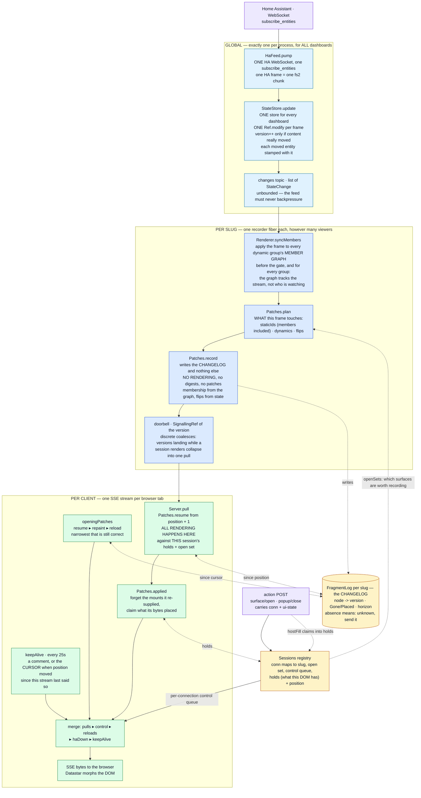
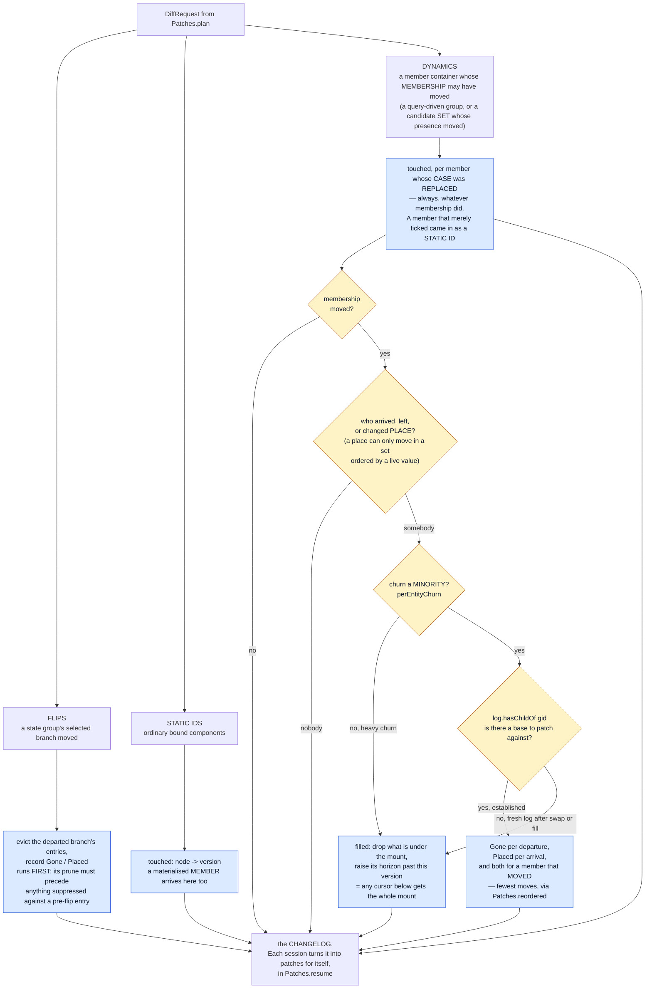
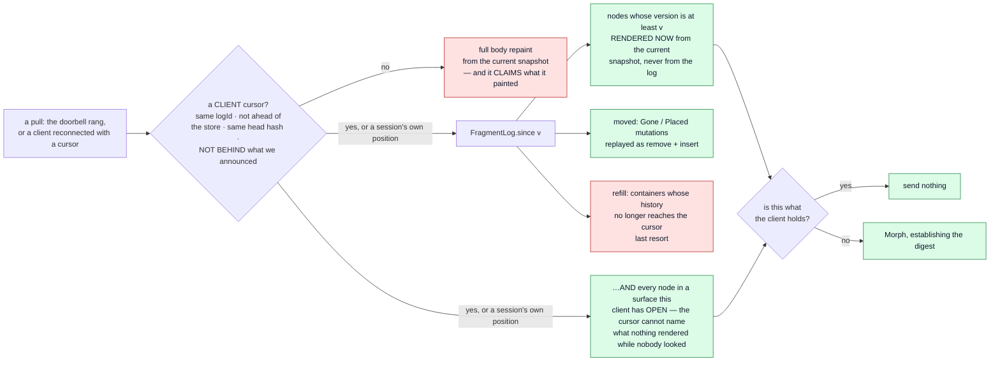

# fh-datastar-view — the rendering pipeline

How a Home Assistant state change becomes bytes in a browser: what runs **once per slug** (shared,
whatever the viewer count) and what runs **once per connection** (because only that connection knows
what its viewer has selected).

> **This is a current-state document, and it is the map we plan changes against.**
>
> It describes the pipeline as the code is today — not a proposal, not a history. Keep it true:
>
> - Change the pipeline, change this file **in the same commit**. A diagram that lags the code is
>   worse than no diagram, because it is trusted.
> - An **ADR that alters this pipeline must update this file too** — the ADR owns the *decision and
>   its rationale*, this file owns *the shape of the thing*. They are not alternatives to each other.
>   ADRs [0011](adr/0011-the-live-connection.md) and
>   [0012](adr/0012-each-session-renders-what-it-is-owed.md) are the two that most often will;
>   [0003](adr/0003-dynamic-groups.md) (dynamic groups) and
>   [0007](adr/0007-state-activated-surfaces.md) (state-activated surfaces) own two of the three node
>   kinds below.
> - When proposing work here, say which box moves. "Render outside the critical section" is a
>   statement about §1; "prune at pull time" is a statement about §6.
> - Everything here is current state. Work in flight lives in a `plan-*.md` and moves into this file
>   as it lands; a plan is deleted once its decisions are in the ADRs and its shape is here.

---

## 1. End to end



**Nothing is pushed.** A frame is recorded once per slug; every byte is produced by the session that
will receive it, from the same `Patches.resume` a reconnect runs. A live tick is a resume from
`position + 1` — one mechanism, not two — which is why there is no audience tag on a patch and no
per-client filter at the wire edge: a patch exists only because the session that will send it asked
for it, against its own open set and its own record of its own DOM.

The recorder is **one fiber per slug** (`Server.publisherFor`), re-armed by `switchMap` on every
renderer swap — and a swap past the first mints a fresh log identity, so cursors issued against the
old renderer cannot be resumed.

**Three scopes, not two.** Getting these confused is the easiest mistake to make here:

| Scope | One per | What lives there |
|---|---|---|
| Global | process | the HA WebSocket, `HaFeed`, **the `StateStore`**, the `changes` topic, the `Sessions` registry |
| Per slug | dashboard | the recorder fiber, the `Renderer` (in a `SignallingRef`, hot-swapped) **and the member graph inside it**, the `FragmentLog`, the doorbell, the `RenderCache` |
| Per connection | browser tab | the `Session` — created by the DOCUMENT, adopted by the stream (slug, open surfaces, control queue, plus `holds`/`position`/`told` — what THIS client's DOM has, how far it has been served, and the newest version it was ANNOUNCED, which is the most it can echo back), the SSE stream, that viewer's selections |

There is exactly ONE store and ONE upstream subscription for every dashboard — `HaFeed.resource`
creates the store, `Server.fromFeed` takes `feed.store`. Dashboards are views over one shared state,
never separate feeds.

---

## 2. The setup, in pseudo-code

The same thing as §1, in words, because the diagram cannot show ordering and lifetime.

### Boot — once per process

```
open ONE WebSocket to Home Assistant, subscribe_entities
  the opening frame IS the full entity set, so there is no separate seeding step
create ONE StateStore              // for every dashboard, not one each
evaluate every *.pkl entry         // slug = filename
  per slug: one Renderer in a SignallingRef   // hot-swapped on file edit
  per slug: one FragmentLog with a fresh id, in a Ref, and one doorbell
create ONE Sessions registry
for each slug: start a recorder fiber
  // STARTS IMMEDIATELY, and runs whether or not a browser ever connects
```

### A browser opens a dashboard

```
GET /d/:slug
  render the WHOLE page from the current snapshot
  mint conn; create Session{slug, open surfaces, control queue, holds, position}
  holds = the digest of every node this render painted   // what THIS client's DOM has
  told  = this version — the page renders a cursor into itself, so the document
          is the first announcement, and a reconnect is measured against it
  register it, and schedule a reap if no stream adopts it within AdoptionWindow
  embed in the page as Datastar signals: the cursor under `_cursor` (logId,
    storeVersion, headHash, styleHash), conn, and haDown READ FROM `healthy` — not a hardcoded false,
    or a page loaded while HA is unreachable renders as healthy until the
    stream corrects it
  ...and conn again on the data-init URL, which is what the connect reads
  close the body with fhScroll(slug): re-apply this tab's saved scroll offset
    // LAST, so the body's full height is already laid out and the offset
    // lands before the first paint. A page holding a streaming fetch is not
    // bfcache-eligible, so crossing dashboards (a document load, ADR 0002)
    // has no browser mechanism to fall back on

GET /sse/dashboard/:slug/patch
  announce `conn` ONLY if this URL named none (a bookmarked SSE endpoint):
    the document seeds it, so echoing it back says nothing
  retire the session `?prev=` names, if any, unless a stream is HOLDING it
    // this tab's previous document, from sessionStorage. A reload mints a
    // fresh conn, so without this its predecessor sits in the registry for a
    // whole linger window holding an old position — and the floor is the
    // LOWEST position, so a few reloads keep the changelog un-prunable.
    // Retiring is all that is wanted: the old holds describes a DOM that no
    // longer exists. The not-Held guard is for a DUPLICATED tab, which
    // inherits sessionStorage and would otherwise evict a live viewer
  adopt the session that URL's conn names (epoch++); mint one under the same id
    if it is gone — a reap, a bookmark, a restart: costs suppression, not correctness
  opening patches, narrowest that is still correct:
      resume   if the cursor's logId matches, nothing structural moved, AND the
               cursor is not behind `told` — a client that never acknowledged
               what we announced has `holds` we cannot answer from
      repaint  if it does not      // claims what it painted, same as the document
      reload   if the document itself is stale
    ...then position = WHAT THIS CONNECTION CAN PROVE IT SENT: the doorbell's
      value (read BEFORE the log) for a resume, since a resume can only answer
      for versions the changelog describes; the snapshot's version for a
      repaint, which painted all of it
  then stream: pulls ▸ control ▸ reloads ▸ haDown ▸ keepAlive
    // no subscription to acquire, so no window to nest around: the doorbell
    // hands a new watcher its current value, so a frame recorded before this
    // stream existed still wakes it

on disconnect
  release the session into a LINGER (Tenure.Lingering), but only if this stream
    still OWNS it — a displaced stream must not put the live one out to pasture
  it stays registered and recorded for, so a client back inside LingerWindow
    resumes against its own holds instead of paying for a repaint
  after the window, the reaper drops it — but only from exactly the tenure it
    expected, so a reconnect that lands while the reaper sleeps simply wins
```

A session's whole life is one value (`Tenure`), walked in order:

```
Fresh ──(a stream adopts)──▸ Held(1) ──(that stream ends)──▸ Lingering(1)
  │                             ▲                                │
  │                             └────(a reconnect adopts)─────────┤
  └──(AdoptionWindow passes)──▸ Reaped ◂──(LingerWindow passes)───┘
```

Every transition names the tenure it expects to replace, which is what makes
the reaper unable to race a stream: both decide on the same ref, so the loser
sees the winner's answer rather than acting on a stale read. `Held` is also the
only state that counts as a live stream (`Sessions.liveStreams`, the readiness
seam tests wait on) — a lingering session is registered and has nobody to send
to.

### A state change arrives — once, globally

```
StateStore.update(frame)                    // one Ref.modify for the whole frame
  version++ ONLY if some entity's content really moved
  stamp each MOVED entity with that version  // EntityState.contentVersion;
                                             // a deduped re-seed keeps its old one
  publish List[StateChange] on `changes`

every slug's recorder wakes
  read snapshot+version together, and sessions.openSets(slug) + floor(slug)
  syncMembers -> apply the frame to EVERY dynamic group's member graph, and
      report what it did to each: the member lists before and after, plus the
      members whose CASE was replaced in place. BEFORE the gate and for
      every group, not the visible ones: the graph tracks the state stream, so
      a frame nobody records still moves members and the next page render must
      see them. Only a CHANGED entity can have crossed a query or case
      boundary, so a frame costs the number of CHANGES, not the size of the
      house — and a frame that only ticks members walks no member list at all
      (10 µs on a 2 000-entity house, flat in group size)
    NO SESSIONS -> record nothing at all, just mark the gap (log.skipped) and
      stop. A dashboard with no browser on it is the normal state of a home
      instance. Safe only because a document registers its session BEFORE
      reading the snapshot it renders from, which makes any version skipped
      one that document already contains
    visible = surfaces some session can actually SEE  // widens what is considered
  plan    -> staticIds (members included — they are in the reverse index),
             dynamics (which groups to ask about MEMBERSHIP), flips
  record  -> the changelog, and nothing else:
      flips first    -> evict the departed branch, record Gone/Placed
      static         -> node -> version    // members are in here: they are in
                                           // the reverse index like any node
      dynamics       -> the members whose CASE was replaced (no entity edge can
                        name a card binding nothing live), then Gone/Placed per
                        membership move, or a filled mount
                        (the churn heuristic survives as `filled`, which raises
                         the container's horizon — "any cursor below this gets
                         this mount")
  ring the doorbell with the version          // AFTER the log is written, or a
                                              // session could set its position
                                              // past changes it never saw

each connection wakes and PULLS
  resume(log, holds, snapshot, position + 1, open, its own ui-state)
      -> render the candidates; send the ones whose digest is not what it holds
  applied  -> forget the mounts those patches re-supplied, claim what they placed
  position = the version it woke for                // ALWAYS, even when it was
                                                    // owed nothing
  write bytes — but ONLY if there were any: a frame this client was owed
    nothing for is silence on the wire, cursor included. The keepalive carries
    the cursor forward instead, so `position` may run ahead of what the client
    holds by up to one interval. Safe, and bounded to a container refill —
    the argument is on Session.position
```

### The log

```
keyed by node id: the version it last moved at   // no digests: what a CLIENT
                                                 // holds is the session's answer
  a later write overwrites — latest wins, and a version never goes backwards
mutations: Gone / Placed per node, latest wins
pruned by the FLOOR: the lowest `position` any live session holds. A mutation
  below it cannot appear in any resume any session will ever run — exact, where
  the rule it replaced was a one-hour wall clock
  per-container `horizon` records the version at which its history became incomplete
  -> a cursor below a container's horizon gets a refill instead of a delta
     (a CLIENT cursor is not bounded by the floor, which is why pruning raises it)
completeFrom: the whole log going incomplete — see the gap above
absence means "unknown, send it" — so dropping an entry is ALWAYS safe
```

### Reconnect

Same call as a live pull; only the cursor differs.

```
client sends back its stored signals: logId, version, headHash, styleHash
  different logId, version ahead of the store, head moved, or a cursor from
    before a stretch this slug did not record -> full repaint
  otherwise since(version):
      nodes   whose logged version >= cursor   -> rendered NOW, sent if the digest
                                                  is not what this client holds
      ...AND every node in a surface this client has OPEN — nothing may have
              rendered it while nobody was viewing it, so the cursor cannot
              name it and only re-rendering can tell
      moved   Gone/Placed                      -> replayed as remove + insert
      refill  containers whose history aged out -> whole mount
```

A client's cursor gets `>=` where a session's `position` gets `+ 1`, and the difference is who is
claiming: a client can hold version V having seen only part of it, where a position is what this
server itself last sent.

---

## 3. Inside `Patches.record` — the three kinds, and what each writes

Nothing here renders. Everything it needs is state: a flip's selection is `resolveActiveByState`,
and membership arrives already applied — `Renderer.syncMembers` moves the member graph for every
member container before the gate, and hands `record` each container's list before and after plus
the members whose case it replaced.



**There is no fourth kind.** A node whose markup reads its own viewer's selection used to be one. Its version
moves like any other node's, and the render that reads a viewer's selection happens where the viewer
is. That is the whole of what `Varying`/`Pending`/`Memo` used to buy, for free, and
`nodeVariesByViewer` went with them once `plan` stopped partitioning what `record` merged back.

**The churn heuristic had to survive the loss of the render**, or the wire would move: heavy churn
still fills the mount rather than patching members. It is recorded as `FragmentLog.filled`, which
raises the container's `horizon` — already the mechanism for "no delta describes this, send the
mount" — so `resume` reaches the same patch from the other side. A fill also `touched`es the members
it leaves, because those entries are what keep the group *established* for the next membership
change.

---

## 4. Why the flip records nothing but structure

A flip is server truth — the branch every viewer must move to — but *which* branch a given viewer
has mounted, and what belongs inside it, depends on selections below it. So the recorder does the
part that is identical for everyone (evict the departed branch, record where it went) and each
session fills the mount for its own selection when it pulls. A branch no connected viewer reaches is
never rendered at all.

That is the same mechanism as every other node, not a second path — which is the point: it used to
need a deferred render (`Pending`) and a memo to share one verdict between viewers who agreed,
because the *pass* was shared. Once the render moved to the viewer, both disappeared.

**A branch fill forgets by MOUNT, not by prefix.** A branch's content ids are `s_<surface>__…`,
which no prefix of the container's id reaches, so the patch names the surfaces at that mount
(`Patches.hostEvicts`) as what it made unknown. A dynamic mount's children *are* `gid_…`, so there
the container's id is the right root.

---

## 4b. The member graph — a member container's members ARE nodes

The dashboard's graph has two halves. The **static** half (`Renderer.allIndexed`) is computed once
from the `Dashboard`: every authored node, keyed by its location-derived id. The **dynamic** half
(`MemberGraph`) is a container's members, and it is maintained by the state stream rather than
computed.

**Two kinds of container feed it**, behind one interface (`Renderer.MemberSource`) — everything
below this paragraph is true of both, and they differ only in where a candidate comes from and how
a member is placed:

| | `LayoutNode.Dynamic` (`QuerySource`) | `LayoutNode.SetNode` (`CandidateSource`) |
|---|---|---|
| candidates | every entity in the house | a STATIC list, decided at build time |
| what the runtime decides | membership | presence and ORDER — it never invents a member |
| a member's node | the matched case, with `entity_id` injected | the clause's COMPLETE node, `entity_id` already on it |
| woken by | a change the group's query matched either side of | a change to a candidate, **or to an entity a guard names** |
| placement | entity id | the authored candidate order |

The set is the newer of the two and the one being built toward
(`docs/plan-dynamics-one-entity-lifecycle.md`), authored through `@fh-dashboard/query.pkl`. A
clause whose node is a nested set is still dropped rather than half-rendered — that, and
aggregates, are what remain of phase 3 there.

**A set with a live `orderBy` or a `limit` is not INCREMENTAL.** One entity moving can reorder its
neighbours, or push a different member past the cut, so `syncMembers` rebuilds that container's
member list instead of patching one place in it (`MemberSource.stable`). The cost is O(candidates)
for a container the frame actually touched — bounded and static, where the query group it replaces
rescanned the whole house. Everything downstream is unchanged: a rebuild still reports arrivals,
departures and now MOVES, and a member that merely ticked still comes through the reverse index.

A member is a real `LayoutNode.Component` — a card, its slots including the entity as a literal
`entity_id` slot, its cell — stored under the id its `MemberKey` derives. That literal slot is the
whole trick: `renderCase` already set it on every render, so setting it ONCE, at membership time,
is all it takes for a member to stop being special. `renderNodeById` renders it,
`renderInputs` keys it, `elementId` patches it. There is no reverse `childId -> entityId` lookup,
because nothing needs to recover an entity from an id — the node carries its own binding, as every
other node does.

Three properties hold it up, and each fails silently if broken:

- **A member is selected like any other node.** `componentsFor` includes members binding the
  entity, so a member re-renders because something it binds moved — the group's query is asked
  about MEMBERSHIP alone. Two consequences: a case slot naming a second entity ticks (it never
  did, silently), and `rootOf` must resolve a member through its group or a member inside a
  surface reaches clients who do not have it open. The one case the index cannot cover is a
  switch to a card binding nothing live: no edge names it, so `syncMembers` reports the members
  it REPLACED and the recorder touches those by id.
- **Ids are key-derived, never positional.** A positional id renames every node below an arrival,
  which is exactly what a per-member delta exists to avoid. Position is the ORDER (the group's
  member list, which is also what an insert anchor reads); the key is the IDENTITY. `MemberKey` is
  already a sum (`Entity` today, `Surface` for a state group's branch), so "one member is one
  entity" stays a property of the predicate engine rather than of the id scheme. A CANDIDATE SET
  has no arrivals — its candidates are static — so the invariant is not load-bearing there; keyed
  ids stay anyway, because `c_light_taklys` is readable in a patch log and `c_3_7` is not.
- **The recorder is the only writer.** A reader derives a group the stream has not reached yet but
  never installs what it derived. Installing would let a page rendering at version 5 — while the
  recorder is still applying the frame that produced 5 — become that frame's "before"; the frame
  would see no membership move, and a client still at 4 would never hear about the arrival.
- **A case switch re-materialises.** The node is state-derived, so a frame moving the matched entity
  across a case boundary REPLACES it. Marking it changed is not enough: the card would render
  happily, from the wrong branch, for as long as the entity stayed a member.

Mutation is in place, in an `AtomicReference` on the renderer, and that is not incidental. Three
things key on renderer IDENTITY — `publisherFor` rotates the changelog on a renderer emission,
`reloadRepaints` repaints every connection on one, and `RenderCache` compares renderers with `eq`.
A membership change that produced a NEW renderer would rotate the log, repaint every browser and
flush the cache on exactly the case the graph exists to make cheap. Mutating in place keeps all
three keyed on the dashboard, for free.

---

## 5. What each scope renders

| | Per slug (the recorder) | Per client (the pull) |
|---|---|---|
| Runs on | one recorder fiber per slug | that connection's own SSE fiber |
| Sees | the full entity snapshot + the union of visible surfaces | one session's open set and ui-state |
| Renders | **nothing** | everything: opening paint, live pulls, resume |
| Writes | the changelog (`node -> version`, mutations, horizon) | that session's `holds` and `position` |
| Cost of N viewers | ×1 | ×1 per distinct SELECTION, via the per-slug render cache |

The last row is not structural any more, and that is worth being precise about. Each session renders
for itself; what makes it ×1 is that both pulls go through one `RenderCache` keyed by what the render
READS (`Renderer.renderInputs`), so whoever arrives first renders and the rest wait on the same slot.
Two viewers of one dashboard have the same key for a node unless their selections differ — the hit is
the normal case, not a lucky one. `SharedPassSuite`'s "rendered once between them" holds the number as
a cost contract: a 2 there means a key is varying per viewer where it should not, or a pull is
rendering outside the cache.

**Viewers whose selections DO differ cost one render each, and no more than that.** A node's key has
two halves that behave nothing alike: the entity versions churn every frame, while the resolved
selection (`bakeIndex`) ranges over a bake group's members — a finite set fixed by the dashboard. So
the cache holds one generation per *(node, selection)*: viewers on different tabs no longer evict
each other, and viewers behind each tab share. That is the floor, since those viewers are owed
genuinely different bytes. Before it, 3+3 viewers across two tabs cost ~3.5 renders a frame against
a floor of 2, drifting toward one render per viewer as viewers piled up.
`RenderCacheContentionSuite` holds both halves — the floor, and the bound that keeps bucketing from
becoming a leak.

**Sessions at different store versions is the other half, and it is an ordering problem, not a
key problem.** Sessions pull on their own fibers and read the store when they get there, so they
do not all render from one snapshot. Three racing — newest, straggler, newest — used to cost three
renders: the straggler's install evicted bytes the third was about to hit. The waste was never the
straggler's own render, which it needed, but what installing it threw away. So an install is
refused when the generation present was rendered from a snapshot at or ahead of the caller's on
every entity it reads (`RenderInputs.isAtLeast`); the straggler renders, is served, and the map
keeps the newer bytes. The accepted cost is in §8.

---

## 6. The pull path

The same call serves a live tick and a reconnect. What differs is only where the cursor came from.



The log stores **versions and structure, never HTML** — a pull renders from the current snapshot,
which is by construction at least as fresh as anything the log could have held. That is why a
missing entry is always safe: it reads as "unknown, send it", costing bytes and never staleness.

"Rendered now" goes through the slug's `RenderCache` (`Patches.bytes`), which is what keeps N
sessions woken by one ring of the doorbell from rendering the same node N times. It changes no
answer — the key is what the render reads, so a hit is the render — only who pays for it.

The second question — *does this client already have these bytes?* — is answered by the **session's
own `holds`**, and only ever by that. It is seeded by the document that created the session (and by
a repaint, which paints the same thing), and updated wherever bytes are sent to this client:
`Patches.applied` for a pull, `Patches.hostFill` for a tab or popup swap. Never from what another
client was told.

**`holds` is trusted only as far as the client has ACKNOWLEDGED.** It records what was *sent*, and
a stream that broke mid-batch — or a tab frozen while its socket kept filling — leaves it claiming
bytes that DOM never got, after which every resume computes "nothing owed" and the tab is stale
until its user reloads. So a reconnect's cursor is compared against `Session.told`, the newest
version this client was ever *announced*: behind it, `holds` is unproven and the body is repainted.
The cursor can carry that proof because it rides LAST in its batch, so echoing it means applying
what came before it. This does NOT fire on an ordinary tab switch (a closed stream sends nothing, so
`told` cannot move), and the yardstick is `told` rather than `position` precisely because a pull
owing this client nothing advances the position while announcing nothing — see ADR 0011.

**Mutations are filtered by visibility too.** A `Gone`/`Placed` inside a surface this client does not
have open would patch an id its DOM lacks — a silent no-op, so it only ever cost bytes, but it is one
client's worth of another client's tab on every frame. That test (`Renderer.visibleNode` on the
container) is where the old audience tag's work now happens.

Mutations are pruned below the floor (`Sessions.floor`, the lowest position among a slug's live
sessions); a container whose history has been pruned past a client's cursor yields a `refill` rather
than a refusal. How long a returning tab still gets the cheap answer is three nested windows —
`LingerWindow` (2 min, its own session survives), then the changelog's reach while another viewer
holds the slug, then nothing, because an unwatched slug records nothing. ADR 0011 has the table and
why the window is not longer. **Nothing in the log reads a clock** — a version orders everything, and the only
thing wall time still decides is how long a session lingers.

---

## 7. Where each box lives

Paths are under `modules/fh-datastar-view/src/main/scala/fh/view/`.

| Box | Code |
|---|---|
| feed → store | `runtime/HaFeed.scala` · `pump`, `runConnection` |
| store + changes topic | `runtime/StateStore.scala` · `update`, `changes` |
| per-slug recorder | `runtime/Server.scala` · `publisherFor`, `recordFrame`, `sharedPatchPublishers` |
| what a frame touches | `runtime/Patches.scala` · `plan` |
| what a frame writes | `runtime/Patches.scala` · `record`, `recordFlip`, `recordDynamic` |
| the doorbell | `runtime/Server.scala` · `LiveSlug.doorbell` |
| the log (the changelog) | `runtime/FragmentLog.scala` · `touched`, `filled`, `removed`, `placed`, `since` |
| a stretch nobody watched | `runtime/FragmentLog.scala` · `skipped`, `reaches`; `runtime/Server.scala` · `recordFrame`'s gate, `openingPatches`' cursor filter |
| a session's pull | `runtime/Server.scala` · `pull`; `runtime/Patches.scala` · `resume`, `applied`, `encode` |
| what a client holds | `runtime/Sessions.scala` · `Session.holds` / `position` |
| SSE stream | `runtime/Server.scala` · `sseStream` |
| opening paint | `runtime/Server.scala` · `openingPatches` |
| sessions + surface actions | `runtime/Sessions.scala`; `runtime/Server.scala` · `withSession`, `openSurface`, `swapHost`; `runtime/Patches.scala` · `hostFill`, `hostEvicts` |
| a document establishes a session | `runtime/Server.scala` · `pageResponse`, `adoptOrMint`; `runtime/Sessions.scala` · `Session.adopt` |
| a session's lifetime | `runtime/Sessions.scala` · `Tenure`, `Session.release`/`relinquish`/`supersede`; `runtime/Server.scala` · `reapAfter`, `retire`, `AdoptionWindow`, `LingerWindow` |
| a tab handing over its session | `src/js/shell.ts` · `fhConn` (`sessionStorage`); `runtime/Server.scala` · `PrevConnParam`, `prevConnOf`, `retire` |
| scroll across a document load | `src/js/shell.ts` · `fhScroll` (`sessionStorage`, keyed by slug), inlined via `runtime/Server.scala` · `UrlSyncScript` |
| the actual rendering | `runtime/Renderer.scala` · `renderNodeById`, `renderMount` |
| what keys a render | `runtime/Renderer.scala` · `renderInputs`, `activeBakeIndex` |
| the member graph | `runtime/Renderer.scala` · `Member`, `MemberGraph`, `syncMembers`, `membersOf` |
| the render cache | `runtime/RenderCache.scala`; entered from `Patches.bytes` (morphs, placements). A composed surface mount is NOT cached — its bytes carry its children, so it has no sound key |
| what a cache entry is keyed by | node id -> renderer identity + one generation per SELECTION (`RenderInputs.vars`), each holding its entity versions. The renderer is in the key because a dashboard edit changes the MARKUP while the entity versions it reads stay put; a swap drops every selection at once |

## 8. Known open questions

Live list — delete an entry when it is answered, and say where the answer landed.

- **A cluster of stragglers at one older version no longer shares.** The accepted cost of the
  straggler rule in §5: they each render, where before the first to arrive would install and the
  rest would hit it. Deliberate — the newest snapshot is what more arrivals are coming for, so
  it is what the single slot should hold — and it costs renders, never wrong bytes. Bounded by
  how long sessions stay skewed, which is one frame's fan-out. Not currently measurable:
  `LiveWorld.change` waits for every session before the next frame, so the live harness has no
  version skew in it at all. Tackle it if a real deployment shows a persistent skew, and measure
  before widening the bound.

- **An entity that VANISHES leaves a ghost member.** A removal produces no `StateChange`, so a
  delta-maintained graph never hears about it and keeps a member whose element is in no DOM — and
  offers its id to `insertInto` as an anchor. The answer is to drop the `LiveSlug` outright rather
  than to teach the delta path about it (a removal already forces a registry watch → renderer swap
  → fresh log); the gap is that an `r` frame does not always have a registry event behind it. See
  ADR 0003's open section.
- **Ordering across sessions is assumed, not stated.** Sessions render on their own fibers and can
  sit at different positions. Nothing in the design depends on them agreeing — each pull is computed
  against the current snapshot from that session's own cursor — but that is an invariant worth
  writing down and testing rather than relying on.
- **Carrying the converted attribute map across a tick.** See TODO2.md — `EntityState.javaAttributes`
  is rebuilt per state change even when attributes did not move.

---

## 9. Two findings worth keeping at hand

The reshaping this file describes — the recorder, the doorbell, the per-session pull, the session
linger, the maintained member graph — **has landed**; its decisions live in ADRs 0011, 0012 and
0003, and the route it took is in the git history. Nothing in §1–§8 describes code that does not
exist.

Two findings from the cache work, which sit between the ADRs and so are easy to lose:

- An `if`/`else` host's branch is a quantified predicate over the WHOLE entity map, so it is keyed
  on the RESOLVED selection rather than on what the selection reads.
- The cache holds ONE generation per node PER SELECTION, and the asymmetry is the point: `plan`
  selects the nodes whose entity just moved, so a full `(nodeId, inputs)` key would grow forever at a
  near-zero hit rate — but the selection half of that key does not churn, and bucketing on it is what
  stops two viewers on different tabs from evicting each other.
