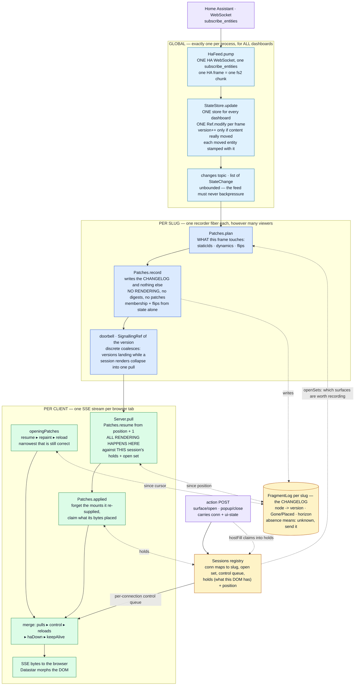
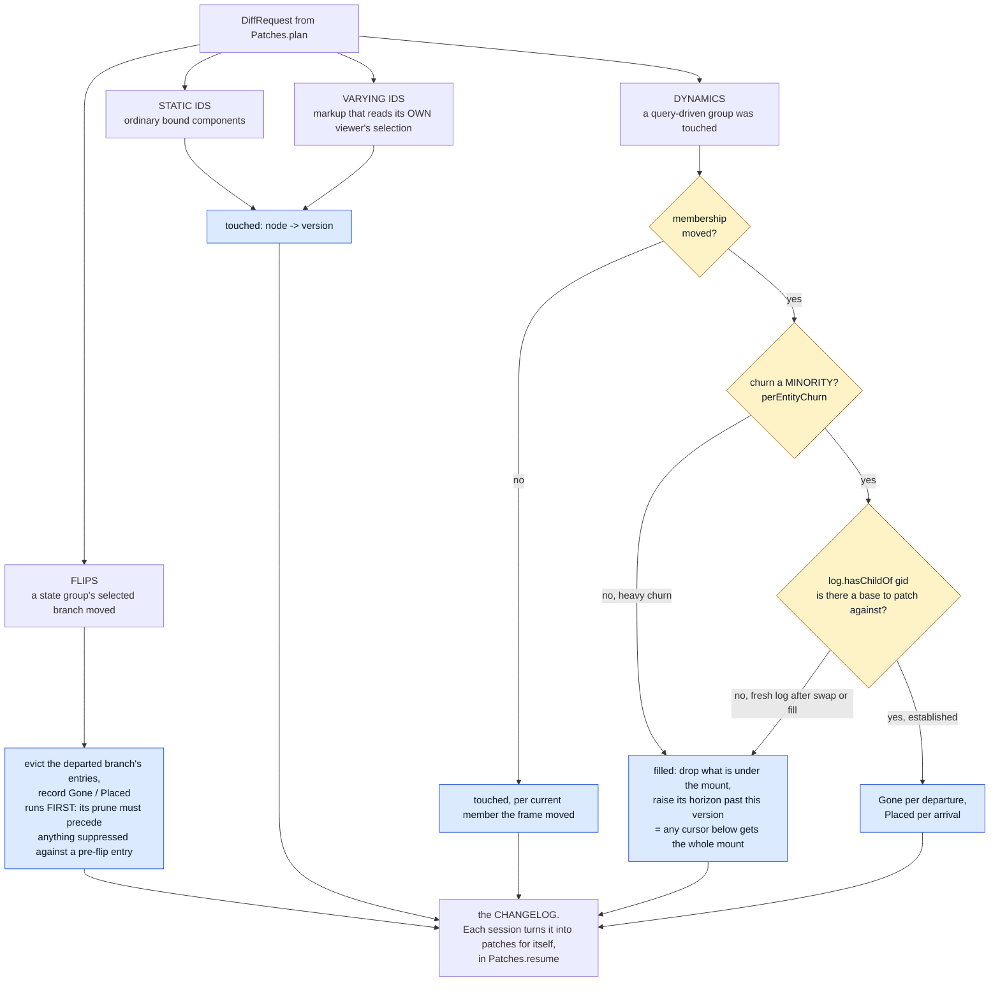
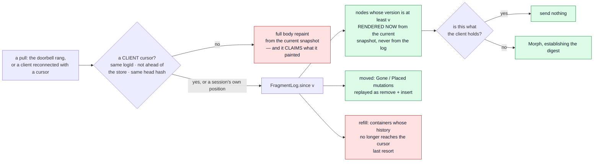

# fh-datastar-view — the rendering pipeline

How a Home Assistant state change becomes bytes in a browser: what runs **once per slug** (shared,
whatever the viewer count) and what runs **once per connection** (because only that connection knows
what its viewer has selected).

> **This is a current-state document, and it is the map we plan changes against.**
>
> It describes the pipeline as the code is today — not a proposal, not a history. Keep it true:
>
> - Change the pipeline, change this file **in the same commit**. A diagram that lags the code is
>   worse than no diagram, because it is trusted.
> - An **ADR that alters this pipeline must update this file too** — the ADR owns the *decision and
>   its rationale*, this file owns *the shape of the thing*. They are not alternatives to each other.
>   ADRs [0011](adr/0011-the-live-connection.md) and
>   [0012](adr/0012-each-session-renders-what-it-is-owed.md) are the two that most often will;
>   [0003](adr/0003-dynamic-groups.md) (dynamic groups) and
>   [0007](adr/0007-state-activated-surfaces.md) (state-activated surfaces) own two of the three node
>   kinds below.
> - When proposing work here, say which box moves. "Render outside the critical section" is a
>   statement about §1; "prune at pull time" is a statement about §6.
> - Everything here is current state. Work in flight lives in
>   [`plan-session-pulled-changelog.md`](plan-session-pulled-changelog.md) and moves into this file
>   as it lands — §9 is a pointer, not an exception.

---

## 1. End to end



**Nothing is pushed.** A frame is recorded once per slug; every byte is produced by the session that
will receive it, from the same `Patches.resume` a reconnect runs. A live tick is a resume from
`position + 1` — one mechanism, not two — which is why there is no audience tag on a patch and no
per-client filter at the wire edge: a patch exists only because the session that will send it asked
for it, against its own open set and its own record of its own DOM.

The recorder is **one fiber per slug** (`Server.publisherFor`), re-armed by `switchMap` on every
renderer swap — and a swap past the first mints a fresh log identity, so cursors issued against the
old renderer cannot be resumed.

**Three scopes, not two.** Getting these confused is the easiest mistake to make here:

| Scope | One per | What lives there |
|---|---|---|
| Global | process | the HA WebSocket, `HaFeed`, **the `StateStore`**, the `changes` topic, the `Sessions` registry |
| Per slug | dashboard | the recorder fiber, the `Renderer` (in a `SignallingRef`, hot-swapped), the `FragmentLog`, the doorbell |
| Per connection | browser tab | the `Session` — created by the DOCUMENT, adopted by the stream (slug, open surfaces, control queue, plus `holds`/`position` — what THIS client's DOM has and how far it has been served), the SSE stream, that viewer's selections |

There is exactly ONE store and ONE upstream subscription for every dashboard — `HaFeed.resource`
creates the store, `Server.fromFeed` takes `feed.store`. Dashboards are views over one shared state,
never separate feeds.

---

## 2. The setup, in pseudo-code

The same thing as §1, in words, because the diagram cannot show ordering and lifetime.

### Boot — once per process

```
open ONE WebSocket to Home Assistant, subscribe_entities
  the opening frame IS the full entity set, so there is no separate seeding step
create ONE StateStore              // for every dashboard, not one each
evaluate every *.pkl entry         // slug = filename
  per slug: one Renderer in a SignallingRef   // hot-swapped on file edit
  per slug: one FragmentLog with a fresh id, in a Ref, and one doorbell
create ONE Sessions registry
for each slug: start a recorder fiber
  // STARTS IMMEDIATELY, and runs whether or not a browser ever connects
```

### A browser opens a dashboard

```
GET /d/:slug
  render the WHOLE page from the current snapshot
  mint conn; create Session{slug, open surfaces, control queue, holds, position}
  holds = the digest of every node this render painted   // what THIS client's DOM has
  register it, and schedule a reap if no stream adopts it within AdoptionWindow
  embed in the page as Datastar signals: logId, storeVersion, headHash, styleHash
  ...and conn, on the data-init URL the page advertises

GET /sse/dashboard/:slug/patch
  adopt the session that URL's conn names (epoch++); mint one under the same id
    if it is gone — a reap, a bookmark, a restart: costs suppression, not correctness
  opening patches, narrowest that is still correct:
      resume   if the cursor's logId matches and nothing structural moved
      repaint  if it does not      // claims what it painted, same as the document
      reload   if the document itself is stale
    ...then position = the snapshot they were rendered from
  then stream: pulls ▸ control ▸ reloads ▸ haDown ▸ keepAlive
    // no subscription to acquire, so no window to nest around: the doorbell
    // hands a new watcher its current value, so a frame recorded before this
    // stream existed still wakes it

on disconnect
  release the session into a LINGER (Tenure.Lingering), but only if this stream
    still OWNS it — a displaced stream must not put the live one out to pasture
  it stays registered and recorded for, so a client back inside LingerWindow
    resumes against its own holds instead of paying for a repaint
  after the window, the reaper drops it — but only from exactly the tenure it
    expected, so a reconnect that lands while the reaper sleeps simply wins
```

A session's whole life is one value (`Tenure`), walked in order:

```
Fresh ──(a stream adopts)──▸ Held(1) ──(that stream ends)──▸ Lingering(1)
  │                             ▲                                │
  │                             └────(a reconnect adopts)─────────┤
  └──(AdoptionWindow passes)──▸ Reaped ◂──(LingerWindow passes)───┘
```

Every transition names the tenure it expects to replace, which is what makes
the reaper unable to race a stream: both decide on the same ref, so the loser
sees the winner's answer rather than acting on a stale read. `Held` is also the
only state that counts as a live stream (`Sessions.liveStreams`, the readiness
seam tests wait on) — a lingering session is registered and has nobody to send
to.

### A state change arrives — once, globally

```
StateStore.update(frame)                    // one Ref.modify for the whole frame
  version++ ONLY if some entity's content really moved
  stamp each MOVED entity with that version  // EntityState.contentVersion;
                                             // a deduped re-seed keeps its old one
  publish List[StateChange] on `changes`

every slug's recorder wakes
  read snapshot+version together, and sessions.openSets(slug) + floor(slug)
    NO SESSIONS -> record nothing at all, just mark the gap (log.skipped) and
      stop. A dashboard with no browser on it is the normal state of a home
      instance. Safe only because a document registers its session BEFORE
      reading the snapshot it renders from, which makes any version skipped
      one that document already contains
    visible = surfaces some session can actually SEE  // widens what is considered
  plan    -> staticIds, dynamics, flips
  record  -> the changelog, and nothing else:
      flips first    -> evict the departed branch, record Gone/Placed
      static         -> node -> version                 // no variant split
      dynamics       -> touched members, or Gone/Placed, or a filled mount
                        (the churn heuristic survives as `filled`, which raises
                         the container's horizon — "any cursor below this gets
                         this mount")
  ring the doorbell with the version          // AFTER the log is written, or a
                                              // session could set its position
                                              // past changes it never saw

each connection wakes and PULLS
  resume(log, holds, snapshot, position + 1, open, its own ui-state)
      -> render the candidates; send the ones whose digest is not what it holds
  applied  -> forget the mounts those patches re-supplied, claim what they placed
  position = the version it woke for, and say so    // ALWAYS, even when it was
                                                    // owed nothing: "nothing owed"
                                                    // is now a per-client answer
  write bytes
```

### The log

```
keyed by node id: the version it last moved at   // no digests: what a CLIENT
                                                 // holds is the session's answer
  a later write overwrites — latest wins, and a version never goes backwards
mutations: Gone / Placed per node, latest wins
pruned by the FLOOR: the lowest `position` any live session holds. A mutation
  below it cannot appear in any resume any session will ever run — exact, where
  the rule it replaced was a one-hour wall clock
  per-container `horizon` records the version at which its history became incomplete
  -> a cursor below a container's horizon gets a refill instead of a delta
     (a CLIENT cursor is not bounded by the floor, which is why pruning raises it)
completeFrom: the whole log going incomplete — see the gap above
absence means "unknown, send it" — so dropping an entry is ALWAYS safe
```

### Reconnect

Same call as a live pull; only the cursor differs.

```
client sends back its stored signals: logId, version, headHash, styleHash
  different logId, version ahead of the store, head moved, or a cursor from
    before a stretch this slug did not record -> full repaint
  otherwise since(version):
      nodes   whose logged version >= cursor   -> rendered NOW, sent if the digest
                                                  is not what this client holds
      moved   Gone/Placed                      -> replayed as remove + insert
      refill  containers whose history aged out -> whole mount
```

A client's cursor gets `>=` where a session's `position` gets `+ 1`, and the difference is who is
claiming: a client can hold version V having seen only part of it, where a position is what this
server itself last sent.

---

## 3. Inside `Patches.record` — the four kinds, and what each writes

Nothing here renders. Everything it needs is state: membership is
`Renderer.dynamicMembers`, and a flip's selection is `resolveActiveByState`.



**A varying node is not a kind of its own — there is no such classification left.** Its version
moves like any other node's, and the render that reads a viewer's selection happens where the viewer
is. That is the whole of what `Varying`/`Pending`/`Memo` used to buy, for free, and
`nodeVariesByViewer` went with them once `plan` stopped partitioning what `record` merged back.

**The churn heuristic had to survive the loss of the render**, or the wire would move: heavy churn
still fills the mount rather than patching members. It is recorded as `FragmentLog.filled`, which
raises the container's `horizon` — already the mechanism for "no delta describes this, send the
mount" — so `resume` reaches the same patch from the other side. A fill also `touched`es the members
it leaves, because those entries are what keep the group *established* for the next membership
change.

---

## 4. Why the flip records nothing but structure

A flip is server truth — the branch every viewer must move to — but *which* branch a given viewer
has mounted, and what belongs inside it, depends on selections below it. So the recorder does the
part that is identical for everyone (evict the departed branch, record where it went) and each
session fills the mount for its own selection when it pulls. A branch no connected viewer reaches is
never rendered at all.

That is the same mechanism as every other node, not a second path — which is the point: it used to
need a deferred render (`Pending`) and a memo to share one verdict between viewers who agreed,
because the *pass* was shared. Once the render moved to the viewer, both disappeared.

**A branch fill forgets by MOUNT, not by prefix.** A branch's content ids are `s_<surface>__…`,
which no prefix of the container's id reaches, so the patch names the surfaces at that mount
(`Patches.hostEvicts`) as what it made unknown. A dynamic mount's children *are* `gid_…`, so there
the container's id is the right root.

---

## 5. What each scope renders

| | Per slug (the recorder) | Per client (the pull) |
|---|---|---|
| Runs on | one recorder fiber per slug | that connection's own SSE fiber |
| Sees | the full entity snapshot + the union of visible surfaces | one session's open set and ui-state |
| Renders | **nothing** | everything: opening paint, live pulls, resume |
| Writes | the changelog (`node -> version`, mutations, horizon) | that session's `holds` and `position` |
| Cost of N viewers | ×1 | ×1, via the per-slug render cache |

The last row is not structural any more, and that is worth being precise about. Each session renders
for itself; what makes it ×1 is that both pulls go through one `RenderCache` keyed by what the render
READS (`Renderer.renderInputs`), so whoever arrives first renders and the rest wait on the same slot.
Two viewers of one dashboard have the same key for a node unless their selections differ — the hit is
the normal case, not a lucky one. `ServerSuite`'s "rendered once between them" holds the number as a
cost contract: a 2 there means a key is varying per viewer where it should not, or a pull is
rendering outside the cache.

---

## 6. The pull path

The same call serves a live tick and a reconnect. What differs is only where the cursor came from.



The log stores **versions and structure, never HTML** — a pull renders from the current snapshot,
which is by construction at least as fresh as anything the log could have held. That is why a
missing entry is always safe: it reads as "unknown, send it", costing bytes and never staleness.

"Rendered now" goes through the slug's `RenderCache` (`Patches.bytes`), which is what keeps N
sessions woken by one ring of the doorbell from rendering the same node N times. It changes no
answer — the key is what the render reads, so a hit is the render — only who pays for it.

The second question — *does this client already have these bytes?* — is answered by the **session's
own `holds`**, and only ever by that. It is seeded by the document that created the session (and by
a repaint, which paints the same thing), and updated wherever bytes are sent to this client:
`Patches.applied` for a pull, `Patches.hostFill` for a tab or popup swap. Never from what another
client was told.

**Mutations are filtered by visibility too.** A `Gone`/`Placed` inside a surface this client does not
have open would patch an id its DOM lacks — a silent no-op, so it only ever cost bytes, but it is one
client's worth of another client's tab on every frame. That test (`Renderer.visibleNode` on the
container) is where the old audience tag's work now happens.

Mutations are pruned below the floor (`Sessions.floor`, the lowest position among a slug's live
sessions); a container whose history has been pruned past a client's cursor yields a `refill` rather
than a refusal. **Nothing in the log reads a clock** — a version orders everything, and the only
thing wall time still decides is how long a session lingers.

---

## 7. Where each box lives

Paths are under `modules/fh-datastar-view/src/main/scala/fh/view/`.

| Box | Code |
|---|---|
| feed → store | `runtime/HaFeed.scala` · `pump`, `runConnection` |
| store + changes topic | `runtime/StateStore.scala` · `update`, `changes` |
| per-slug recorder | `runtime/Server.scala` · `publisherFor`, `recordFrame`, `sharedPatchPublishers` |
| what a frame touches | `runtime/Patches.scala` · `plan` |
| what a frame writes | `runtime/Patches.scala` · `record`, `recordFlip`, `recordDynamic` |
| the doorbell | `runtime/Server.scala` · `LiveSlug.doorbell` |
| the log (the changelog) | `runtime/FragmentLog.scala` · `touched`, `filled`, `removed`, `placed`, `since` |
| a stretch nobody watched | `runtime/FragmentLog.scala` · `skipped`, `reaches`; `runtime/Server.scala` · `recordFrame`'s gate, `openingPatches`' cursor filter |
| a session's pull | `runtime/Server.scala` · `pull`; `runtime/Patches.scala` · `resume`, `applied`, `encode` |
| what a client holds | `runtime/Sessions.scala` · `Session.holds` / `position` |
| SSE stream | `runtime/Server.scala` · `sseStream` |
| opening paint | `runtime/Server.scala` · `openingPatches` |
| sessions + surface actions | `runtime/Sessions.scala`; `runtime/Server.scala` · `withSession`, `openSurface`, `swapHost`; `runtime/Patches.scala` · `hostFill`, `hostEvicts` |
| a document establishes a session | `runtime/Server.scala` · `pageResponse`, `adoptOrMint`; `runtime/Sessions.scala` · `Session.adopt` |
| a session's lifetime | `runtime/Sessions.scala` · `Tenure`, `Session.release`/`relinquish`; `runtime/Server.scala` · `reapAfter`, `AdoptionWindow`, `LingerWindow` |
| the actual rendering | `runtime/Renderer.scala` · `renderNodeById`, `renderLogged`, `renderMount`, `renderDynamicChild` |
| what keys a render | `runtime/Renderer.scala` · `renderInputs`, `dynamicChildInputs`, `activeBakeIndex` |
| the render cache | `runtime/RenderCache.scala`; entered from `Patches.bytes` (morphs, placements). A composed surface mount is NOT cached — its bytes carry its children, so it has no sound key |
| what a cache entry is keyed by | node id -> (renderer identity, `RenderInputs`) — one generation. The renderer is in the key because a dashboard edit changes the MARKUP while the entity versions it reads stay put |

## 8. Known open questions

Live list — delete an entry when it is answered, and say where the answer landed.

- **A laggard evicts the current.** One generation per node means two sessions pulling with different
  keys for the same node replace each other's entry rather than sharing the map. Costs renders, never
  wrong bytes (the key is compared, not assumed). Unmeasured; the fix if it bites is a small FIXED
  number of generations per node, not a return to unbounded keys.
- **A patch that lands in the first moments of a page's life is lost.** Server-side liveness is not
  client-side readiness: the session is held, the stream is open and an HTTP client on the same URL
  sees the patch ~50 ms after the change, but the browser drops an elements patch that arrives right
  after `data-init` fires — and Datastar leaves no trace of its own readiness to wait on (no
  attribute, no class, nothing reaching the DOM). The window is short and self-healing (the next
  tick of that entity repaints it), so nothing is done about it; the browser suites gate on the
  effect instead (`SmokeSuite.awaitApplying`). If it ever needs fixing, the fix is client-side —
  the server has no signal that the page is listening.
- **A pull always reports its position**, even when it owed the client nothing — one small signal
  per client per frame. It is what makes "nothing owed" a per-client answer rather than a shared
  one, and what tells a browser the frame reached it. Whether that is worth the bytes on a busy
  instance is unmeasured.
- **Carrying the converted attribute map across a tick.** See TODO2.md — `EntityState.javaAttributes`
  is rebuilt per state change even when attributes did not move.

---

## 9. In progress

The reshaping this file describes — the recorder, the doorbell, the per-session pull — **has
landed**. Its document, [`plan-session-pulled-changelog.md`](plan-session-pulled-changelog.md),
covers what is left of session lifetime (a staleness bound, gating recording on a slug having
viewers) and maintained dynamic membership. The linger has landed — see `Tenure` above. Nothing in §1–§8 describes code that does not exist.

Two findings from the cache phase, worth carrying here rather than leaving in the plan:

- An `if`/`else` host's branch is a quantified predicate over the WHOLE entity map, so it is keyed
  on the RESOLVED selection rather than on what the selection reads.
- The cache holds ONE generation per node, which is what bounds it: `plan` selects the nodes whose
  entity just moved, so a `(nodeId, inputs)` key would grow forever at a near-zero hit rate.
