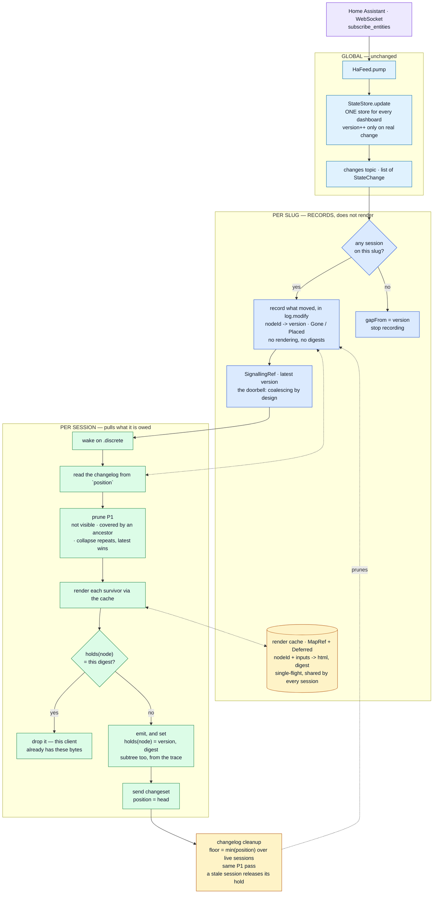

# Plan — the session-pulled changelog

> **A deferred design plan, not implemented code** — the repo convention for `docs/plan-*.md`. Read
> it against [`architecture-rendering-pipeline.md`](architecture-rendering-pipeline.md), which describes what actually runs
> today. As phases land they move INTO that file and out of this one.

## Goal, and what must not change

Each session pulls what it is owed from a changelog and decides for itself what is worth sending,
instead of a per-slug publisher rendering and pushing on everyone's behalf.

**The wire is the constraint**: the same patches, in the same order, for the same reasons. A browser
should not be able to tell. The suites that assert on emitted SSE output are the check — see
"How we will know it worked" below.

## Phases

Each one lands on its own and keeps the suites green.

0. ~~**Spike `inputs`.**~~ **Landed** — see "What `inputs` turned out to be" below.
   `EntityState.contentVersion` is the per-entity stamp, `Renderer.renderInputs` is the key, and
   `RenderInputsSuite` is the adversarial check.
1. ~~**The render cache**~~ **Landed** — `RenderCache` (per slug, `MapRef` + `Deferred`), and
   `Patches.prepare` renders through it. Behaviour-neutral: every suite asserting on emitted SSE
   output passed untouched. `Memo.keyed` is NOT yet retired — it serves `Varying`, which phase 3
   removes. See "What the cache turned out to need" below.
2+3. **Per-session `holds`, and the pull loop.** Taken as ONE change, deliberately: the end-state
   architecture is easier to review than the intermediate, where a per-session decision still feeds
   a shared push. Move the "worth sending?" decision off the shared log onto the session
   (`established` becomes per-client, so patch shape may legitimately differ between clients);
   reduce the log to the changelog; add the per-slug `SignallingRef` wake-up; sessions pull. Retire
   `sharedTopic`, `Varying`/`Pending`/`Memo` and the flip's deferred render.

   Landing in steps, each green:
   - ~~Merge and encode per connection, not per slug~~ — `Addressed` carries a `Patch`, `Encoded`
     splits off for the resume cursor, the topic carries batches, `Patches.encode` folds and
     encodes inside the connection's stream. Merging must not bake one client's filters into
     everyone's bytes, so it has to move before the decision does.
   - ~~`Addressed` carries `establishes: Map[NodeId, Digest]`~~ — what a patch's bytes put in the
     DOM, at every producing site. Nothing reads it yet; the shared log still knows. It is the
     handle a per-session `holds` needs, since after the split the only thing that can tell a
     session what it just sent is the patch it sent.
   - ~~`Session` gains `holds` + `position`~~ — written from `Addressed.establishes` where a
     connection KEEPS a patch, and from the batch's version once it has encoded one. The topic
     carries a `Batch(version, items)` so the version travels with the items rather than being read
     back out of an encoded cursor signal. Still not read: the shared log decides. Landed
     separately on purpose — the way a per-client record goes wrong is drifting from what the client
     has, so it is filled in and tested while the shared log is still the authority, leaving the
     next step a change of who is ASKED rather than new bookkeeping arriving at the same time.
   - ~~`Patches.resume` asks a `holds` map, not the log~~ — it takes `Map[NodeId, Digest]`, and
     `FragmentLog.digestsFor` projects the shared log onto one viewer at the single call site, so
     behaviour is unchanged. The projection is where the variant dimension dies: variants exist
     only because the log is shared, and a per-connection record is already one viewer's.
   - ~~The DOCUMENT creates the session~~ — `pageResponse` mints `conn`, builds the `Session`, seeds
     `holds` from its own `painted.own`, and advertises `conn` on the `data-init` URL; the stream
     ADOPTS that session (`Session.adopt`, an epoch) instead of minting one. The resume now decides
     against `session.holds`, and `FragmentLog.seed` is gone. This is the only shape in which the
     variant dimension dies: the page rendered at THIS viewer's `uiState`, where a shared seed has
     to carry one digest per selection to avoid claiming somebody else's tab. It also pulls two
     pieces of phase 4 forward — `conn` as a session identity, and a lifetime (`AdoptionWindow`,
     reaping a document nobody connected to).
   - The send path decides against its own `holds`; the publisher stops rendering and pushing.
4. **Session lifetime.** Linger after disconnect, the staleness bound that releases the floor. Gate
   recording on a slug having sessions. ~~Displacement of a second live stream~~ landed with the
   document-creates-the-session step, which is what first made two streams able to reach one
   session; the rest of this phase is still open.
5. **Maintained dynamic membership**, tested per change instead of rescanned per frame.

## ADRs this will rewrite

They are current-state documents, so they are rewritten **when the phase lands**, not before:

- **0012 — One render pass, addressed per client.** The one this most directly changes: the pass
  stops being shared, and "addressed per client" becomes literal.
- **0011 — The live connection.** Resume, the cursor, and what may never be dropped. Sessions
  outliving their connection and the floor/staleness bound belong here.
- **0003 — Dynamic groups.** Membership becomes maintained state rather than a per-frame rescan.


## The shift, in one line

Today the publisher **renders and pushes ready bytes**, and one shared log answers "does the client
already have this?" on everyone's behalf. In the new shape the publisher records **what moved**,
each session **pulls what it is owed**, and "does *this* client have it?" is answered per session.

Deliberately NOT a change to what a browser experiences: the same patches, in the same order, for
the same reasons. This is about who decides, and when the work happens.


## The shape, to compare against the architecture doc

Same visual language as
[`architecture-rendering-pipeline.md`](architecture-rendering-pipeline.md) §1, so the two can be read
side by side. What is global does not move. What changes is everything after it: the per-slug lane
stops rendering, and the session lane grows a pull loop.



### Read against the architecture doc, box for box

| Architecture doc §1 | Here |
|---|---|
| `Patches.plan` (per slug) | survives, but only to select node ids — no render inputs needed |
| `Patches.prepare` / `Renders` (per slug) | **gone** — replaced by the render cache, which outlives the batch |
| `Patches.diff` inside `log.modify` (per slug) | **shrinks to recording**: node → version, Gone/Placed. No digests, no patches |
| `sharedTopic` (global, lossless fan-out) | **gone** — replaced by a per-slug `SignallingRef` doorbell |
| `Addressed` / `Varying` / `Pending` / `Memo` | **gone** — every render is per session, so the special case dissolves |
| filter by slug, then `visibleTo` (per client) | becomes the P1 prune, which also collapses repeats |
| `FragmentLog` digests (per slug, shared answer) | **moves into the session** as `holds`, so the answer is per client |
| nothing | **new**: the session gate, `gapFrom`, the floor, and the staleness bound |

## Cost and complexity, honestly

This is not a performance fix, and it should not be argued for as one — the measurements taken while
writing it (§ the architecture doc's open questions) found no CPU or RAM problem to solve. It is
worth doing for correctness and for what it deletes. Here is the ledger.

### CPU

| | Today | After |
|---|---|---|
| A slug nobody is watching | renders every affected node, every frame | **records a few map writes, or nothing at all** |
| A slug with N viewers | one shared render pass + one shared log write | one record pass + **N prune passes and N `holds` updates** |
| Sharing a render between viewers | within one batch, via `Renders`/`Memo` | via the cache, and across batches — a laggard shares with a current session |
| Knowing a render is unnecessary | must render, then compare digests | same — the digest still requires the bytes |

So the shape of the cost changes: from *constant regardless of viewers* to *proportional to viewers*.
For a household that is a clear win, because the idle case dominates. For a hypothetical fifty
simultaneous tabs it would be a loss, and that is worth stating rather than discovering.

One thing does NOT improve: suppression still requires rendering. Only the client's own `holds` can
tell you whether bytes are worth sending, and you cannot get the digest without the bytes.

### RAM

- **The changelog SHRINKS.** It drops digests and keeps `nodeId -> version`, which is smaller than
  what `FragmentLog` holds today.
- **`holds` duplicates per session.** One digest map per connection instead of one per slug. Tens of
  KB per session at a realistic node count — small in absolute terms, but it is now O(sessions).
- **The render cache is the new cost, and the only one worth designing against.** It retains HTML
  that is transient today. Grounded estimate: a rendered page measured on the live instance is
  13–44 KB, and per-node own-markup sums to roughly that, so ~40 KB per dashboard per generation of
  inputs. Five dashboards over ten live generations is a couple of MB — fine, but only because
  something bounds the generations.

  Which points at a design consequence: **the render cache wants to be SHORT-lived.** Its value is
  fan-out between sessions rendering the same node around the same time; it is not a history and
  gains nothing from retention. A small TTL keeps it a rounding error, where an unbounded one makes
  it the largest structure in the process.

  This also settles part of the `inputs` question: keyed by per-entity content VERSION, a revert to a
  previous value produces a new key and misses. Content-hash keys would hit, at the price of hashing
  values. With a short TTL the difference stops mattering, which is an argument for versions.

### Complexity

**Deleted:** `Addressed` / `Varying` / `Pending`, `Memo`, `prepare` / `Renders`, `sharedTopic`, the
shared-versus-per-client split running through `Patches`, `hasChildOf` as a guess, `horizon`'s
per-container completeness, and the residual missed-insert race.

**Added:** single-flight caching with its failure and cancellation rules (landed — see below), the
`holds` invariant
(every emitted patch updates it, subtree included), session lifetime (linger, displacement,
staleness), floor coordination across sessions, and two-pass composition.

That is close to a wash in volume. What changes is the KIND: today's complexity is shared-state
reasoning, where a wrong answer is silent and affects everyone — the missed-insert race is exactly
that. The new complexity is per-session bookkeeping, which is more code but fails one client at a
time and is visible when it does.

The exception, and the reason phase 0 is a spike: **`inputs` is a new single point of catastrophic
subtlety.** Too coarse and it serves stale bytes silently and permanently. Nothing in today's design
has that property, and no test will notice it on a small fixture. It deserves adversarial testing,
not a passing suite.

## If viewer count ever matters

The per-session cost is N prune passes and N `holds` updates. Nothing below is worth building now —
N is tabs in a house — but the design should not paint itself out of them, so here is the ladder,
cheapest first.

**The framing that makes it a choice rather than a tradeoff:** the unit of sharing is the
EQUIVALENCE CLASS of sessions that would receive the same bytes — same position, same visible
surfaces, same selections. Today's design assumes exactly one class (everybody gets one shared
render). The design in this plan assumes N classes (one per session). Neither is right in general;
the truth is that a household's tabs mostly fall into one or two classes. **The class is the
tunable**, and the two designs are the endpoints of one axis rather than rivals.

**1. Memoise the prune by class** — the cheapest, and it costs nothing until used. Key a per-batch
memo on `(fromVersion, visibleSurfaces, selections)` and let sessions in the same class share one
computed changeset. This is exactly the `Memo.keyed` pattern this plan deletes for renders, applied
one level up; four tabs on the same dashboard with the same tab selected collapse to one pass.

**2. Hoist the shared part of the pull.** The per-slug fiber already knows the changelog moved. It
can compute the parts that do not depend on a session — the slice since the OLDEST live position,
and the latest-wins collapse — once, and hand that down; sessions then do only the cheap per-session
filtering (visibility, ancestor coverage). Shares the work without needing classes at all.

**3. Baseline plus overlay, if `holds` memory is ever the problem.** The shared log does not have to
die. Keep one per-slug map as "what a typical client has" and give each session only its DIVERGENCE
from it — usually empty, and non-empty exactly where today's shared answer is wrong (a client that
missed an `insert`, one that just opened a surface). Lookup checks the overlay then the baseline.
This recovers today's O(1)-in-viewers memory while keeping the per-client correctness that motivates
the whole plan.

Worth noting what already helps for free: `holds` as an immutable `Map` means sessions applying the
same updates from a common ancestor share most of their internal structure, so N identical maps cost
roughly one map plus N small paths rather than N copies.

## The four structures

**1. The changelog — per slug.** Today's `FragmentLog`, reduced to its record-keeping half:

```
nodeId -> version            // latest wins; a version never goes backwards
mutations: Gone / Placed     // per node, latest wins (a node cannot be both)
gapFrom: Option[version]     // set when the slug had no sessions and stopped recording
```

No digests: it no longer answers "worth sending?" — structure 3 does. `gapFrom` is what is left of
today's `horizon`, and it is still needed: a slug with no sessions records nothing, so a lingering
session returning across that gap must repaint rather than resume.

**2. The render cache — per slug, living and dying with the dashboard's renderer.**

```
nodeId -> (inputs, Deferred[Either[Throwable, (html, digest)]])
```

Per slug rather than global because node ids are only meaningful within one renderer: a hot-swap
drops the whole map, which is the correctness story and half the eviction story for free.

Keyed by NODE, not by `(nodeId, inputs)` — see "What the cache turned out to need". The entry
remembers the inputs it was rendered for, and a render for different inputs replaces it.

`Deferred` behind a `MapRef` gives single-flight: the first fiber to want a key inserts an empty
`Deferred` and renders; everyone else finds it and waits. Insertion stays a per-key operation
instead of a whole-map CAS. The value is

```
Deferred[IO, Either[Throwable, (Html, Digest)]]
```

so a failed render reaches every waiter instead of stranding them. Two rules come with that, and
both are the usual way this pattern breaks:

- **Completion must survive cancellation.** `attempt` does not intercept it, so a producer cancelled
  mid-render never completes its `Deferred` and every waiter blocks forever. Complete it from a
  `guaranteeCase`/`onCancel`, not from the happy path.
- **A failure must evict the key.** Leaving a `Left` in the map poisons that node for the life of
  the renderer; evicting lets the next caller retry while the waiters that already hold it still see
  the error.

See "What `inputs` turned out to be" for the answer phase 0 produced, and the two things about it
that were not obvious from the outside.

**Children are not part of a node's cache entry.** A node caches its OWN markup with holes where
its children go; a second pass substitutes the children's (also cached) HTML. Otherwise any
descendant's tick invalidates every ancestor up to the root and the cache stops earning its keep.
The seam already exists — `Renderer.renderTemplateOf` takes `childrenHtml` as a parameter — so this
is a split of an existing function, not a new mechanism.

This also retires a widening that exists today only because of composition: `selectionsOf` is narrow,
but surfaces currently need a WIDER selection set (`Renderer.scala:290`) because a composed subtree
varies with any tab inside it, even when the container's own markup never reads one. With per-node
caching plus composition, each node keys on its own narrow selections and the composition picks the
right children.

**3. The session's own view — per connection.**

```
position: version                                  // how far this session has been served
holds:    nodeId -> Option[(version, digest)]      // what this client's DOM actually has
```

`None` is load-bearing: **this client does not have that node** — removed, or never sent — as
distinct from "absent, unknown". That distinction is what makes the per-session decisions exact
rather than guessed.

Kept alive by the same insert/remove logic that drives the patches: an `insert` adds an entry, a
`remove` drops it. Get that wrong and the map leaks for the life of the session, so the invariant is
"every patch that changes the client's DOM updates `holds` in the same step" — not a cleanup pass
bolted on afterwards.

**4. Dynamic membership — maintained, not recomputed.**

Today `dynamicMembers` rescans every entity and evaluates the group's predicate, twice per frame
(before and after). Instead the group's membership is live dashboard state, and each incoming change
is tested against the predicate once to see whether it adds, removes, or does neither — O(changed)
per frame instead of O(entities). A sorted structure keeps DOM order and answers "successor of this
arrival" directly, which is what an `insert before` needs. Rebuilt on renderer swap, like everything
else keyed by node id.

## The flow

```
state change arrives  (globally, once — unchanged from `architecture-rendering-pipeline.md` §2)
  StateStore.update(frame); version++ only on real change

for each slug that HAS AT LEAST ONE SESSION            // the gate that does not exist today
  log.modify:                                          // cheap: no rendering in here
      entity -> nodes via the reverse index; record nodeId -> version
      test each change against each dynamic group's predicate:
          joined -> record Placed;  left -> record Gone;  neither -> nothing
      state groups (if/tabs): record the branch move
  // nothing is rendered, nothing is pushed
for a slug with NO sessions: record gapFrom, skip everything else

each active session, on batch change
  read the changelog from `position`
  prune (P1) to what THIS session can use:
      drop nodes it cannot see        (its open surfaces)
      drop nodes covered by an ancestor mutation it is already being sent
      collapse repeats — latest version per node wins
  for each survivor:
      html, digest = renderCache(nodeId, inputs)   // single-flight; one render serves all sessions
      holds(nodeId) already that digest? -> drop it, this client has these bytes
      otherwise                          -> emit, and set holds(nodeId) = (version, digest)
  send the changeset; position = batch version

after sending, changelog cleanup
  floor = min(position) over live sessions
  prune (P1, the same pass) everything no session can still ask for
```

## Sessions outlive their connection

A dropped SSE stream no longer destroys the session. Instead the disconnect schedules a delayed
check through a `Supervisor`: if the session has not been picked up again after X, it is dropped and
its `holds` map with it. A client reconnecting inside that window presents the `conn` it already
holds as a signal and resumes against a warm session — its `holds` map intact, so the reconnect
costs only what actually moved rather than a repaint.

The client stays the authority. Its cursor is the truth about what its DOM contains; `position` and
`holds` are the server's record of the last truth it was told, and a reconnect corrects them. That
is what makes it safe for the server to prune on `position` while still handling a client that comes
back with a different story.

## A client that returns after its session was dropped

The session's `holds` map is an OPTIMISATION, not the resume mechanism. Losing it degrades the
reconnect by one rung; it does not force a repaint. The existing ladder just gains a middle step,
and it is chosen on the CHANGELOG, not on whether the session survived:

```
cursor's logId does not match this renderer      -> reload  (a different document)
changelog still reaches back to cursor.version
  and no gapFrom sits above it                   -> resume: rebuild the changeset from the
                                                    changelog + the current snapshot, exactly as
                                                    since(v) does today. Without `holds` there is
                                                    no per-client suppression, so the client may
                                                    receive bytes it already had — idempotent
                                                    morphs, so this costs bytes and nothing else.
otherwise                                        -> repaint from the current snapshot
```

So the linger window X is not really "how long we keep a session" — it is **how long we keep the
ability to resume that client cheaply**, which is what today's one-hour `Retention` means. Note the
coupling it creates: the changelog floor is `min(position)` over live sessions, so dropping the last
session holding an old position RAISES the floor and a client returning past it repaints. That is
the deliberate cost of exact pruning.

Ordering is by **version**, never by wall clock. X is a wall-clock timer for the linger, and that is
the only thing time is allowed to decide (`Stamp`'s split — `architecture-rendering-pipeline.md` §2).

## How we will know it worked

The wire is the contract: the same patches, in the same order, for the same reasons. So the
acceptance criterion is that the suites which assert on EMITTED SSE OUTPUT pass unchanged —
`ServerSuite`'s stream tests, `DatastarMorphContractSuite`, and the functional suites over the fake
HA (`DashboardBehaviourSuite`, `UseCaseSuite`, `PklDashboardBehaviourSuite`). A diff in any of those
is a design question, not a test to update.

Tests that construct internals WILL change — `Patches.diff`'s signature, `Server.LiveSlug`,
`FragmentLog` — and that is fine. The distinction is worth holding on to while working: changing a
test that names a type is refactoring; changing a test that names a byte on the wire is a behaviour
change wearing a refactor's clothes.

`PklBuildSuite`'s wire-format snapshots are unaffected — they pin the AUTHORING wire (`{cards,
card}`), which this does not touch.

## What this buys

- **No work when nobody is watching.** The gate is the session lookup; the arch doc's first open question
  disappears rather than needing a subscriber-count hack.
- **Exact pruning**, on what live sessions can still ask for, rather than a one-hour wall clock.
  `Stamp.millis` stops being load-bearing (`gapFrom` replaces `horizon`).
- **`hasChildOf` stops being a guess.** "Is this group established?" becomes "does this session's
  `holds` have its children?" — per client, exactly. The red box in `architecture-rendering-pipeline.md` §3 goes away, and with it the
  pre-render-vs-fill trade.
- **The missed-insert race goes away.** Today a client that missed an `insert` in the connect gap
  lacks that child until a whole-group repaint, because the shared log says everyone has it. A
  per-session `holds` cannot make that mistake.
- **Membership goes from O(entities) to O(changed)** per group per frame.
- **One caching mechanism** where there are currently two (`Renders`, `Memo`), and it survives
  across batches instead of dying with each one.

## What `inputs` turned out to be

Phase 0, landed. The key is `RenderInputs(entities, vars)`, produced by `Renderer.renderInputs` (and
`dynamicChildInputs` for a group member, whose id is derived per entity rather than indexed):

- **`entities`** — `entityId -> contentVersion` for each entity the node's slots bind
  (`entitiesForNode`). An entity the snapshot does not hold has NO entry, which is a key distinct
  from any version it could have — `resolveSlot` renders such a slot from a synthetic empty state.
- **`vars`** — the structural vars the bake group contributes, today just `bakeIndex`.

Two things were not visible from the design side.

**The per-entity version did not exist.** The store had only `StoreState.version`, a per-batch
counter — it says a batch moved, not which entity. `EntityState.contentVersion` is the new stamp,
assigned in `StateStore.update` at the point that already decides whether to publish a
`StateChange`. So it moves exactly when `sameContent` says content moved: a reconnect's full
re-seed and a timestamp-only bump keep the old stamp, and a render keyed on them still hits. The
stamp rides into the published `StateChange` too, so the snapshot and the change can never name
different versions of one entity.

**A state group's selection cannot be keyed on its sources.** The plan assumed a node's inputs were
the entities it binds plus its own selections. That holds for a user group, but an `if/else` host's
branch is `holds(condition, quantifier, states)` — a QUANTIFIED predicate (`any`/`none`/`all`) over
the entire entity map. Keying on what that reads would key such a node on every entity in the
instance, and the cache would never hit.

The fix generalises, and it is the rule to apply to anything added to the key later: **key on the
resolved value, not on the inputs it derives from.** The selection collapses to a small `Int`
whatever produced it, so `activeBakeIndex` — split out of `resolveBakeTraced` so the key and the
render cannot drift — is shared by both. `selectionsOf` is not used: the resolved index subsumes it,
and unlike `selectionsOf` it also covers the state-activated case, where there is no viewer
selection at all.

**How it is checked.** Only one direction can hurt: too discriminating costs a wasted render, too
coarse serves a client bytes that no longer match its state, silently and for as long as the entry
lives. So `RenderInputsSuite` tests one implication — same key implies same bytes — over ALL PAIRS
of a timeline, because the failure mode is a pair that agrees on the key and disagrees on the bytes,
not a step. The timeline runs through a real `StateStore`, so the stamps under test are the ones the
store assigns. Its contrapositive is the precision claim, so one loop covers both directions, and a
separate test pins the hits that must happen (a timestamp-only re-seed, an unrelated entity, a light
that does not move a quantified condition) so a key of "everything" cannot pass.

Verified by mutation rather than by passing: dropping either half of the key makes the suite fail.

**The gap it leaves, deliberately.** `renderNodeById` still splices a node's children into its own
bytes, so a container's rendering moves while its key stands still. That is the "too coarse" failure
in miniature — and it is why the key excludes children rather than including them: including them
would make any descendant's tick invalidate every ancestor to the root, which is the whole reason
for the two-pass split. The suite pins it as a known, named gap. **Phase 1 closes it or the cache is
wrong**, and `Renderer.renderTemplateOf` taking `childrenHtml` is the seam it splits at.

## What the cache turned out to need

Phase 1, landed. Two corrections to what was written above, both found by building it.

**Keyed by node, not by `(nodeId, inputs)`.** The composite key grows without bound, in exchange for
hits that do not happen. `Patches.plan` selects exactly the nodes binding an entity that just moved
(`Renderer.componentsFor`), so every batch mints keys nothing will ask for again — an unbounded
retention of HTML with a near-zero hit rate. Keyed by node, with the entry remembering the inputs it
was rendered for, the bound is the dashboard's node count: no timer, no sweep, nothing to tune. That
is a better answer than the short TTL argued for above, and it removes the need for `Caffeine`.

Fills are where the hits actually are: a whole-mount fill IS its members' renders in DOM order
(`Renderer.renderDynamicMembers` is defined that way), so it reuses every member that did not move.

What one generation gives up is a LAGGARD — two readers at different versions evict each other.
Nothing does that yet; the publisher is the only caller and it holds one snapshot. When sessions
pull at their own positions (phase 3) the fix is a small FIXED number of generations per node, still
bounded — not a return to unbounded keys.

**Uncancelable production, not `guaranteeCase`.** The plan said to complete the `Deferred` from a
cancellation handler. That covers only one of two windows: between the CAS winning and the render
starting, nothing has run for a finalizer to hang off, and the waiters block forever. And in the
window it does cover it can only complete with an error, so one cancelled fiber fails every waiter
attached to it — avoiding that needs a sentinel plus a retry, a second mechanism. Making production
uncancelable removes the state instead: the render is a pure CPU walk with no async boundary, so
cancellation is checked before it starts and never inside, and only a WAITER stays cancelable.

That argument is conditional and the code says so: move the render to a blocking pool, or split it
with `IO.cede`, and the second window returns — then `guaranteeCase` plus a retrying waiter is right.

**The lifetime came for free.** The cache needs no `Ref` and no rotation: it is created inside the
publisher's `switchMap` arm, which already ends on a renderer swap — exactly when a node id stops
meaning anything. Unlike the log, nothing outside the publisher reads it.

**What did NOT land:** `Memo.keyed` is still there. It serves `Varying`, which phase 3 removes; the
cache does not subsume it yet.

## Resolved by review

**A. `holds` fingerprints a node's OWN markup — pass 1, before composition.** The worry that it must
fingerprint the composed bytes was wrong, and the reason is worth stating because it is the invariant
the whole scheme rests on:

> Every node is patched at its OWN dom id, so a change is always sent at the most specific node that
> changed. An ancestor goes out only when the ancestor's own markup changed.

Under that rule an own-markup digest answers exactly the right question. A descendant's change is
never "missed" by comparing the ancestor, because it is not the ancestor's job to carry it — the
descendant is sent on its own.

The one consequence to implement: when a node IS sent, its bytes ARE composed (an outer morph
replaces the element and its subtree), so that payload re-establishes every descendant too. `holds`
must therefore be updated for the whole subtree, from the trace of what was composed — not just for
the node addressed. Today's code already works this way and is the model: `Patches.fillGroup` writes
`set(cid, html)` per member, and the page paint folds `painted.own` into the log per node. The tree
hash is not needed for correctness; keep it in mind only as an optimisation for skipping traversal
of unaffected subtrees.

**B. `SignallingRef`, not `Topic` — and the axis is LOSSLESS vs LATEST, not push vs pull.** Both are
demand-driven; fs2 is pull-based throughout. What separates them is the delivery guarantee, and it
is the guarantee that costs:

- `Topic.publish1` "does not complete until after the given element has been enqueued on all
  subscribers… if any subscriber is at its `maxQueued` limit, `publish1` will semantically block
  until that subscriber consumes an element." Every subscriber gets every element, which is exactly
  why each needs a queue, and why `architecture-rendering-pipeline.md` §1 has to choose between backpressuring the publisher and growing
  without bound.
- `Signal.discrete` promises the opposite: "updates that are very close together may result in only
  the last update appearing in the stream… if you want to be notified about every single update, use
  a `Queue` or `Channel` instead."

**What gets dropped is WAKE-UPS, never changes.** The signal carries no data — only "something
moved, go look". Every change is in the changelog, and a session that wakes once after three batches
pulls from its `position` to the head and sees all three batches' worth of work. Coalescing the
notification cannot lose anything the changelog is holding.

There is a second, deliberate kind of dropping one level down, and it is worth separating: the
changelog itself is keyed by node with latest-wins, so a node that moved three times in a window is
recorded once, at its latest version. The intermediate values ARE dropped — and should be. This is
state synchronisation, not event delivery: the browser needs to end up showing what is true now, and
Datastar morphs to current state. Sending it two superseded renderings on the way would be wasted
bytes and a visible flicker. Today's pipeline already works this way (`FragmentLog.set` overwrites),
so this is not a new property.

The rule of thumb: **the changelog is the truth and never loses a node; the signal is a doorbell and
may ring once for three deliveries.** Multiple subscribers are fine — each gets its own `discrete`.

**C. What actually grows is the MUTATIONS, and the bound is the session's own staleness.** The
`nodeId -> version` map cannot grow without bound: it is keyed by node, latest-wins, so it is O(nodes
in the dashboard) however long it runs. The mutations are the ones that accumulate — one `Gone` per
entity that has ever left a group, which is why today's log ages them out on a wall clock
(`FragmentLog.Retention`).

So the floor bound and the session timeout are one knob, not two: a session that has not advanced its
`position` within X is stale — whether it is disconnected, or connected but not consuming — and
being stale releases its hold on the floor and marks it must-repaint. One rule covers the dropped
connection, the wedged client, and the tab left open on a sleeping laptop.

**D. Record for a surface iff at least one session has it open.** No per-surface bookkeeping is
needed, and this is the property that makes it work: recording stops only when NO session has the
surface open, and any session that opens it later gets a fill rendered from the current snapshot
(today's `fillHost`), which re-establishes its `holds` for that subtree. So a session can never need
history from a window in which it did not have the surface open. Cheap, and closer to what the code
already does than recording everything would be.

**E. Fits the auth story.** `conn` becomes a session identifier with a real lifetime; when auth
arrives the session belongs to a principal and `conn` is a per-session token scoped to it. The
displacement rule stands on its own: a second live stream for one session must displace the first,
or two writers share one `holds` map.

## Falls out for free

Worth recording so they are not re-invented as work:

- **`Varying` / `Pending` disappear.** Every render is already per-session against that session's own
  selections, so the "this node cannot be rendered once for everyone" special case dissolves into
  the general path. `Memo.keyed` is subsumed by the render cache.
- **Flips lose their deferred-render machinery** for the same reason — a flip records the branch move
  and the pull renders it.
- **`Patches.prepare` / `Renders` is superseded** by the render cache. Not wasted: it is what
  established that renders never needed the log, which is the premise §9 is built on.
- **Fill-vs-delta becomes per-session.** `established` is today's `log.hasChildOf(gid)`: does the log
  hold children for this dynamic group, and so may it be patched with a per-member delta rather than
  a whole-mount fill? Today one shared answer serves everyone. Per-session it becomes exact: a client
  that has had the group rendered gets the delta; one that just opened the surface, or reconnected
  without those children, gets the fill. Same change, different patch SHAPE per client — not because
  their versions differ, but because their DOMs do. That is strictly more correct than today, where
  the shared answer can claim on behalf of a client that missed an `insert` (the residual race
  documented on `renderMembershipChange`). Worth knowing before a multi-client test asserts there is
  one right patch.

## What it must answer

- ~~**`inputs`, precisely.**~~ Answered above. What remains of it is phase 1's job: the key is only
  sound once a node's own markup stops carrying its children.
- ~~**Single-flight failure and cancellation.**~~ Answered by phase 1 — and not the way this said.
  See "What the cache turned out to need".
- **Composition and escaping.** Children splice unescaped today (`{{{html}}}`); a placeholder-then-
  substitute pass must not change what is escaped where, and the wire-format snapshots are the check.
- ~~**Max age.**~~ Answered for the render cache by keying it per node (one generation), which is a
  hard bound needing no timer and no `Caffeine`. Still open for the session's `holds`, which phase 2
  introduces.
- **Ordering across sessions.** Sessions render on their own fibers and can sit at different
  positions. Nothing above depends on them agreeing, but that should be stated as an invariant
  rather than assumed.
- ~~**What a session FORGETS.**~~ **Answered: a REMOVE, nothing; a FILL, its mount.** A digest is an
  optimisation around redundant pushes, not part of the machinery that decides what a client is
  owed — that is the changelog's `nodeId -> version`, which must be right. So the two directions are
  not symmetric: dropping a claim costs one redundant patch, while holding a claim the client's DOM
  does not match is silently stale forever. The rule that falls out is one line — **a patch must
  leave `holds` describing the DOM it just produced** — and it has exactly two cases:

  - **Remove**: nothing to do. It places no bytes, and a stale claim for an element that is GONE
    costs at most a morph at a missing id, which the client ignores. What brings it back is an
    insert, which establishes afresh.
  - **Fill** (`Inner` over a mount): must invalidate. Its bytes replaced everything under the mount
    with no per-node trace, so a member's old claim outlives what it described — and if that value
    comes round again the patch is suppressed while the client still shows the fill's version. This
    is the prune `FragmentLog.invalidateWhere` already does for the shared log, so it is not new
    bookkeeping, just the same fact recorded per client.

  Hence `Addressed.invalidates` (roots, applied by prefix) alongside `establishes`, and
  `Patches.applied` — forget, then claim, in that order, because a fill does both to one mount. No
  mutation-reading in the session, and no ancestor tracking: the patch knows which mount it filled.
