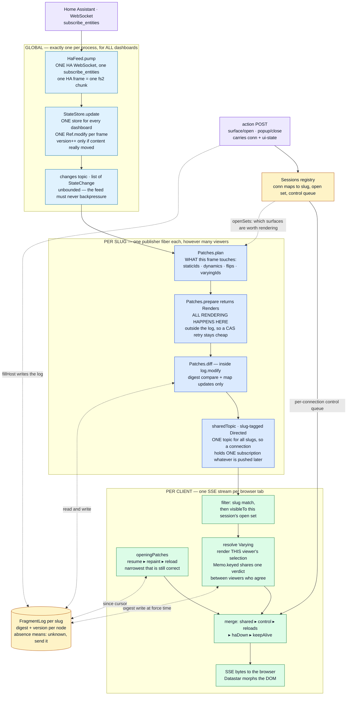
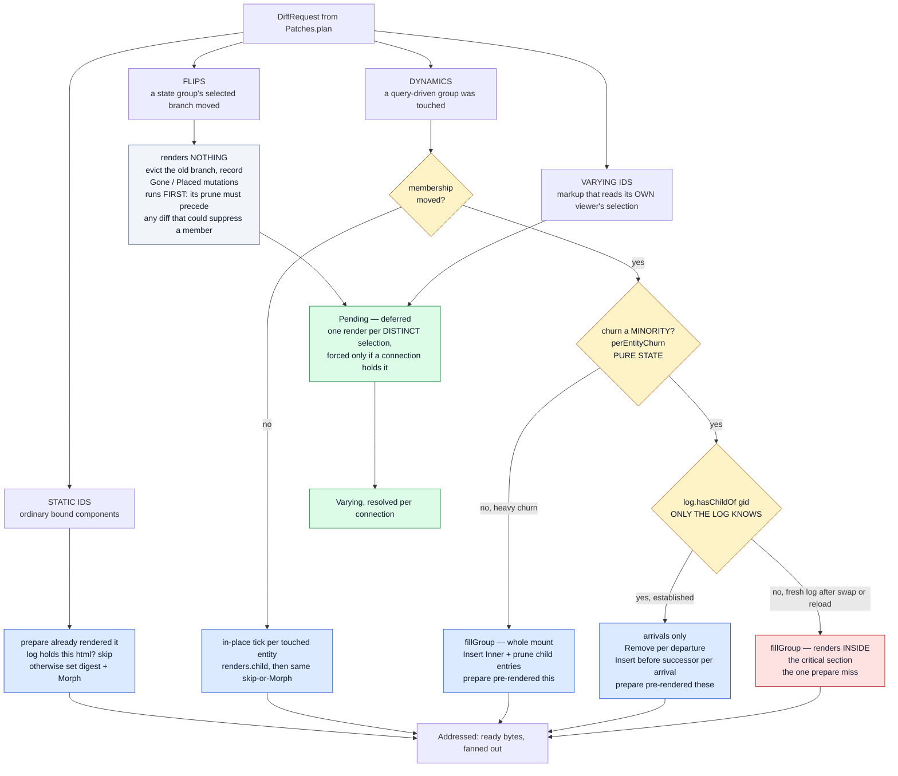
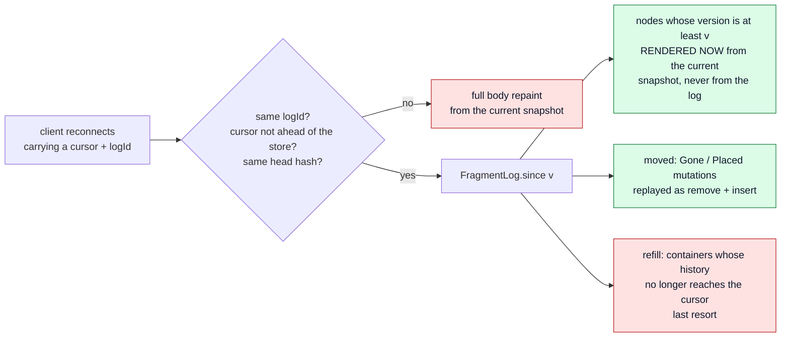

# fh-datastar-view — the rendering pipeline

How a Home Assistant state change becomes bytes in a browser: what runs **once per slug** (shared,
whatever the viewer count) and what runs **once per connection** (because only that connection knows
what its viewer has selected).

> **This is a current-state document, and it is the map we plan changes against.**
>
> It describes the pipeline as the code is today — not a proposal, not a history. Keep it true:
>
> - Change the pipeline, change this file **in the same commit**. A diagram that lags the code is
>   worse than no diagram, because it is trusted.
> - An **ADR that alters this pipeline must update this file too** — the ADR owns the *decision and
>   its rationale*, this file owns *the shape of the thing*. They are not alternatives to each other.
>   ADRs [0011](adr/0011-the-live-connection.md) and
>   [0012](adr/0012-one-pass-addressed-per-client.md) are the two that most often will;
>   [0003](adr/0003-dynamic-groups.md) (dynamic groups) and
>   [0007](adr/0007-state-activated-surfaces.md) (state-activated surfaces) own two of the four node
>   kinds below.
> - When proposing work here, say which box moves. "Render outside the critical section" is a
>   statement about §1; "prune at pull time" is a statement about §6.
> - §9 is the ONE exception to current-state: a design in progress, fenced off and labelled. It
>   moves into the body and disappears when it lands. Nothing else in this file describes code
>   that does not exist.

---

## 1. End to end



The publisher is **one fiber per slug** (`Server.publisherFor`), re-armed by `switchMap` on every
renderer swap — and a swap past the first mints a fresh log identity, so cursors issued against the
old renderer cannot be resumed.

**Three scopes, not two.** Getting these confused is the easiest mistake to make here:

| Scope | One per | What lives there |
|---|---|---|
| Global | process | the HA WebSocket, `HaFeed`, **the `StateStore`**, the `changes` topic, `sharedTopic`, the `Sessions` registry |
| Per slug | dashboard | the publisher fiber, the `Renderer` (in a `SignallingRef`, hot-swapped), the `FragmentLog` |
| Per connection | browser tab | the `Session` (slug, open surfaces, control queue), the SSE stream, that viewer's selections |

There is exactly ONE store and ONE upstream subscription for every dashboard — `HaFeed.resource`
creates the store, `Server.fromFeed` takes `feed.store`. Dashboards are views over one shared state,
never separate feeds.

---

## 2. The setup, in pseudo-code

The same thing as §1, in words, because the diagram cannot show ordering and lifetime.

### Boot — once per process

```
open ONE WebSocket to Home Assistant, subscribe_entities
  the opening frame IS the full entity set, so there is no separate seeding step
create ONE StateStore              // for every dashboard, not one each
evaluate every *.pkl entry         // slug = filename
  per slug: one Renderer in a SignallingRef   // hot-swapped on file edit
  per slug: one FragmentLog with a fresh id, in a Ref
create ONE sharedTopic  (slug-tagged)  and ONE Sessions registry
for each slug: start a publisher fiber
  // STARTS IMMEDIATELY, and runs whether or not a browser ever connects
```

### A browser opens a dashboard

```
GET /d/:slug
  render the WHOLE page from the current snapshot
  seed the log for the OPEN SURFACES' nodes only     // absent-only; a main-page
                                                     // node deliberately gets no entry
  embed in the page as Datastar signals: logId, storeVersion, headHash, styleHash

GET /sse/dashboard/:slug/patch
  mint conn; create Session{slug, open surfaces, control queue}
  register it (bracketed to the stream, so a failed connect cannot leak it)
  subscribe ONCE to sharedTopic                       // all slugs, filtered per patch
  opening patches, narrowest that is still correct:
      resume   if the cursor's logId matches and nothing structural moved
      repaint  if it does not
      reload   if the document itself is stale
  then stream: shared patches ▸ control ▸ reloads ▸ haDown ▸ keepAlive

on disconnect
  deregister IMMEDIATELY — nothing lingers, no disconnected state
  the client keeps the cursor; the server keeps no per-session position
```

### A state change arrives — once, globally

```
StateStore.update(frame)                    // one Ref.modify for the whole frame
  version++ ONLY if some entity's content really moved
  publish List[StateChange] on `changes`

every slug's publisher wakes            // whether or not that slug has any viewer
  read snapshot+version together, wall clock, and sessions.openSets(slug)
    visible = surfaces some session can actually SEE  // widens what is considered
  plan     -> staticIds, dynamics, flips, varyingIds
  prepare  -> render everything            // OUTSIDE the log
  log.modify:
      flips first    -> evict, record Gone/Placed, defer the bytes
      static         -> digest holds? skip : set + Morph
      dynamics       -> tick per entity, or membership delta, or whole-mount fill
      varying        -> Pending, rendered later per distinct selection
  publish slug-tagged patches to sharedTopic

each connection
  drop other slugs; drop what its open set cannot see
  force any Varying against ITS OWN selections (memoised across equal selections)
  write bytes
```

### The log

```
keyed by node id: digest per variant + the version it was rendered from
  a later write overwrites — latest wins, and a version never goes backwards
mutations: Gone / Placed per node, latest wins
pruned by WALL CLOCK: mutations older than FragmentLog.Retention (1h) are evicted
  per-container `horizon` records the version at which its history became incomplete
  -> a cursor below a container's horizon gets a refill instead of a delta
absence means "unknown, send it" — so dropping an entry is ALWAYS safe
```

### Reconnect

```
client sends back its stored signals: logId, version, headHash, styleHash
  different logId, or version ahead of the store, or head moved -> full repaint
  otherwise since(version):
      nodes   whose logged version >= cursor   -> rendered NOW from the current snapshot
      moved   Gone/Placed                      -> replayed as remove + insert
      refill  containers whose history aged out -> whole mount
```

---

## 3. Inside `Patches.diff` — the four kinds, and where each is rendered



**Legend**

| Colour | Meaning |
|---|---|
| Blue | rendered by `prepare`, before the log is touched |
| Red | rendered *inside* `log.modify` — the single case `prepare` cannot predict |
| Green | deferred: rendered per distinct viewer selection, only if someone holds it |
| Grey | renders nothing at all |

---

## 4. Why the flip renders nothing

A flip is server truth — the branch every viewer must move to — but *which* branch a given viewer
has mounted, and what belongs inside it, depends on selections below it. So the shared pass does the
part that is identical for everyone (evict the departed branch, record where it went) and defers the
bytes to a `Pending`, which each connection forces for its own selection. A branch no connected
viewer reaches is never rendered at all.

That is the same mechanism as `varyingIds`, not a second path.

---

## 5. The two rendering lanes, side by side

| | Shared (per slug) | Per client (per connection) |
|---|---|---|
| Runs on | one publisher fiber per slug | that connection's own SSE fiber |
| Sees | the full entity snapshot + the union of visible surfaces | one session's open set and ui-state |
| Renders | static nodes, dynamic ticks, group fills and arrivals | `Varying` nodes, opening paint, resume |
| Writes the log | yes, in `log.modify` | yes, at force time and on surface fills |
| Cost of N viewers | ×1 | ×(distinct selections), not ×N — `Memo.keyed` |

---

## 6. Reconnect: the pull path



The log stores **digests and versions, never HTML** — a resume renders from the current snapshot,
which is by construction at least as fresh as anything the log could have held. That is why a
missing entry is always safe: it reads as "unknown, send it", costing bytes and never staleness.

Mutations age out after `FragmentLog.Retention` = 1 hour; a container whose history has aged past a
client's cursor yields a `refill` rather than a refusal.

---

## 7. Where each box lives

Paths are under `modules/fh-datastar-view/src/main/scala/fh/view/`.

| Box | Code |
|---|---|
| feed → store | `runtime/HaFeed.scala` · `pump`, `runConnection` |
| store + changes topic | `runtime/StateStore.scala` · `update`, `changes` |
| per-slug publisher | `runtime/Server.scala` · `publisherFor`, `sharedPatchPublishers` |
| what a frame touches | `runtime/Patches.scala` · `plan` |
| all shared rendering | `runtime/Patches.scala` · `prepare`, class `Renders` |
| the critical section | `runtime/Patches.scala` · `diff` (called inside `Server.sharedPatches`) |
| flips | `runtime/Patches.scala` · `flipStateGroup` |
| dynamic groups | `runtime/Patches.scala` · `renderDynamicGroup`, `renderMembershipChange`, `fillGroup` |
| deferred per-viewer renders | `runtime/Patches.scala` · `Pending` / `Varying`; `runtime/Memo.scala` |
| the log | `runtime/FragmentLog.scala` |
| SSE stream + fan-out | `runtime/Server.scala` · `sseStream` |
| opening paint / resume | `runtime/Server.scala` · `openingPatches`; `runtime/Patches.scala` · `resume` |
| sessions + surface actions | `runtime/Sessions.scala`; `runtime/Server.scala` · `withSession`, `openSurface`, `swapHost` |
| the actual rendering | `runtime/Renderer.scala` · `renderNodeById`, `renderDynamicChild`, `renderDynamicMembers` |

## 8. Known open questions

Live list — delete an entry when it is answered, and say where the answer landed.

- **Nobody is watching.** The publisher runs from boot and `plan` does not gate main-page nodes on
  viewers, so with every browser closed each frame still renders every affected fragment into a
  topic with no subscribers. Measured at 0 CPU ticks over 90 s idle on a real instance, so this is
  architecture rather than a live cost. Gating on subscriber count needs one correctness move with
  it: mint a fresh log identity on the 0→1 transition, or a client returning with a pre-gap cursor
  resumes against a log that never recorded the gap.
- **`prepare` vs `hasChildOf`.** The single render `prepare` cannot predict (§2, the red box). The
  alternative — pre-render both sides — makes every membership change pay for the whole mount.
- **Pull instead of push.** Being designed — see §9. The two objections that used to block it (losing
  digest suppression, losing the shared render) are answered there by a global render cache and a
  per-session digest map.
- **Carrying the converted attribute map across a tick.** See TODO2.md — `EntityState.javaAttributes`
  is rebuilt per state change even when attributes did not move.

---

## 9. In progress — the session-pulled changelog

> **NOT IMPLEMENTED.** Everything above describes running code. This section does not: it is the
> shape being converged on, kept here so §1–§8 can be read against it. When it lands it moves into
> the body and this section goes away.

### The shift, in one line

Today the publisher **renders and pushes ready bytes**, and one shared log answers "does the client
already have this?" on everyone's behalf. In the new shape the publisher records **what moved**,
each session **pulls what it is owed**, and "does *this* client have it?" is answered per session.

Deliberately NOT a change to what a browser experiences: the same patches, in the same order, for
the same reasons. This is about who decides, and when the work happens.

### The four structures

**1. The changelog — per slug.** Today's `FragmentLog`, reduced to its record-keeping half:

```
nodeId -> version            // latest wins; a version never goes backwards
mutations: Gone / Placed     // per node, latest wins (a node cannot be both)
gapFrom: Option[version]     // set when the slug had no sessions and stopped recording
```

No digests: it no longer answers "worth sending?" — structure 3 does. `gapFrom` is what is left of
today's `horizon`, and it is still needed: a slug with no sessions records nothing, so a lingering
session returning across that gap must repaint rather than resume.

**2. The render cache — per slug, living and dying with the dashboard's renderer.**

```
(nodeId, inputs) -> Deferred[(html, digest)]
```

Per slug rather than global because node ids are only meaningful within one renderer: a hot-swap
drops the whole map, which is the correctness story AND the eviction story for free.

`Deferred` behind a `MapRef` gives single-flight: the first fiber to want a key inserts an empty
`Deferred` and renders; everyone else finds it and waits. Insertion stays a per-key operation
instead of a whole-map CAS. The value is

```
Deferred[IO, Either[Throwable, (Html, Digest)]]
```

so a failed render reaches every waiter instead of stranding them. Two rules come with that, and
both are the usual way this pattern breaks:

- **Completion must survive cancellation.** `attempt` does not intercept it, so a producer cancelled
  mid-render never completes its `Deferred` and every waiter blocks forever. Complete it from a
  `guaranteeCase`/`onCancel`, not from the happy path.
- **A failure must evict the key.** Leaving a `Left` in the map poisons that node for the life of
  the renderer; evicting lets the next caller retry while the waiters that already hold it still see
  the error.

`inputs` is what the render actually reads, and nothing more:

- the **content version of each entity the node binds** — `Renderer.entitiesForNode` already gives
  the set. Scala does synthesize `hashCode`/`equals` for `EntityState`, so keying on the values
  themselves would WORK; the reasons not to are cost and precision. Cost: a case class hash is
  recomputed on every call (no memoisation) and recurses into the attributes `Map`, so every lookup
  walks every attribute of every bound entity, where a version stamp is a `Long` compare. Precision:
  the whole value is MORE discriminating than the render is — `lastUpdated` moves on ticks that
  change no rendered byte, so value-keying misses on states that would render identically. A
  per-entity version stamped at ingest moves exactly when content moves, which is the store's
  existing definition.
- the node's **own selections** — `Renderer.selectionsOf`, i.e. only the selections this node's
  markup reads, not the viewer's whole open set. Keying on the open set would fragment the cache
  between viewers who differ somewhere irrelevant.

The asymmetry to keep in mind while choosing it: a key that is **too discriminating** costs a
wasted render, and the digest then shows nothing changed so nothing is sent — CPU, no bug. A key
that is **too coarse** serves a client bytes that no longer match its state, silently and
permanently. When in doubt, over-discriminate.

**Children are not part of a node's cache entry.** A node caches its OWN markup with holes where
its children go; a second pass substitutes the children's (also cached) HTML. Otherwise any
descendant's tick invalidates every ancestor up to the root and the cache stops earning its keep.
The seam already exists — `Renderer.renderTemplateOf` takes `childrenHtml` as a parameter — so this
is a split of an existing function, not a new mechanism.

This also retires a widening that exists today only because of composition: `selectionsOf` is narrow,
but surfaces currently need a WIDER selection set (`Renderer.scala:290`) because a composed subtree
varies with any tab inside it, even when the container's own markup never reads one. With per-node
caching plus composition, each node keys on its own narrow selections and the composition picks the
right children.

**3. The session's own view — per connection.**

```
position: version                                  // how far this session has been served
holds:    nodeId -> Option[(version, digest)]      // what this client's DOM actually has
```

`None` is load-bearing: **this client does not have that node** — removed, or never sent — as
distinct from "absent, unknown". That distinction is what makes the per-session decisions exact
rather than guessed.

Kept alive by the same insert/remove logic that drives the patches: an `insert` adds an entry, a
`remove` drops it. Get that wrong and the map leaks for the life of the session, so the invariant is
"every patch that changes the client's DOM updates `holds` in the same step" — not a cleanup pass
bolted on afterwards.

**4. Dynamic membership — maintained, not recomputed.**

Today `dynamicMembers` rescans every entity and evaluates the group's predicate, twice per frame
(before and after). Instead the group's membership is live dashboard state, and each incoming change
is tested against the predicate once to see whether it adds, removes, or does neither — O(changed)
per frame instead of O(entities). A sorted structure keeps DOM order and answers "successor of this
arrival" directly, which is what an `insert before` needs. Rebuilt on renderer swap, like everything
else keyed by node id.

### The flow

```
state change arrives  (globally, once — unchanged from §2)
  StateStore.update(frame); version++ only on real change

for each slug that HAS AT LEAST ONE SESSION            // the gate that does not exist today
  log.modify:                                          // cheap: no rendering in here
      entity -> nodes via the reverse index; record nodeId -> version
      test each change against each dynamic group's predicate:
          joined -> record Placed;  left -> record Gone;  neither -> nothing
      state groups (if/tabs): record the branch move
  // nothing is rendered, nothing is pushed
for a slug with NO sessions: record gapFrom, skip everything else

each active session, on batch change
  read the changelog from `position`
  prune (P1) to what THIS session can use:
      drop nodes it cannot see        (its open surfaces)
      drop nodes covered by an ancestor mutation it is already being sent
      collapse repeats — latest version per node wins
  for each survivor:
      html, digest = renderCache(nodeId, inputs)   // single-flight; one render serves all sessions
      holds(nodeId) already that digest? -> drop it, this client has these bytes
      otherwise                          -> emit, and set holds(nodeId) = (version, digest)
  send the changeset; position = batch version

after sending, changelog cleanup
  floor = min(position) over live sessions
  prune (P1, the same pass) everything no session can still ask for
```

### Sessions outlive their connection

A dropped SSE stream no longer destroys the session. Instead the disconnect schedules a delayed
check through a `Supervisor`: if the session has not been picked up again after X, it is dropped and
its `holds` map with it. A client reconnecting inside that window presents the `conn` it already
holds as a signal and resumes against a warm session — its `holds` map intact, so the reconnect
costs only what actually moved rather than a repaint.

The client stays the authority. Its cursor is the truth about what its DOM contains; `position` and
`holds` are the server's record of the last truth it was told, and a reconnect corrects them. That
is what makes it safe for the server to prune on `position` while still handling a client that comes
back with a different story.

### A client that returns after its session was dropped

The session's `holds` map is an OPTIMISATION, not the resume mechanism. Losing it degrades the
reconnect by one rung; it does not force a repaint. The existing ladder just gains a middle step,
and it is chosen on the CHANGELOG, not on whether the session survived:

```
cursor's logId does not match this renderer      -> reload  (a different document)
changelog still reaches back to cursor.version
  and no gapFrom sits above it                   -> resume: rebuild the changeset from the
                                                    changelog + the current snapshot, exactly as
                                                    since(v) does today. Without `holds` there is
                                                    no per-client suppression, so the client may
                                                    receive bytes it already had — idempotent
                                                    morphs, so this costs bytes and nothing else.
otherwise                                        -> repaint from the current snapshot
```

So the linger window X is not really "how long we keep a session" — it is **how long we keep the
ability to resume that client cheaply**, which is what today's one-hour `Retention` means. Note the
coupling it creates: the changelog floor is `min(position)` over live sessions, so dropping the last
session holding an old position RAISES the floor and a client returning past it repaints. That is
the deliberate cost of exact pruning.

Ordering is by **version**, never by wall clock. X is a wall-clock timer for the linger, and that is
the only thing time is allowed to decide (`Stamp`'s split, §2).

### How we will know it worked

The wire is the contract: the same patches, in the same order, for the same reasons. So the
acceptance criterion is that the suites which assert on EMITTED SSE OUTPUT pass unchanged —
`ServerSuite`'s stream tests, `DatastarMorphContractSuite`, and the functional suites over the fake
HA (`DashboardBehaviourSuite`, `UseCaseSuite`, `PklDashboardBehaviourSuite`). A diff in any of those
is a design question, not a test to update.

Tests that construct internals WILL change — `Patches.diff`'s signature, `Server.LiveSlug`,
`FragmentLog` — and that is fine. The distinction is worth holding on to while working: changing a
test that names a type is refactoring; changing a test that names a byte on the wire is a behaviour
change wearing a refactor's clothes.

`PklBuildSuite`'s wire-format snapshots are unaffected — they pin the AUTHORING wire (`{cards,
card}`), which this does not touch.

### What this buys

- **No work when nobody is watching.** The gate is the session lookup; §8's first open question
  disappears rather than needing a subscriber-count hack.
- **Exact pruning**, on what live sessions can still ask for, rather than a one-hour wall clock.
  `Stamp.millis` stops being load-bearing (`gapFrom` replaces `horizon`).
- **`hasChildOf` stops being a guess.** "Is this group established?" becomes "does this session's
  `holds` have its children?" — per client, exactly. The red box in §3 goes away, and with it the
  pre-render-vs-fill trade.
- **The missed-insert race goes away.** Today a client that missed an `insert` in the connect gap
  lacks that child until a whole-group repaint, because the shared log says everyone has it. A
  per-session `holds` cannot make that mistake.
- **Membership goes from O(entities) to O(changed)** per group per frame.
- **One caching mechanism** where there are currently two (`Renders`, `Memo`), and it survives
  across batches instead of dying with each one.

### Resolved by review

**A. `holds` fingerprints a node's OWN markup — pass 1, before composition.** The worry that it must
fingerprint the composed bytes was wrong, and the reason is worth stating because it is the invariant
the whole scheme rests on:

> Every node is patched at its OWN dom id, so a change is always sent at the most specific node that
> changed. An ancestor goes out only when the ancestor's own markup changed.

Under that rule an own-markup digest answers exactly the right question. A descendant's change is
never "missed" by comparing the ancestor, because it is not the ancestor's job to carry it — the
descendant is sent on its own.

The one consequence to implement: when a node IS sent, its bytes ARE composed (an outer morph
replaces the element and its subtree), so that payload re-establishes every descendant too. `holds`
must therefore be updated for the whole subtree, from the trace of what was composed — not just for
the node addressed. Today's code already works this way and is the model: `Patches.fillGroup` writes
`set(cid, html)` per member, and the page paint folds `painted.own` into the log per node. The tree
hash is not needed for correctness; keep it in mind only as an optimisation for skipping traversal
of unaffected subtrees.

**B. `SignallingRef`, not `Topic` — and precisely because it drops things.** `Topic` is the right
tool for multiple subscribers who must each receive EVERY element, and that contract is what forces
the per-subscriber queue and the bounded-vs-unbounded dilemma §1 lives with today. A pull model does
not want delivery; it wants a nudge. `SignallingRef[IO, Version]`'s `.discrete` gives the latest
value and is free to drop intermediates, so a session busy through three batches wakes once and
pulls straight to the head. Multiple subscribers are fine — every subscriber gets its own `discrete`.
The changelog is the data; the signal only says "look".

**C. What actually grows is the MUTATIONS, and the bound is the session's own staleness.** The
`nodeId -> version` map cannot grow without bound: it is keyed by node, latest-wins, so it is O(nodes
in the dashboard) however long it runs. The mutations are the ones that accumulate — one `Gone` per
entity that has ever left a group, which is why today's log ages them out on a wall clock
(`FragmentLog.Retention`).

So the floor bound and the session timeout are one knob, not two: a session that has not advanced its
`position` within X is stale — whether it is disconnected, or connected but not consuming — and
being stale releases its hold on the floor and marks it must-repaint. One rule covers the dropped
connection, the wedged client, and the tab left open on a sleeping laptop.

**D. Record for a surface iff at least one session has it open.** No per-surface bookkeeping is
needed, and this is the property that makes it work: recording stops only when NO session has the
surface open, and any session that opens it later gets a fill rendered from the current snapshot
(today's `fillHost`), which re-establishes its `holds` for that subtree. So a session can never need
history from a window in which it did not have the surface open. Cheap, and closer to what the code
already does than recording everything would be.

**E. Fits the auth story.** `conn` becomes a session identifier with a real lifetime; when auth
arrives the session belongs to a principal and `conn` is a per-session token scoped to it. The
displacement rule stands on its own: a second live stream for one session must displace the first,
or two writers share one `holds` map.

### Falls out for free

Worth recording so they are not re-invented as work:

- **`Varying` / `Pending` disappear.** Every render is already per-session against that session's own
  selections, so the "this node cannot be rendered once for everyone" special case dissolves into
  the general path. `Memo.keyed` is subsumed by the render cache.
- **Flips lose their deferred-render machinery** for the same reason — a flip records the branch move
  and the pull renders it.
- **`Patches.prepare` / `Renders` is superseded** by the render cache. Not wasted: it is what
  established that renders never needed the log, which is the premise §9 is built on.
- **Fill-vs-delta becomes per-session.** `established` is today's `log.hasChildOf(gid)`: does the log
  hold children for this dynamic group, and so may it be patched with a per-member delta rather than
  a whole-mount fill? Today one shared answer serves everyone. Per-session it becomes exact: a client
  that has had the group rendered gets the delta; one that just opened the surface, or reconnected
  without those children, gets the fill. Same change, different patch SHAPE per client — not because
  their versions differ, but because their DOMs do. That is strictly more correct than today, where
  the shared answer can claim on behalf of a client that missed an `insert` (the residual race
  documented on `renderMembershipChange`). Worth knowing before a multi-client test asserts there is
  one right patch.

### What it must answer

- **`inputs`, precisely.** Everything rests on it: too coarse and the cache never hits, too narrow
  and it serves stale bytes — silent staleness, the worst failure mode here. Wants a spike first,
  including where the per-entity content version is stamped.
- **Single-flight failure and cancellation.** A `Deferred` whose producer fails or is cancelled must
  not leave waiters blocked forever: complete it with the error, or remove the key and let the next
  caller retry. This is the standard way this pattern breaks.
- **Composition and escaping.** Children splice unescaped today (`{{{html}}}`); a placeholder-then-
  substitute pass must not change what is escaped where, and the wire-format snapshots are the check.
- **Max age.** Neither map is bounded by anything but lifecycle. A `Caffeine` cache behind the
  `MapRef` facade would give size and age eviction without hand-rolling it — noted for when the
  shape is settled, not before.
- **Ordering across sessions.** Sessions render on their own fibers and can sit at different
  positions. Nothing above depends on them agreeing, but that should be stated as an invariant
  rather than assumed.
