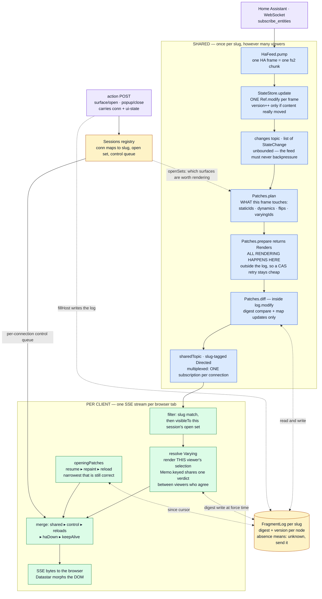
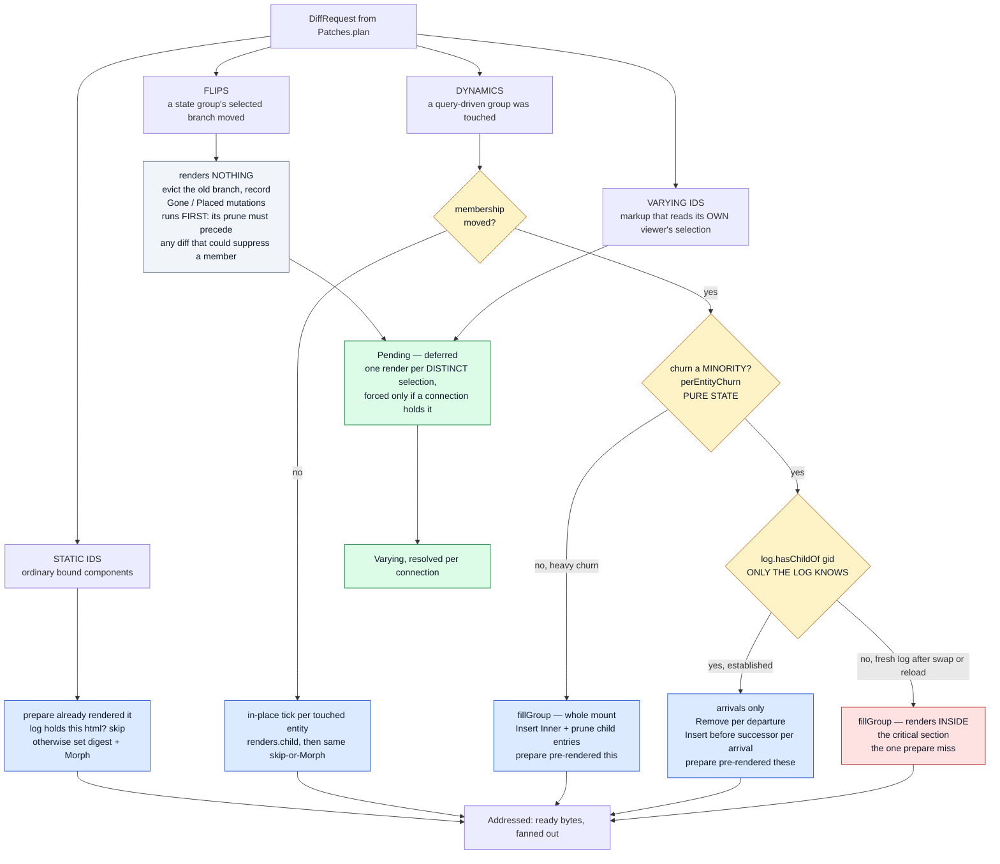
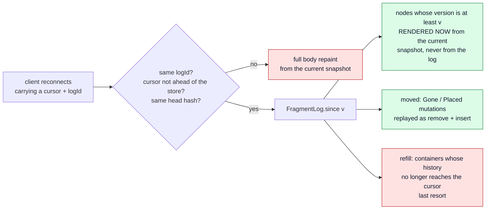

# fh-datastar-view — the rendering pipeline

How a Home Assistant state change becomes bytes in a browser: what runs **once per slug** (shared,
whatever the viewer count) and what runs **once per connection** (because only that connection knows
what its viewer has selected).

> **This is a current-state document, and it is the map we plan changes against.**
>
> It describes the pipeline as the code is today — not a proposal, not a history. Keep it true:
>
> - Change the pipeline, change this file **in the same commit**. A diagram that lags the code is
>   worse than no diagram, because it is trusted.
> - An **ADR that alters this pipeline must update this file too** — the ADR owns the *decision and
>   its rationale*, this file owns *the shape of the thing*. They are not alternatives to each other.
>   ADRs [0011](adr/0011-the-live-connection.md) and
>   [0012](adr/0012-one-pass-addressed-per-client.md) are the two that most often will;
>   [0003](adr/0003-dynamic-groups.md) (dynamic groups) and
>   [0007](adr/0007-state-activated-surfaces.md) (state-activated surfaces) own two of the four node
>   kinds below.
> - When proposing work here, say which box moves. "Render outside the critical section" is a
>   statement about §1; "prune at pull time" is a statement about §5.

---

## 1. End to end

The publisher is **one fiber per slug** (`Server.publisherFor`), re-armed by `switchMap` on every
renderer swap — and a swap past the first mints a fresh log identity, so cursors issued against the
old renderer cannot be resumed.

---

## 2. Inside `Patches.diff` — the four kinds, and where each is rendered

**Legend**

| Colour | Meaning |
|---|---|
| Blue | rendered by `prepare`, before the log is touched |
| Red | rendered *inside* `log.modify` — the single case `prepare` cannot predict |
| Green | deferred: rendered per distinct viewer selection, only if someone holds it |
| Grey | renders nothing at all |

---

## 3. Why the flip renders nothing

A flip is server truth — the branch every viewer must move to — but *which* branch a given viewer
has mounted, and what belongs inside it, depends on selections below it. So the shared pass does the
part that is identical for everyone (evict the departed branch, record where it went) and defers the
bytes to a `Pending`, which each connection forces for its own selection. A branch no connected
viewer reaches is never rendered at all.

That is the same mechanism as `varyingIds`, not a second path.

---

## 4. The two lanes, side by side

| | Shared (per slug) | Per client (per connection) |
|---|---|---|
| Runs on | one publisher fiber per slug | that connection's own SSE fiber |
| Sees | the full entity snapshot + the union of visible surfaces | one session's open set and ui-state |
| Renders | static nodes, dynamic ticks, group fills and arrivals | `Varying` nodes, opening paint, resume |
| Writes the log | yes, in `log.modify` | yes, at force time and on surface fills |
| Cost of N viewers | ×1 | ×(distinct selections), not ×N — `Memo.keyed` |

---

## 5. Reconnect: the pull path

The log stores **digests and versions, never HTML** — a resume renders from the current snapshot,
which is by construction at least as fresh as anything the log could have held. That is why a
missing entry is always safe: it reads as "unknown, send it", costing bytes and never staleness.

Mutations age out after `FragmentLog.Retention` = 1 hour; a container whose history has aged past a
client's cursor yields a `refill` rather than a refusal.

---

## 6. Where each box lives

Paths are under `modules/fh-datastar-view/src/main/scala/fh/view/`.

| Box | Code |
|---|---|
| feed → store | `runtime/HaFeed.scala` · `pump`, `runConnection` |
| store + changes topic | `runtime/StateStore.scala` · `update`, `changes` |
| per-slug publisher | `runtime/Server.scala` · `publisherFor`, `sharedPatchPublishers` |
| what a frame touches | `runtime/Patches.scala` · `plan` |
| all shared rendering | `runtime/Patches.scala` · `prepare`, class `Renders` |
| the critical section | `runtime/Patches.scala` · `diff` (called inside `Server.sharedPatches`) |
| flips | `runtime/Patches.scala` · `flipStateGroup` |
| dynamic groups | `runtime/Patches.scala` · `renderDynamicGroup`, `renderMembershipChange`, `fillGroup` |
| deferred per-viewer renders | `runtime/Patches.scala` · `Pending` / `Varying`; `runtime/Memo.scala` |
| the log | `runtime/FragmentLog.scala` |
| SSE stream + fan-out | `runtime/Server.scala` · `sseStream` |
| opening paint / resume | `runtime/Server.scala` · `openingPatches`; `runtime/Patches.scala` · `resume` |
| sessions + surface actions | `runtime/Sessions.scala`; `runtime/Server.scala` · `withSession`, `openSurface`, `swapHost` |
| the actual rendering | `runtime/Renderer.scala` · `renderNodeById`, `renderDynamicChild`, `renderDynamicMembers` |

## 7. Known open questions

Live list — delete an entry when it is answered, and say where the answer landed.

- **Nobody is watching.** The publisher runs from boot and `plan` does not gate main-page nodes on
  viewers, so with every browser closed each frame still renders every affected fragment into a
  topic with no subscribers. Measured at 0 CPU ticks over 90 s idle on a real instance, so this is
  architecture rather than a live cost. Gating on subscriber count needs one correctness move with
  it: mint a fresh log identity on the 0→1 transition, or a client returning with a pre-gap cursor
  resumes against a log that never recorded the gap.
- **`prepare` vs `hasChildOf`.** The single render `prepare` cannot predict (§2, the red box). The
  alternative — pre-render both sides — makes every membership change pay for the whole mount.
- **Pull instead of push.** The shared pass could record only "these ids moved at version V" and let
  each connection render what it holds, generalising the `Varying` mechanism to every node. Trades
  render-once-per-slug for render-once-per-distinct-selection, and moves work onto connection
  fibers. ADR-level; wants a measurement first.
- **Carrying the converted attribute map across a tick.** See TODO2.md — `EntityState.javaAttributes`
  is rebuilt per state change even when attributes did not move.
